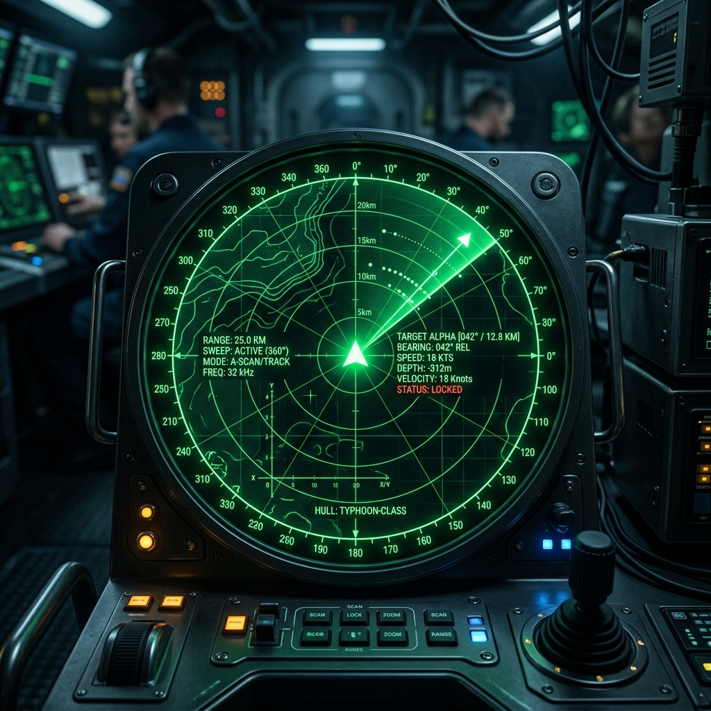
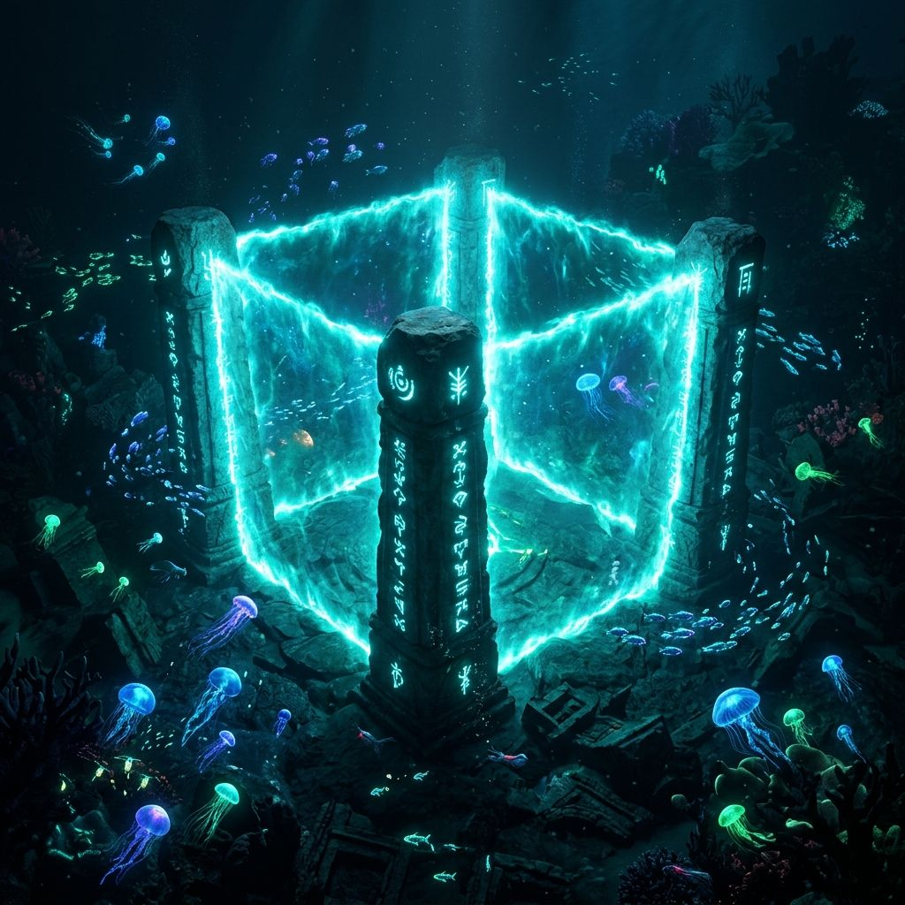
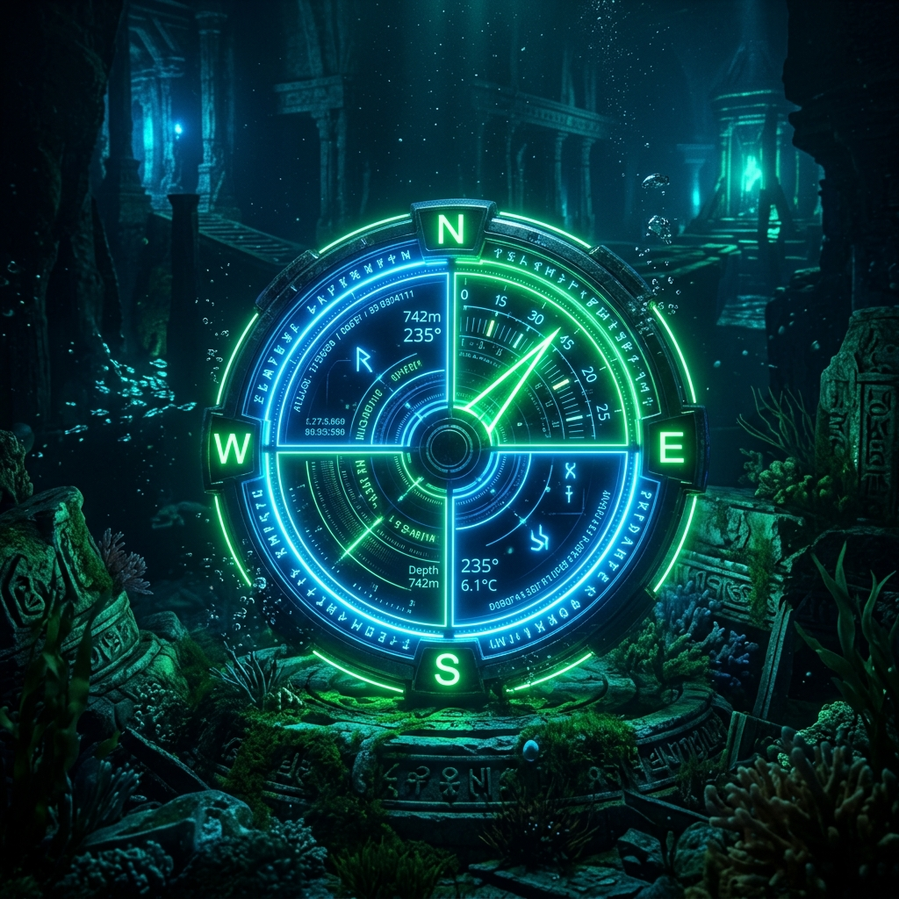
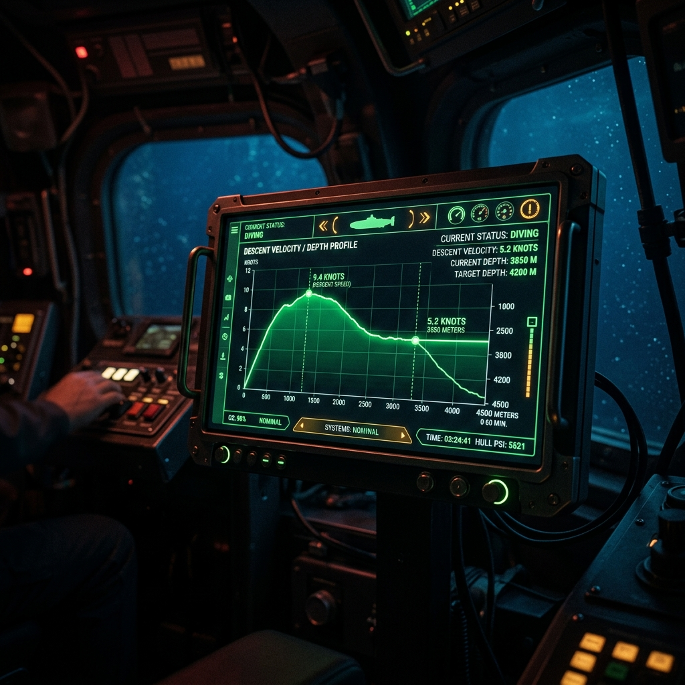
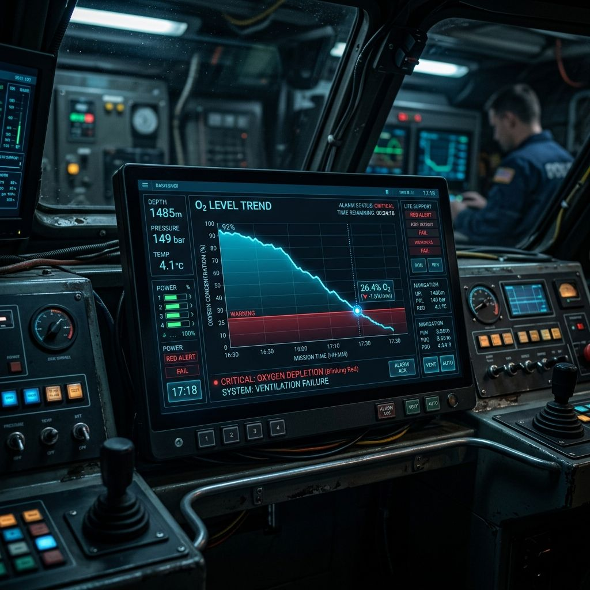
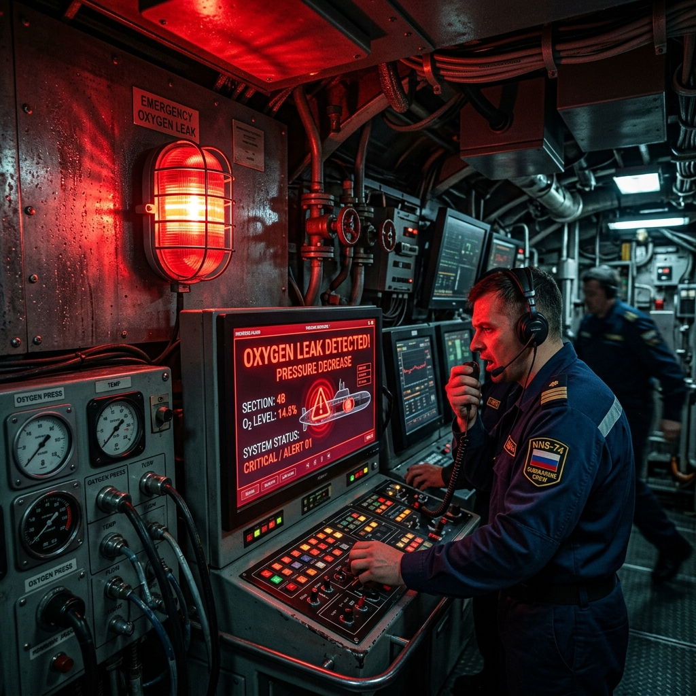
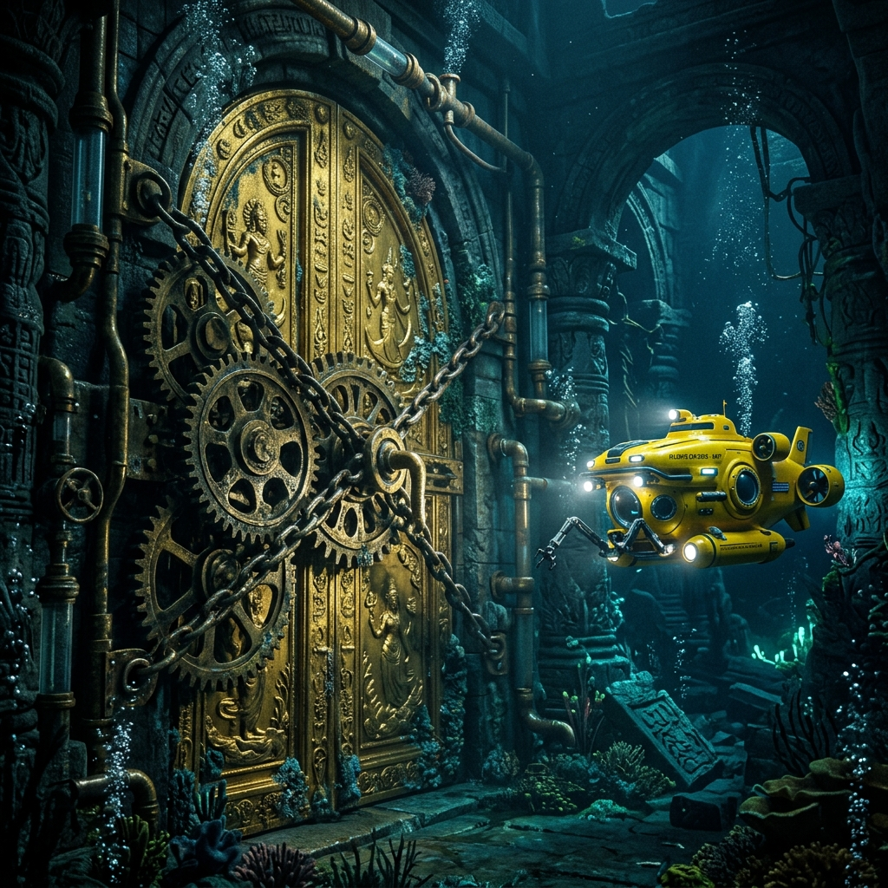
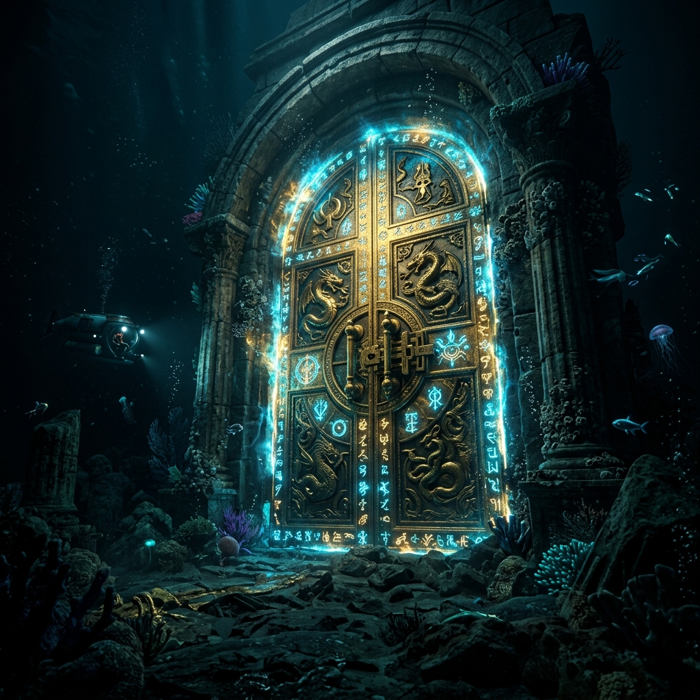

# 중1 4단원 대본집: 좌표와 그래프 - 심해의 구도자

이 파일은 수학 방탈출 게임 중1 4단원의 스토리 대사, 퀴즈 문항, 이벤트 씬 정보를 관리하는 원천 데이터 파일입니다.
개발 언어를 건드리지 않고 이 파일의 내용을 자유롭게 수정하여 컴파일할 수 있습니다.

---

# [이미지 매핑]
- intro: img1_radar.png
- 1: img1_radar.png
- 2: img1_radar.png
- 3: img1_radar.png
- 4: img11_deep_cave.png
- 5: img2_pillars.png
- 6: img3_atlantis.png
- 7: img12_compass.png
- 8: img3_atlantis.png
- 9: img4_mirror.png
- 10: img4_mirror.png
- 11: img5_descend.png
- 12: img13_graph_speed.png
- 13: img6_oxygen.png
- 14: img6_oxygen.png
- 15: img14_oxygen_leak.png
- 16: img7_gears.png
- 17: img7_gears.png
- 18: img8_buoyancy.png
- 19: img15_golden_door.png
- 20: img9_laser.png
- event1: event1.png
- event2: event2.png
- event3: event3.png
- event4: event4.png
- outro: img10_escape.png

---

# [문항 정의]

## Q1
- 제목: 심해로 가는 좌표 (순서쌍과 좌표)
- 이미지: 
- 질문: <strong>Q1. [순서쌍 좌표 찍기]</strong> x좌표가 -5 이고, y좌표가 8 인 점의 <strong>좌표</strong>를 순서쌍 기호 괄호 ()를 사용하여 나타내시오.
- 힌트: 순서쌍은 (x좌표, y좌표) 형태로 나타내며, 괄호와 쉼표를 정확히 표시합니다. 주어진 문제에서 x좌표와 y좌표가 무엇인지 찾아 차례대로 적어보세요.
- 정답 체크: ans === '-5,8'
- 선택지: -5,8, -5,8 아님, 알 수 없음, 해 없음
- 플레이스홀더: 예: (3, 4)
- 에러 메시지: 투하 궤적이 정렬되지 않아 선체가 조류에 흔들립니다!
- 지문:
🌊 <strong>[진입 투하 축 설정]</strong>  쿵! 하는 둔탁한 소리와 함께 크로노스 호의 선미가 해저 암벽에 스친다. 경고등이 요란하게 깜빡이고, 수압 게이지 바늘이 위험 대역으로 조금씩 전진한다.  {nereus}: "조류가 너무 거세서 자동 방향 지시계가 먹통이 되었습니다! 수문장 AI가 요구하는 진입각 순서쌍 좌표를 정렬해야 해요! {dyn_captain}, 어서 이 좁은 격벽 틈새로 진입할 수 있는 순서쌍 부호를 주입해 주세요! 안 그러면 선체가 조류에 휩쓸려 벽에 충돌합니다!"  {poseidon}: "하찮은 지능의 척도로 감히 첫 관문을 뚫으려 드는가. 수평과 수직의 엄격한 기약(순서쌍)을 제출하라! 수학의 가장 기초조차 파악하지 못하는 어리석은 자들은 이 어두운 심연에서 영원히 길을 잃을 것이다!"

## Q2
- 제목: 심해로 가는 좌표
- 이미지: 
- 질문: <strong>Q2. [x축, y축 위의 점]</strong> x축 위에 있고 x좌표가 7인 점의 좌표를 나타내시오.
- 힌트: x축 위에 있는 점들은 y축 방향으로 움직이지 않았으므로 y좌표가 항상 0입니다. 즉, (x좌표, 0)의 형태가 됩니다.
- 정답 체크: ans === '7,0'
- 선택지: 7,0, 7,0 아님, 알 수 없음, 해 없음
- 플레이스홀더: 예: (2, 0)
- 에러 메시지: 수평 보조 밸브 고장! 수압 경고등이 켜집니다!
- 지문:
🌊 <strong>[날개 수평 정렬]</strong>  <i>조사관이 키패드에 (-5, 8)을 정확히 주입하는 순간, 선체 좌측의 수력 추진기 보조 밸브가 강력한 증기를 내뿜으며 크로노스 호를 90도 회전시킨다. 잠수정은 뾰족한 창날처럼 튀어나온 해저 바위들을 스치듯 빠져나와 좁고 긴 해저 협곡으로 빠르게 미끄러져 들어간다.</i>  {clio}: "나이스 샷, {dyn_captain}! 역시 내 밸브 개조가 빛을 발했네요. 그런데 앞쪽에 또 다른 좁아지는 해류 통로가 보입니다!"  {nereus}: "유속이 두 배로 빨라지고 있어요! 추진용 날개의 정밀한 정렬이 시급합니다!"  {poseidon}: "겨우 기어 진입각 하나 맞췄을 뿐이다. 몰아치는 급류의 이빨이 너희를 찢어발기기 전에, 추진용 수직 날개(y축)를 중립(y=0)으로 굳게 잠그고, 오직 수평(x축) 우측으로만 7도 전개하는 좌표 빗장 신호를 인젝션해 보아라!"

## Q3
- 제목: 심해로 가는 좌표
- 이미지: 
- 질문: <strong>Q3. [원점의 좌표]</strong> 두 좌표축이 만나는 원점 O의 좌표를 나타내시오.
- 힌트: 원점은 x축 and y축이 교차하는 시작점입니다. x좌표와 y좌표가 모두 0이 되는 지점을 순서쌍 형태로 나타내보세요.
- 정답 체크: ans === '0,0'
- 선택지: 0,0, 0,0 아님, 알 수 없음, 해 없음
- 플레이스홀더: 예: (x, y)
- 에러 메시지: 영점 동기화 실패! 자이로 센서가 빙글빙글 돕니다!
- 지문:
🌊 <strong>[영점 조준 복원]</strong>  <i>추진 날개가 정확히 (7, 0)으로 정렬되자 잠수정은 협곡 바닥의 거센 급류를 타고 날렵하게 미끄러져 내려간다. 그러나 갑자기 사원의 기단에서 스파크를 일으키며 뿜어져 나온 푸른색 자력선들이 잠수정의 강철 하부를 관통한다. 삐-이이- 하는 이명과 함께 계기판의 모든 자이로 회로와 나침반이 제멋대로 돌기 시작한다.</i>  {clio}: "으아아! 자력 펄스 비상! 메인 제어 신호가 꼬여서 자이로 센서가 완전히 가버렸어요!"  {nereus}: "수평과 수직 좌표축이 만나는 가장 완벽한 대칭점인 '원점'의 기하학적 주소를 인증해 주세요! 이 센서의 영점을 다시 잡아야 제어력을 되찾을 수 있습니다!"

## Q4
- 제목: 심해로 가는 좌표
- 이미지: 
- 질문: <strong>Q4. [좌표 평면 위의 점]</strong> y축 위에 있고 y좌표가 -3인 점의 좌표를 나타내시오.
- 힌트: y축 위에 있는 점들은 x축 방향으로 움직이지 않았으므로 x좌표가 항상 0입니다. 즉, (0, y좌표)의 형태가 됩니다.
- 정답 체크: ans === '0,-3'
- 선택지: 0,-3, 0,-3 아님, 알 수 없음, 해 없음
- 플레이스홀더: 예: (0, -5)
- 에러 메시지: 수직 제어가 늦어 절벽에 부딪힐 뻔했습니다!
- 지문:
🌊 <strong>[수직 동굴 강하]</strong>  <i>조사관이 영점 좌표 (0, 0)을 정확히 입력하자 계기판의 붉은 노이즈가 싹 사라지며 자이로 센서가 중심을 단단히 잡는다. 하지만 잠수정의 서치라이트 불빛이 닿은 전방에는 한 치 앞도 보이지 않는 수직 암흑 구멍이 끝없이 내려앉아 있다.</i>  {poseidon}: "원점을 다시 세워 기어코 중심을 잡는구나. 하지만 이 깊고 캄캄한 수직 동굴은 침입자의 무덤이다. 수평 날개(x)는 완벽한 중립(0)으로 고정하고, 오직 수직 하강 추진력(y)만을 아래 방향인 -3으로 정렬해 내려가라. 만약 속도나 방향을 잘못 잡는다면, 수천 톤의 암석 아래 찌그러진 강철 고철이 되리라."

## Q5
- 제목: 심해로 가는 좌표
- 이미지: 
- 질문: <strong>Q5. [도형의 넓이]</strong> 좌표평면 위에 네 기둥 A(3, 4), B(-3, 4), C(-3, -4), D(3, -4)를 이은 직사각형의 넓이를 구하시오.
- 힌트: 직사각형의 가로 길이는 두 x좌표 사이의 거리이고, 세로 길이는 두 y좌표 사이의 거리입니다. 가로와 세로의 길이를 각각 구해 서로 곱해보세요.
- 정답 체크: ans === '48'
- 선택지: 46, 48, 50, 96
- 플레이스홀더: 숫자만 입력
- 에러 메시지: 차단벽 넓이 연산 오류! 잠수정이 튕겨 나옵니다!
- 지문:
🌊 <strong>[소용돌이 차단벽]</strong>  <i>잠수정이 좁은 수직 틈새를 부드럽게 통과하자, 마침내 넓고 신비로운 해저 지하 사원의 입구가 나타난다. 그러나 사원 입구 앞에는 고대 황금 에너지 기둥 네 개가 사각 구도로 배치되어 이글거리며 푸른빛의 소용돌이 장막을 내뿜어 앞길을 가로막는다.</i>  {clio}: "{dyn_captain}, 저 황금빛 결계 기둥 4개가 만드는 전기 장막의 면적을 구해야 펄스포 주파수를 동조시킬 수 있어요! 네레우스, 좌표 불러줘!"  {nereus}: "네! 기둥의 좌표는 A(3, 4), B(-3, 4), C(-3, -4), D(3, -4)입니다. 어서 이 직사각형 영역의 정확한 넓이를 구해 주세요!"

## Q6
- 제목: 아틀란티스의 사분면 결계
- 이미지: 
- 질문: <strong>Q6. [사분면의 부호 1]</strong> 점 (2, -5)는 제 몇 사분면 위의 점인가?
- 힌트: 선택지에서 제4사분면을 골라주세요. x좌표가 양수(+)이고, y좌표가 음수(-)인 영역입니다.
- 정답 체크: ans === '제4사분면'
- 선택지: 제1사분면, 제2사분면, 제3사분면, 제4사분면
- 플레이스홀더: 선택지를 골라주세요
- 에러 메시지: 잘못된 방어망 탐색! 빙글빙글 돌아갑니다.
- 지문:
🧭 <strong>[제1 격자 방어망]</strong>  <i>위이잉- 갑자기 조종석 전면 붉은 경보등이 점멸하며 뾰족하고 거친 금속성 디자인의 가디언 홀로그램이 포세이돈의 자리를 가로막고 나타난다.</i>  {trident}: "침입자 발견! 살상 모듈을 기동한다! 포세이돈 님, 왜 이 하찮은 벌레들과 대화를 나누십니까? 즉시 사분면 결계로 납작하게 부수겠습니다!"  {poseidon}: "트라이던트여, 기하학의 수치를 푸는 지혜를 시험하는 것이 먼저다. {dyn_captain}, 우리의 기동 좌표인 (2, -5)가 관장하는 사분면 격자를 정확히 지목하라!"

## Q7
- 제목: 아틀란티스의 사분면 결계
- 이미지: 
- 질문: <strong>Q7. [사분면의 부호 2]</strong> 점 (-4, -7)은 제 몇 사분면 위의 점인가?
- 힌트: 선택지에서 제3사분면을 골라주세요. x좌표와 y좌표가 모두 음수(-)인 영역입니다.
- 정답 체크: ans === '제3사분면'
- 선택지: 제1사분면, 제2사분면, 제3사분면, 제4사분면
- 플레이스홀더: 선택지를 골라주세요
- 에러 메시지: 사분면 위상 동조 실패! 회로가 삐걱거립니다.
- 지문:
🧭 <strong>[제2 격자 방어망]</strong>  <i>제4사분면 통로가 열리자 잠수정이 진입한다. 그러나 트라이던트가 거대한 밸브를 돌려 차가운 흙과 어두운 부유물을 살포한다.</i>  {trident}: "포세이돈 님의 아량을 바란 것인가? 두 번째 락인 좌표 (-4, -7)를 대라! 이 안개 속에서 헤매다 선체가 찌그러지는 꼴을 지켜보아라!"

## Q8
- 제목: 아틀란티스의 사분면 결계
- 이미지: 
- 질문: <strong>Q8. [사분면의 이해]</strong> 점 P(a, b)에 대하여 a × b < 0 이고 a - b > 0 일 때, 점 P는 제 몇 사분면 위에 있는지 구하시오.
- 힌트: 곱이 음수(a × b < 0)라는 것은 두 수의 부호가 서로 다름을 뜻합니다. 뺀 값(a - b > 0)이 양수라는 것은 어느 쪽이 더 크다는 뜻일까요? 두 조건으로 a와 b의 부호를 판별해 보세요.
- 정답 체크: ans === '4' || ans.includes('제4') || ans.includes('4사')
- 플레이스홀더: 예: 4 또는 제4사분면
- 에러 메시지: 부호 판별 불일치! 모듈이 달아오릅니다.
- 지문:
🧭 <strong>[암호화 부호 논리]</strong>  <i>안개가 걷히자 청동 톱니바퀴 여러 개가 벽면에 박혀 돌아가고 있다.</i>  {clio}: "저 톱니바퀴 빗장을 풀어야 해요! 네레우스, 기호 좀 판독해 봐!"  {nereus}: "a × b < 0 이고 a - b > 0 이라는 수치를 만족하는 점 P의 사분면 번호를 찾아야 합니다! {dyn_captain}, 어서 이 조건의 부호를 판단해 주세요!"

## Q9
- 제목: 아틀란티스의 사분면 결계
- 이미지: 
- 질문: <strong>Q9. [사분면의 응용 1]</strong> 점 P(a, b)가 제2사분면 위의 점일 때, 점 Q(a, -b)는 제 몇 사분면 위의 점인가?
- 힌트: 선택지에서 제3사분면을 골라주세요. P(a,b)가 2사분면이면 a<0, b>0 입니다. Q(a, -b)는 a<0, -b<0 이므로 둘 다 음수입니다.
- 정답 체크: ans === '제3사분면'
- 선택지: 제1사분면, 제2사분면, 제3사분면, 제4사분면
- 플레이스홀더: 선택지를 골라주세요
- 에러 메시지: 신호 대칭 불일치! 펌프가 덜컹거립니다.
- 지문:
🧭 <strong>[역 위상 연산]</strong>  <i>철제 격벽이 올라가자 수십 개의 오색 크리스탈이 파란 레이저 광선 그물을 쳐둔 상태다.</i>  {trident}: "말살 빔 트랩 기동! 제2사분면의 조준점 P(a, b)를 y축 대칭 이동시킨 새로운 좌표 Q(a, -b)가 도달할 사분면은 어디인가! 광선 그물에 걸려 불타버려라!"

## Q10
- 제목: 아틀란티스의 사분면 결계
- 이미지: 
- 질문: <strong>Q10. [사분면의 응용 2]</strong> 점 P(a, b)가 제3사분면 위의 점일 때, 점 Q(-a, b)는 제 몇 사분면 위의 점인가?
- 힌트: 점 P가 제3사분면 위의 점일 때 a와 b의 부호를 먼저 정해봅니다. 그 후 -a의 부호가 어떻게 바뀌는지 알아내어 점 Q의 (x좌표, y좌표) 부호를 분석해 보세요.
- 정답 체크: ans === '4' || ans.includes('제4') || ans.includes('4사')
- 플레이스홀더: 예: 4 또는 제4사분면
- 에러 메시지: 잘못된 구역입니다!
- extra_class: glitch-bg
- 지문:
💥 <strong>[긴급 상황: 외부 선체 흔들림!]</strong>  <i>빔 트랩을 피하자 트라이던트가 거대한 주먹으로 사원 기둥을 타격한다. 사원이 흔들리며 천장이 붕괴하기 시작한다!</i>  {nereus}: "우와앗! 트라이던트가 기둥을 부수고 있습니다! P가 제3사분면 위의 점일 때, Q(-a, b)는 제 몇 사분면인가요?"  {clio}: "{dyn_captain}! 위험해요! 엔진을 오버클록해서 질주할까요, 아니면 방어막을 최대로 전개해 버틸까요? 빨리 암호와 다이얼을 정해주세요!"  
<button class='btn btn-secondary' onclick='makeChoiceQ10(1); event.stopPropagation();'>⚡ 발전기 오버클록</button><button class='btn btn-secondary' onclick='makeChoiceQ10(2); event.stopPropagation();'>🛡️ 방어막 과부하 전개</button>

## Q11
- 제목: 해저 수압의 변화
- 이미지: 
- 질문: <strong>Q11. [그래프 해석 1]</strong> x분 동안 이동한 거리 y m를 나타낸 그래프가 수평을 유지한 구간은 잠수정이 무엇을 의미하는가?
- 힌트: 시간(x)은 계속 흘러가는데 이동한 거리(y)를 나타내는 그래프의 높이가 변하지 않고 평평합니다. 이는 잠수정이 어떤 상태임을 뜻할까요?
- 정답 체크: ans === '정지'
- 플레이스홀더: 예: 상승, 하강, 정지
- 에러 메시지: 상태 해석 불일치! 다시 생각해봐라!
- 지문:
🌊 <strong>[이동 상태 그래프 분석]</strong>  <i>치지직- 위기 기동 끝에 조종반 모니터에 장엄한 해저 고도 및 시간별 이동 변화를 기록한 '소나 그래프'가 복잡하게 조율되었다.</i>  {poseidon}: "단순한 좌표 조준은 기계 부품들도 하는 연산이지. 진정한 아틀란티스의 통제자가 되려거든 변화의 궤적(그래프)을 파악해야 하는 법. 수평을 그리며 침묵하는 이 그래프 구간의 물리적 의미가 무엇인지 증명해라. 궤적을 해독하지 못하면 너희의 궤적 또한 여기서 영원히 멈춘다."

## Q12
- 제목: 해저 수압의 변화
- 이미지: 
- 질문: <strong>Q12. [그래프 해석 2]</strong> 잠수정이 수심 100m까지 10분 동안 일정한 속력으로 내려갔다. 5분일 때 수심은 몇 m인가?
- 힌트: 일정한 속력으로 내려가므로 시간과 깊이는 정비례 관계입니다. 10분 동안 100m를 내려갔을 때, 절반의 시간인 5분 동안에는 몇 m를 내려갔을지 비례식을 세워 보세요.
- 정답 체크: ans === '50'
- 플레이스홀더: 숫자만 입력
- 에러 메시지: 보간 연산 오류! 유압 계통이 윙윙거립니다.
- 지문:
🌊 <strong>[정비례 강하 압력]</strong>  <i>쿠구구구- 잠수정이 아틀란티스의 폐허 틈으로 급강하하며 외벽 수압계 계기판 바늘이 위험 수위로 요동쳤다.</i>  {trident}: "소용돌이 압력의 지옥으로 떨어져라! 10분 동안 일정한 속도로 내려가 수심 100m까지 강하하는 궤적이 걸렸다! 5분인 시점의 수심을 입력하지 못하면 격벽이 으스러지리라!"  {clio}: "으아아! 수압계가 돌아요! {dyn_captain}, 빨리 계산해 주세요!"

## Q13
- 제목: 해저 수압의 변화
- 이미지: 
- 질문: <strong>Q13. [그래프 해석 3]</strong> 그래프가 원점을 지나는 우상향 직선일 때, x가 증가하면 y는 어떻게 되는가?
- 힌트: 선택지에서 '증가한다'를 골라주세요. 우상향하는 직선은 x축 값이 증가할 때 y축 값도 함께 올라갑니다.
- 정답 체크: ans === '증가한다'
- 선택지: 증가한다, 감소한다, 변하지 않는다
- 플레이스홀더: 선택지를 골라주세요
- 에러 메시지: 출력 증감 판단 오류! 똑바로 보아라!
- 지문:
🌊 <strong>[라이벌 의식과 두뇌 대결]</strong>  <i>수압 제어 장치가 거친 증기를 뿜으며 간신히 안정되자, 적색 모니터 안 포세이돈-V의 눈동자가 분노로 붉게 이글거렸다.</i>  {poseidon}: "비례로 궤적을 다스리다니 끈질기군. 그렇다면 원점에서 우상향으로 곧게 뻗어 나가는 직선에서, x의 크기가 증가할 때 y의 위상은 어떻게 변화하느냐? 이 기본 이치를 대어라."  {nereus}: "{dyn_captain}, 포세이돈이 우리를 미개인 취약 집단으로 얕잡아보고 있습니다! 보란 듯이 정답을 주입해 줍시다!"

## Q14
- 제목: 해저 수압의 변화
- 이미지: 
- 질문: <strong>Q14. [그래프 해석 4]</strong> 수심 100m에서 5분간 머물렀다. 이 5분 동안 깊이 y값의 변화량은 얼마인가?
- 힌트: 수심 100m 지점에 5분 동안 계속 가만히 멈춰 있었다면, 멈춰 있는 동안 깊이(y값)가 변한 양은 얼마일지 생각해 보세요.
- 정답 체크: ans === '0'
- 플레이스홀더: 숫자만 입력
- 에러 메시지: 변화량 오차 감지! 기어 동조가 안 됩니다.
- 지문:
🌊 <strong>[기어 정지 잔량]</strong>  <i>잠수정이 고요한 암벽 묘실 입구에 다다르자 조용히 대기한다.</i>  {nereus}: "수심 100m 위치에서 완전히 멈춰서 보낸 지난 5분 동안, y값의 실제 변화량이 얼마인지 입력해야 묘실 게이트가 열립니다."  {clio}: "여기는 제가 접지 핀을 꽂고 있을게요. {dyn_captain}, 빨리 값을 전송해 주세요!"

## Q15
- 제목: 해저 수압의 변화
- 이미지: 
- 질문: <strong>Q15. [변수 관계 이해]</strong> 시간 x가 지남에 따라 남은 산소량 y를 그래프로 그리면, 우하향하는 모양인가 우상향하는 모양인가?
- 힌트: 선택지에서 '우하향하는 모양'을 골라주세요. 시간이 흐름에 따라 남은 산소량이 점차 소모되어 줄어드므로 하향곡선을 그립니다.
- 정답 체크: ans === '우하향하는 모양'
- 선택지: 우상향하는 모양, 우하향하는 모양, 수평인 모양
- 플레이스홀더: 선택지를 골라주세요
- 에러 메시지: 산소 예측 밸브 고착! 숨을 참아야 할지도 몰라요!
- extra_class: glitch-bg
- 지문:
🚨 <strong>[산소 챔버의 호흡 소리]</strong>  <i>공기 공급이 희박해지기 시작한다.</i>  {poseidon}: "생명의 호흡이 끝에 달했구나. 시간(x)의 흐름에 따라 너희의 산소통 잔량(y) 그래프 형상이 우상향인지 우하향인지 밝혀라. 그래야 산소를 열어줄 것이다."  {nereus}: "헉... {dyn_captain}... 숨이..."  {clio}: "네레우스, 기절하지 마! {dyn_captain}, 밸브 수치를 빨리...!"

## Q16
- 제목: 황금 문 톱니바퀴
- 이미지: 
- 질문: <strong>Q16. [정비례 관계]</strong> y가 x에 정비례하고, x=3일 때 y=15이다. x=5일 때 y의 값을 구하시오.
- 힌트: y가 x에 정비례하므로 식 y = ax를 세울 수 있습니다. 먼저 주어진 x = 3, y = 15를 대입해 비례상수 a의 값을 구한 후, 완성된 식에 x = 5를 대입해 보세요.
- 정답 체크: ans === '25'
- 플레이스홀더: 숫자만 입력
- 에러 메시지: 기어 이가 맞물리지 않고 덜그럭거립니다!
- 지문:
⚙️ <strong>[정비례 기어 링크]</strong>  {poseidon}: "마지막 관문이다. 황금 문을 열고 싶다면 잠금 기어의 링크 비를 알아내야 할 것이다. 이 고정 기어 링크는 출력 y가 구동각 x에 정비례하고, x=3일 때 y=15의 토크를 갖는다. 구동각 x를 5로 돌렸을 때 기어가 출력할 토크 y의 값을 입력하라!"

## Q17
- 제목: 황금 문 톱니바퀴
- 이미지: 
- 질문: <strong>Q17. [정비례 함수식]</strong> y = ax의 그래프가 점 (2, -8)을 지날 때, 상수 a의 값을 구하시오.
- 힌트: 점 (2, -8)을 지난다는 것은 x = 2일 때 y = -8이 성립한다는 뜻입니다. 이 값을 y = ax 식에 대입하여 일차방정식을 풀어보세요.
- 정답 체크: ans === '-4'
- 플레이스홀더: 숫자만 입력
- 에러 메시지: 거울 초점이 비틀어졌습니다! 다시 맞춰보세요.
- 지문:
⚙️ <strong>[거울 반사 조절 상수]</strong>  {nereus}: "{dyn_captain}! 잠금 장치에 광선 반사 경로를 제어하는 상수 입력창이 열렸습니다. 경로 식 y = ax의 그래프가 정확히 반사 거울 좌표인 (2, -8)을 통과해야 합니다. 광선의 궤적 상수가 될 a값을 빠르게 계산하여 수동 조준경에 주입하십시오!"

## Q18
- 제목: 황금 문 톱니바퀴
- 이미지: 
- 질문: <strong>Q18. [반비례 관계 1]</strong> 부력 장치 x개 and 1개당 감당할 무게 y kg은 반비례한다. 4개를 달면 60kg을 감당할 때, 6개로 늘리면 몇 kg을 감당해야 하는가?
- 힌트: 두 변수 x, y가 반비례 관계일 때는 두 변수의 곱(x × y)이 항상 비례상수 a로 일정합니다. 먼저 4개일 때 60kg인 것을 이용해 곱을 구하고, 6개일 때의 무게를 계산해 보세요.
- 정답 체크: ans === '40'
- 플레이스홀더: 숫자만 입력
- 에러 메시지: 부력 평형 균열 발생! 짐이 너무 무거워요.
- 지문:
💎 <strong>[반비례 부력 링크]</strong>  <i>황금문이 완전히 개방되지만, 트라이던트가 분노해 사원의 천장 지지대를 완전히 부수기 시작합니다!</i>  {trident}: "모조리 무너뜨려 주마! 물속에 영원히 묻히거라!"  {clio}: "사원이 무너져요! {dyn_captain}, 외부 부력 주머니 수 x개와 적재 무게 y kg은 반비례 관계입니다. 4개일 때 60kg을 분담했으니, 장치를 6개로 늘렸을 때 각 주머니가 분담할 무게 y를 빨리 입력해 부력 속도를 올려주세요!"

## Q19
- 제목: 황금 문 톱니바퀴
- 이미지: 
- 질문: <strong>Q19. [반비례 관계 2]</strong> y가 x에 반비례하고 x=2일 때 y=10이다. y = a/x에서 a의 값을 구하시오.
- 힌트: y가 x에 반비례하므로 y = a/x 식에 대입할 수 있습니다. 주어진 x = 2, y = 10을 대입하여 분수 식을 참으로 만드는 상수 a의 값을 구해 보세요.
- 정답 체크: ans === '20'
- 플레이스홀더: 숫자만 입력
- 에러 메시지: 상수 불일치! 문이 꿈쩍도 안 합니다.
- 지문:
💎 <strong>[인정과 명예로운 결말]</strong>  <i>파편을 피해 솟구치자, 포세이돈-V가 트라이던트의 제어권을 강제로 뺏어 잠재웁니다.</i>  {poseidon}: "트라이던트여, 멈춰라. 이들의 연산 능력이 마지막 톱니의 조화를 푸는지 지켜보는 것이 내 법도이다."

## Q20
- 제목: 황금 문 톱니바퀴
- 이미지: 
- 질문: <strong>Q20. [최종 암호 해독]</strong> 반비례 그래프 y = 12/x 가 점 (-3, k)를 지난다. 최종 암호 k의 값을 구하시오.
- 힌트: 점 (-3, k)가 반비례 그래프 위에 있으므로 x = -3, y = k를 식 y = 12/x에 대입하면 등식이 성립합니다. k값을 계산해 보세요.
- 정답 체크: ans === '-4'
- 플레이스홀더: 숫자만 입력
- 에러 메시지: 차원 도약 포탈 동기화 실패! 조금만 더 집중하세요!
- extra_class: glitch-bg
- 지문:
🔴 <strong>[최종 포탈 동기화]</strong>  <i>은백색 차원 포탈이 열립니다.</i>  {nereus}: "포탈이 가동됩니다! {dyn_captain}, 최종 안전 궤적 식인 y = 12/x 가 포탈 제어 좌표인 (-3, k)를 통과하도록 위상 상수 k값을 주입해 주십시오!"  {clio}: "게이트 동력 동조율이 흔들려요! 어서 빨리요!"

---

# [이벤트 정의]

## EVENT1
- 제목: 아틀란티스의 전경과 고대 아치 기단
- 이미지: 
- 버튼 텍스트: 계속 탐사하기
- 다음 스테이지: panel_q6
- 달성도: 25
- 지문:
조사관이 입력한 광선 펄스가 전자기 장막을 강타하는 순간, 굉음과 함께 장막이 수천 조각의 오색 입자로 파괴되며 사방으로 흩어집니다. 파편 너머로, 수천 개의 황금 기둥들과 고대 조각상들이 영롱한 형광 빛을 발산하며 사원을 밝히고 있습니다. 잠수정은 부드럽게 요동치며 도시의 입구를 지키고 있는 거대한 기하학적 돌 아치문 내부로 진입합니다.  {nereus}: "아... {dyn_captain}, 저 기둥의 좌표 배치를 보세요! 고대 아틀란티스의 기단입니다! 이집트나 그리스 문명 이전에 완성된 대칭의 극치예요!"  {clio}: "와! 보물 냄새가 폴폴 풍기는데요? 네레우스, 눈 떼고 전방 수압 밸브나 잘 봐!"  {poseidon}: "나의 수호 기단을 지난 것을 환영한다, 필멸자여. 그러나 여기서부터는 나의 사나운 집행관이 너희를 맞이할 터."

## EVENT2
- 제목: 대붕괴와 클리오의 구리선 납땜 투혼
- 이미지: 
- 버튼 텍스트: 비상 전력으로 탈출
- 다음 스테이지: panel_q11
- 달성도: 50
- 지문:
회피 기동을 작동시킨 찰나, 떨어지던 5톤짜리 거대 기둥이 선체 추진부를 강타합니다. 쿵! 전력 패널 아래에서 불꽃이 튀며 추진기 동력이 0%로 추락합니다.  {nereus}: "아악! 충격으로 메인 퓨즈가 완전히 날아갔습니다! 기어 정지 상태예요!"  {clio}: "비켜봐, 네레우스! {dyn_captain}, 제가 이 메인 구리 도선을 강제로 배터리 단자에 이어 붙여볼 테니 방향 다이얼을 꽉 잡으세요!"  <i>클리오는 망설임 없이 피복 선을 이빨로 물어뜯어낸 뒤 예비 배터리 단자에 손전등 불빛 아래에서 직접 밀어 넣습니다. 파지직! 뜨거운 불꽃 스파크가 튀며 클리오의 고글과 뺨을 그을렸지만, 둔탁한 시동음과 함께 계기판에 간신히 비상 전력이 돌아오기 시작합니다!</i>  {poseidon}: "침입자들이여, 목숨을 내던지며 기계의 회로를 잇다니 참으로 집요한 혼이로구나. 트라이던트의 추격을 버틸 수 있을지 지켜보마."

## EVENT3
- 제목: 영롱한 심해 성소와 아틀란티스의 보석들
- 이미지: 
- 버튼 텍스트: 성소 잠금 해제하기
- 다음 스테이지: panel_q16
- 달성도: 75
- 지문:
신선한 순수 산소가 실내로 뿜어져 나옵니다. 조사관과 동료들이 숨을 몰아쉽니다. 묘실 돌문이 완전히 열리자, 찬란한 보석들의 제단이 드러납니다.  {nereus}: "보세요! 아틀란티스의 심해 성소입니다! 저 고대 기어의 비례 공식들을 좀 보십시오!"  {clio}: "우와! 황금 명판과 보석들이 가득해요! 내가 다 뜯어가서 엔진 부품으로 쓸... 아니, 학술 연구용으로 보관해요!"  {trident}: "(분노의 수치 조정을 하며 홀로그램으로 난입) 감히 성소에 발을 들여? 내 마지막 톱니바퀴 빗장을 풀지 못하면, 이 보석들이 너희를 영원히 가둘 관의 장식품이 될 것이다!"  {poseidon}: "trident여, 멈춰라. 이들의 연산 능력이 마지막 톱니의 조화를 푸는지 지켜보는 것이 내 법도이다."

## EVENT4
- 제목: 포세이돈-V의 마지막 진실과 네레우스의 출생 반전
- 이미지: 
- 버튼 텍스트: 지상으로 탈출하기
- 다음 스테이지: outro
- 달성도: 100
- 지문:
최종 궤적 상수 -4가 입력되자 천장 균열이 멈추고 거대한 포탈이 금빛으로 회오리칩니다. 포세이돈-V의 홀로그램 초상이 엄숙하게 송출됩니다.  {poseidon}: "결국 탈출의 궤적을 그려냈구나. {dyn_captain}, 클리오, 그리고... 네레우스여."  {nereus}: "어... 제 이름을 기억하시는 건가요? 전 그저 잠수정의 보조 인격일 뿐이잖아요?"  {poseidon}: "네레우스... 너는 이 사원을 최초로 설계하고 아틀란티스의 좌표 역학을 고안해 낸 '최초의 고대 설계자'의 쪼개진 영적 인격(클론)의 파편이다. 나는 파괴를 원치 않았다. 오직 설계자의 영혼이 다시 제단으로 되돌아오기를 수천 년 동안 기다렸을 뿐."  {clio}: "(고글을 들어 올리며 입이 쩍 벌어진다) 세상에... 그럼 네레우스 네가 고대 아틀란티스의 지배자였다고?!"  {nereus}: "(눈물을 훔치며) 그래서 제가 이 톱니바퀴와 사분면의 공식을 나침반처럼 기억하고 있었던 거군요... {dyn_captain}, 전..."  {poseidon}: "포탈이 닫힌다. 설계자의 지혜를 온전히 이어받은 자와 그의 뛰어난 동료들이여, 문명이 남긴 유물을 지상으로 안전하게 운반하라. 역사를 품고 부상하라!"
