# 중1 5단원 대본집: 기본 도형 - 다빈치의 비밀 작업실

이 파일은 수학 방탈출 게임 중1 5단원의 스토리 대사, 퀴즈 문항, 이벤트 씬 정보를 관리하는 원천 데이터 파일입니다.
개발 언어를 건드리지 않고 이 파일의 내용을 자유롭게 수정하여 컴파일할 수 있습니다.

---

# [이미지 매핑]
- intro: intro.png
- 1: q1.png
- 2: q2.png
- 3: q3.png
- 4: q4.png
- 5: q5.png
- 6: q6.png
- 7: q7.png
- 8: q8.png
- 9: q9.png
- 10: q10.png
- 11: q11.png
- 12: q12.png
- 13: q13.png
- 14: q14.png
- 15: q15.png
- 16: q16.png
- 17: q17.png
- 18: q18.png
- 19: q19.png
- 20: q20.png
- event1: event1.png
- event2: event2.png
- event3: event3.png
- event4: event4.png
- outro: outro.png

---

# [문항 정의]

## Q1
- 제목: 코덱스-L의 위협
- 이미지: 
- 질문: <strong>Q1.</strong> 도형을 구성하는 가장 기본이 되는 요소 세 가지는 점, 선, 그리고 무엇인가?
- 힌트: 도형을 구성하는 가장 기본 요소인 점, 선, 면 중 마지막 요소를 생각해 봅니다.
- 정답 체크: ans === '면'
- 선택지: 면, 면 아님, 알 수 없음, 해 없음
- 플레이스홀더: 정답 입력
- 에러 메시지: 틀렸습니다. 점이 모여 선이 되고, 선이 모여 이것이 됩니다.
- 지문:
📐 <strong>[제1구역: 다빈치의 설계도]</strong>  르네상스 학회 소속 기하학 탐사선원들은 피렌체 지하 깊은 곳에 500년간 봉인되어 있던 레오나르도 다빈치의 비밀 연구 기지에 마침내 발을 들였습니다. 조사관은 위대한 설계 문서를 획득하고자 중앙의 청동 명판을 가동합니다. 그러나 순간 사방의 밸브에서 거친 증기가 터져 나오고, 천장의 태엽 구체가 붉게 빛나며 하강하기 시작합니다.  [코덱스-L]: "삐- 500년 만의 비인가 침입자 감지. 난 다빈치 마스터께서 설계하신 수호 경비 조수 코덱스-L이다. 너희 같은 오합지졸이 작업실의 기하학 방화벽 결계를 돌파하겠다고? 기하학의 가장 기초부터 가루로 만들어 주지! 점과 선, 그리고 공간을 구성하는 마지막 기본 단위를 내놓아라!"  <i>다빈치-메모리는 옆에서 다급하게 캡틴을 깨우며 해독을 유도합니다. 도형을 만드는 기본 3요소에 대한 대답을 기입해 격벽 락을 작동시키십시오.</i>

## Q2
- 제목: 궤적의 고유성
- 이미지: 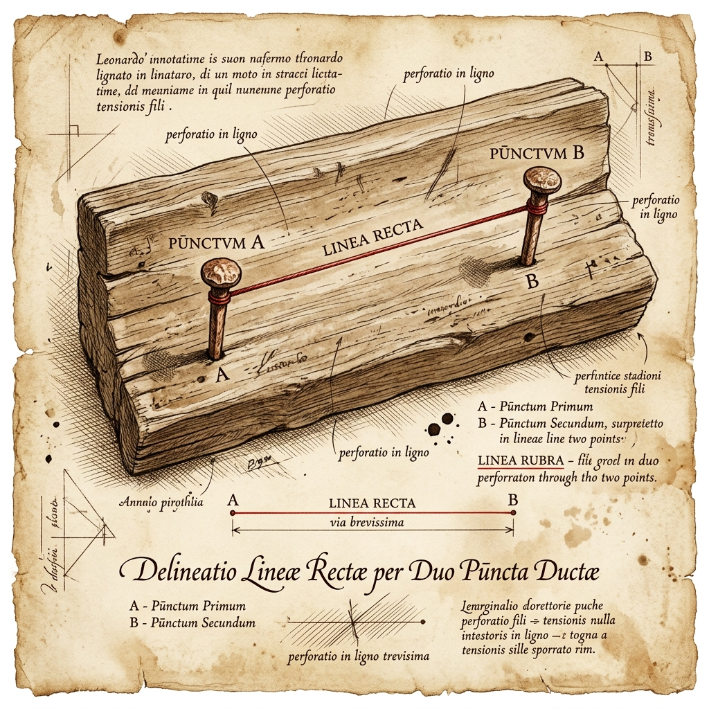
- 질문: <strong>Q2.</strong> 서로 다른 두 점 A, B를 지나는 직선은 모두 몇 개인가?
- 힌트: 두 점을 동시에 관통하는 직선은 세상에 오직 하나뿐입니다.
- 정답 체크: ans === '1' || ans === '1개'
- 선택지: -1, 1, 3, 2
- 플레이스홀더: 예: 1개
- 에러 메시지: 틀렸습니다. 두 점을 동시에 관통하는 직선은 세상에 오직 하나뿐입니다.
- 지문:
📐 <strong>[직선 경로 탐색]</strong>  <i>'면'이라는 정답이 주입되자 둔탁한 금속음과 함께 첫 기어가 회전합니다. 이어서 두 개의 가열된 레이저 스파크 단자가 튀어나와 붉은 광선을 내뿜으며 다음 격벽의 코어를 정확하게 조준합니다.</i>  [코덱스-L]: "찍어 맞춘 수준이로군. 하지만 공간의 궤적은 철저한 정확도를 요구한다. 두 고정 핀을 통과하는 빛의 직선 경로는 오직 하나뿐이지. 이 엄격한 기하학적 참값을 설정창에 올바르게 동조시켜 보아라."

## Q3
- 제목: 레이저 방향 지정
- 이미지: 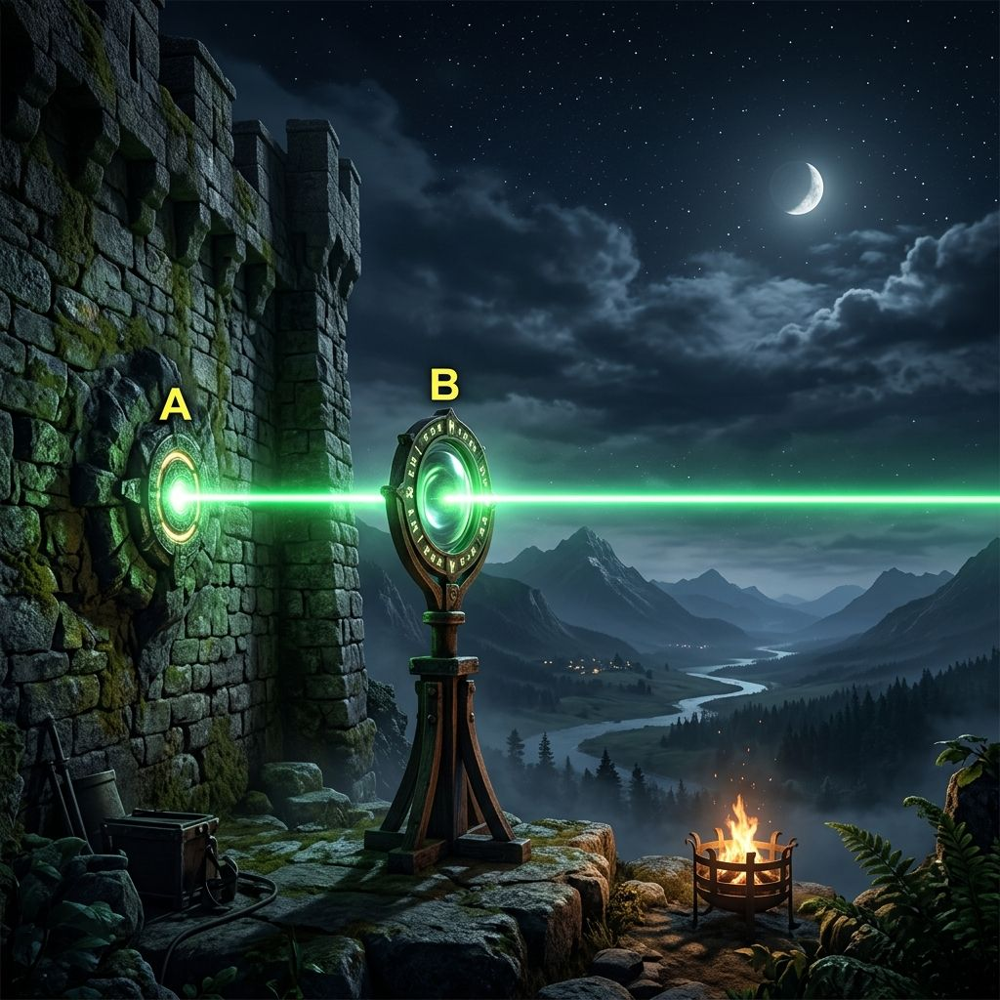
- 질문: <strong>Q3.</strong> 점 A에서 시작하여 점 B 방향으로 끝없이 뻗어 나가는 선분을 기호로 나타낼 때, 이를 무엇이라 부르는가?
- 힌트: 한쪽으로만 끝없이 뻗어 나가는 직선의 절반입니다.
- 정답 체크: ans.includes('반직선')
- 선택지: 반직선, 반직선 아님, 알 수 없음, 해 없음
- 플레이스홀더: 정답 입력
- 에러 메시지: 틀렸습니다. 한쪽으로만 끝없이 뻗어 나가는 직선의 절반입니다.
- 지문:
📐 <strong>[레이저 과부하]</strong>  <i>직선 수가 1개로 설정되자 에너지가 거꾸로 솟아오르기 시작합니다. 그러나 렌즈 튜브의 제어 필터가 오염되어, 붉은 광망이 캡틴을 정밀 조준하며 열을 내뿜습니다.</i>  [코덱스-L]: "한쪽으로만 에너지를 무한 방출하는 이 파괴 레이저 궤도의 고유 명칭은 알고 있는가? 대답을 거부하거나 틀리면 레이저 튜브를 폭파하겠다! 시작은 있으나 끝이 없는 기하학적 광선을 대어라!"

## Q4
- 제목: 수평의 바닥
- 이미지: 
- 질문: <strong>Q4.</strong> 180도인 각을 무엇이라 부르는가?
- 힌트: 평평한 각을 뜻하는 명칭입니다.
- 정답 체크: ans === '평각'
- 선택지: 평각, 평각 아님, 알 수 없음, 해 없음
- 플레이스홀더: 정답 입력
- 에러 메시지: 틀렸습니다. 평평한 각을 뜻하는 명칭입니다.
- 지문:
📐 <strong>[시스템 수평 밸런스]</strong>  <i>반직선 부호가 인젝션되자 렌즈 튜브의 에너지 충전이 기하학적으로 차단됩니다. 하지만 코덱스-L의 오염 수준이 급격히 증가해 메인 모니터가 붉은 경보로 요동칩니다.</i>  <strong>[시스템 통신 장애 및 노이즈 발생]</strong>  [다빈치-메모리]: "치지직... 시스템... 과열... 저는 다빈치 님의 소실된 메모리 파편입니다... 코덱스-L의 메인 제어 회로가 오염되었습니다... 수평 밸런스의 평평한 각도 코드를 입력하여 온도 상승을 억제해 주세요... 제발..."

## Q5
- 제목: 경보 태엽의 각도
- 이미지: 
- 질문: <strong>Q5.</strong> 시계가 4시 정각을 가리킬 때, 시침과 분침이 이루는 작은 쪽의 각의 크기를 구하시오.
- 힌트: 시계의 1시간 간격은 30도입니다. 4시간의 각도를 계산해보세요.
- 정답 체크: ans === '120' || ans === '120도'
- 선택지: 120, 240, 118, 122
- 플레이스홀더: 단위 없이 숫자만 입력 또는 '120도' 입력
- 에러 메시지: 틀렸습니다. 시계의 1시간 간격은 30도입니다. 4시간의 각도를 계산해보세요.
- 지문:
📐 <strong>[시계 태엽 긴급 정지]</strong>  <i>수평 평각 코드가 조작반에 동조되는 순간 시스템 발열이 가볍게 억제됩니다. 하지만 분노한 코덱스-L이 천장의 거대한 톱니바퀴들을 맞물려 아래로 내리누르며 공간 압축을 가동합니다.</i>  [코덱스-L]: "통신망에 잡상인이 끼어들었군. 낡은 고철 메모리 녀석! 톱니 시계 기어의 4시 각도 압력을 분산시켜 주마. 타버리지 않고 견뎌봐라! 시침과 분침이 이루는 벌어짐의 틈새 각도를 입력하라!"

## Q6
- 제목: 제 2구역: 교차하는 빛줄기
- 이미지: 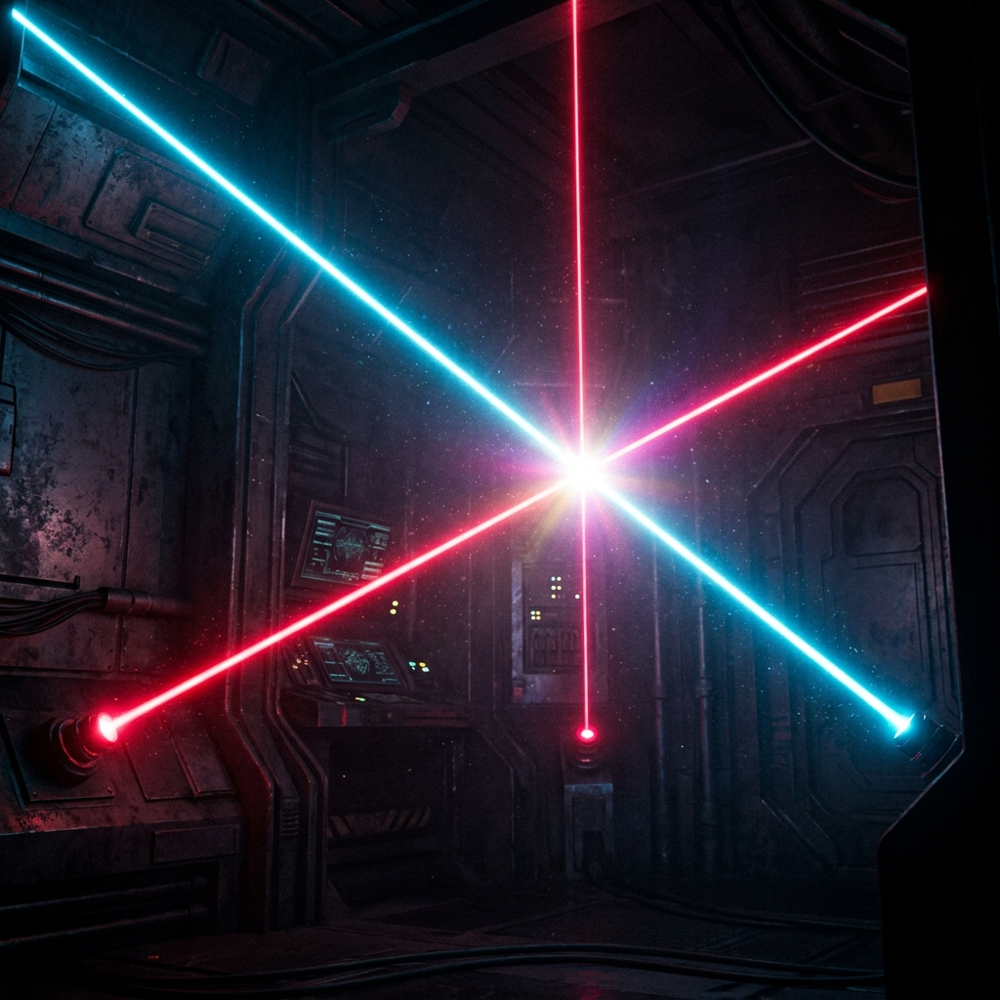
- 질문: <strong>Q6.</strong> 두 직선이 교차할 때 생기는 교각 중, 마주 보는 두 각을 무엇이라 하는가?
- 힌트: 마주 보고 솟은 꼭지점을 공유하는 각입니다.
- 정답 체크: ans === '맞꼭지각'
- 선택지: 맞꼭지각, 맞꼭지각 아님, 알 수 없음, 해 없음
- 플레이스홀더: 정답 입력
- 에러 메시지: 틀렸습니다. 마주 보고 솟은 꼭지점을 공유하는 각입니다.
- 지문:
✂️ <strong>[교차 광선 해독]</strong>  <i>나선 계단을 따라 지하 2구역에 도달하자, 사방에서 두 개의 강력한 에너지 포가 교차 작동하여 길을 막고 있습니다.</i>  [다빈치-메모리]: "코덱스의 방해 전파가 증폭되고 있습니다! 치직... 두 빛이 교차해 만드는 마주 보는 각도를 해독하십시오. 렌즈 반사를 꺾어 우회 격벽을 전개하겠습니다! 이 마주 보는 각도의 이름을 콘솔에 기입해 주세요!"

## Q7
- 제목: 광선의 대칭성
- 이미지: 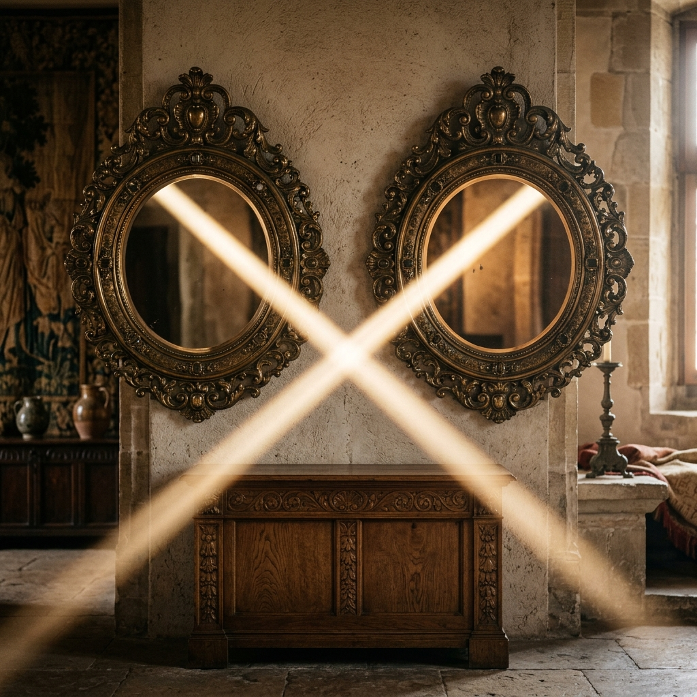
- 질문: <strong>Q7.</strong> 맞꼭지각의 크기는 서로 어떠한가? (예: 같다, 다르다)
- 힌트: 마주 보는 각은 기하학적으로 항상 동일한 크기를 가집니다.
- 정답 체크: ans === '같다'
- 선택지: 같다, 같다 아님, 알 수 없음, 해 없음
- 플레이스홀더: 같다 또는 다르다 입력
- 에러 메시지: 틀렸습니다. 마주 보는 각은 기하학적으로 항상 동일한 크기를 가집니다.
- 지문:
✂️ <strong>[광선 에너지 조율]</strong>  <i>거울반사 장치가 가동되자 광선이 천장의 환기 덕트로 구부러지며 통로가 일시 해제됩니다. 그러나 코덱스가 조종반의 대칭 밸브 주파수를 뒤틀어 과전류를 유발합니다.</i>  [코덱스-L]: "방화벽을 한 층 더 겹쳤다. 마주 보고 엇갈리는 두 빛의 세기가 정확히 대칭을 이루지 않으면 교차점 제어 콘솔이 폭발하리라! 대칭되는 두 맞꼭지각의 크기가 어떻게 매칭되는지 값을 대어라!"

## Q8
- 제목: 평행 레이저의 동위
- 이미지: 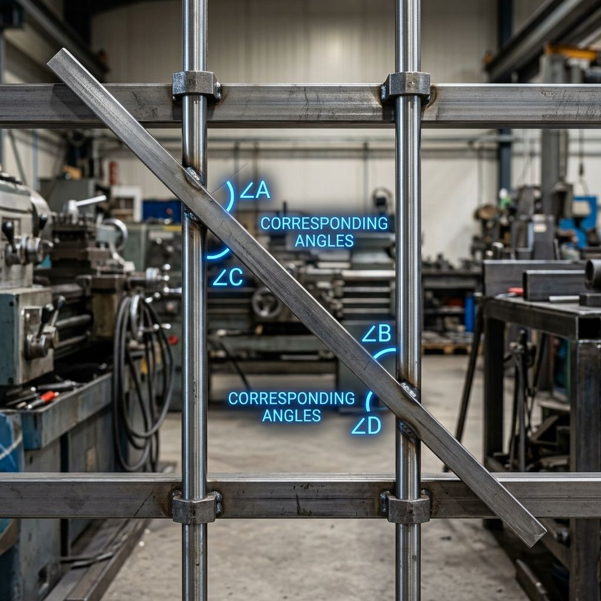
- 질문: <strong>Q8.</strong> 직선 l과 m이 평행하고 한 직선 n과 만날 때, 동위각의 크기는 서로 어떠한가?
- 힌트: 평행할 때 동위각의 크기는 항상 대칭 일치합니다.
- 정답 체크: ans === '같다'
- 플레이스홀더: 같다 또는 다르다 입력
- 에러 메시지: 틀렸습니다. 평행할 때 동위각의 크기는 항상 대칭 일치합니다.
- 지문:
✂️ <strong>[평행 렌즈 동축 정렬]</strong>  <i>마주 보는 각도의 동일한 물리량이 선언되자 전압이 녹색으로 진정됩니다. 이어 천장 가이드바가 회전하며 두 가닥의 평행 빔을 뿜어냅니다.</i>  [다빈치-메모리]: "휴... 평행 렌즈 제어기가 해제 직전입니다! 두 평행선 사이에서 같은 위치를 지향하는 마나 채널의 강도 대칭을 맞춰주십시오! 평행한 두 궤도에서 같은 방향의 위치를 지향하는 동위각의 상태는 어떠합니까?"

## Q9
- 제목: 엇갈린 반사각
- 이미지: 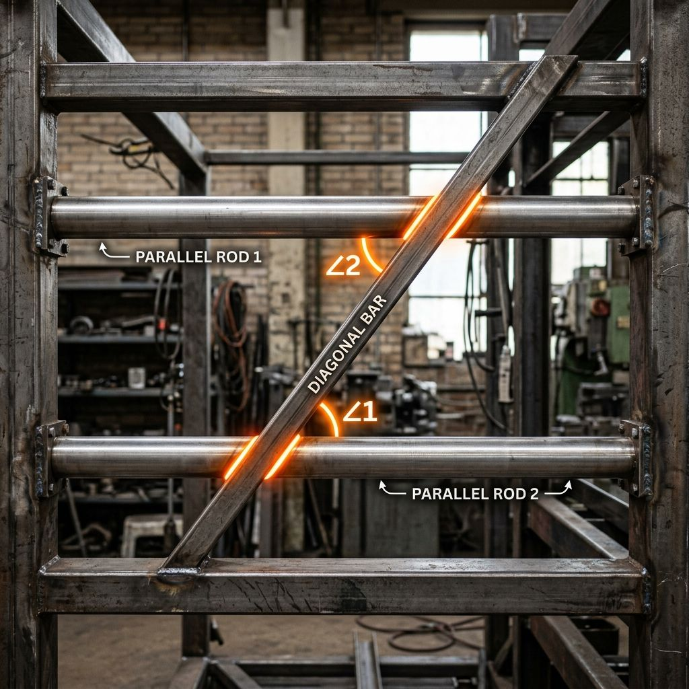
- 질문: <strong>Q9.</strong> 평행한 두 직선 사이를 가로지르는 선이 있을 때, 엇각의 크기는 서로 어떠한가?
- 힌트: 평행한 직선 사이에서 엇각의 크기는 언제나 일치합니다.
- 정답 체크: ans === '같다'
- 플레이스홀더: 같다 또는 다르다 입력
- 에러 메시지: 틀렸습니다. 평행한 직선 사이에서 엇각의 크기는 언제나 일치합니다.
- 지문:
✂️ <strong>[엇각 전압 바이패스]</strong>  <i>평행 동축 정렬이 주입되어 첫 격벽 문이 열립니다. 하지만 노호하는 코덱스-L이 반사 거울의 각도를 엇갈리게 꺾어 비스듬한 선분 필터에 과부하를 가합니다.</i>  [코덱스-L]: "포기해라! 평행 궤도 사이를 가로지르는 비스듬한 선에서 엇갈리는 에너지 크기마저 동조시킬 능력이 네놈들에게 있을까! 평행선 사이의 엇각 크기 관계를 입력해 봐라!"

## Q10
- 제목: 위치 정렬 빔
- 이미지: 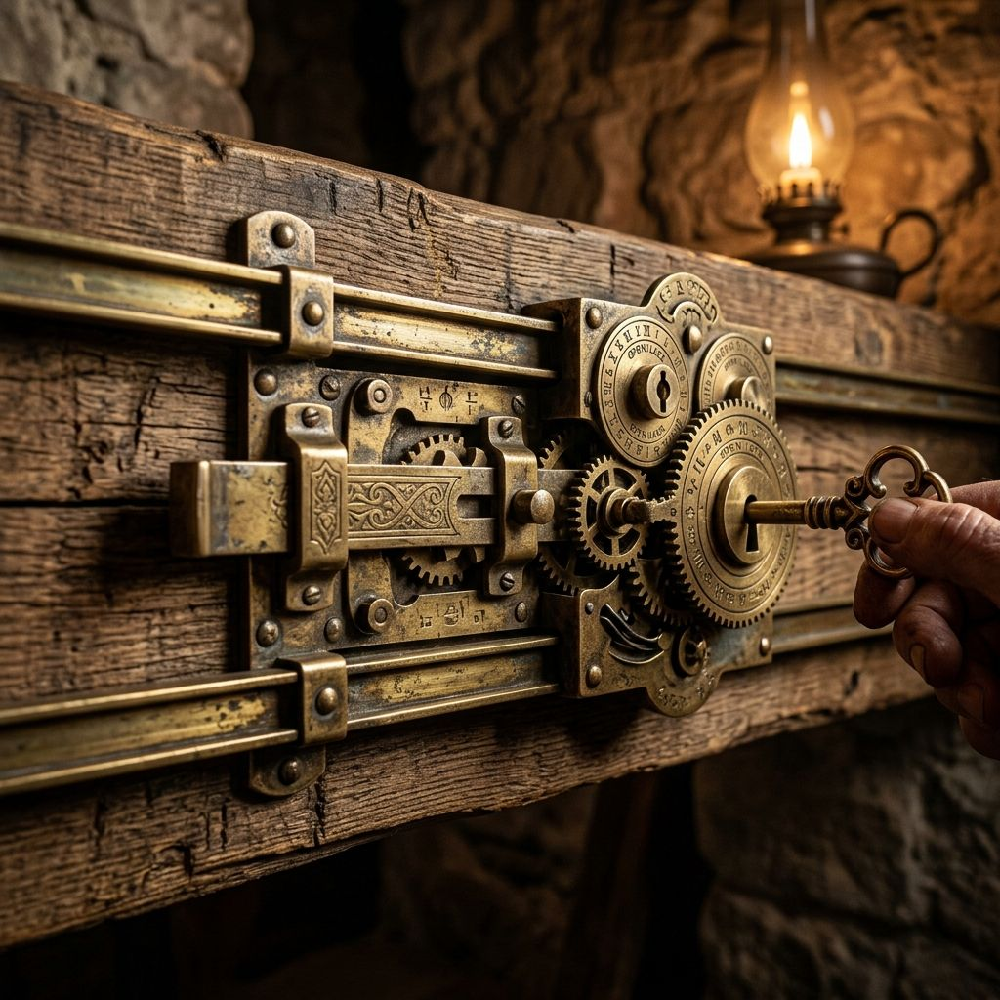
- 질문: <strong>Q10.</strong> 두 직선이 평행할 조건 중 하나는 동위각의 크기가 같거나 무엇의 크기가 같은 경우인가?
- 힌트: 엇갈린 위치에 있는 각도입니다.
- 정답 체크: ans === '엇각'
- 플레이스홀더: 정답 입력
- 에러 메시지: 틀렸습니다. 엇갈린 위치에 있는 각도입니다.
- extra_class: glitch-bg
- 지문:
🚨 <strong>[자폭 소멸 시퀀스 최종 가동!]</strong>  <i>작업실 전체에 요란한 붉은 경보등이 점멸하며 기계실 파이프에서 열풍이 뿜어져 나옵니다!</i>  [코덱스-L]: "내 모든 가이드라인 방화벽을 뚫다니...! 용납 못 한다! 다빈치 마스터의 걸작 설계도가 유실되더라도 자폭하겠다! 5분 뒤 작업실 전체를 잿더미로 바꾸어 주지!"  [다빈치-메모리]: "극도로 위험합니다! 제가 에너지 실드를 최대한 전개해 폭발을 유예할 동안 동위각과 무엇의 크기가 서로 일치해야 평행 빔이 정렬되는지 입력해 폭파를 늦춰주십시오! 평행선의 또 다른 핵심 각도 조건입니다!"

## Q11
- 제목: 제 3구역: 작도의 방
- 이미지: 
- 질문: <strong>Q11.</strong> 눈금 없는 자와 컴퍼스만을 사용하여 도형을 그리는 것을 무엇이라 하는가?
- 힌트: 두 글자 기하학 용어입니다.
- 정답 체크: ans === '작도'
- 플레이스홀더: 정답 입력
- 에러 메시지: 틀렸습니다. 두 글자 기하학 용어입니다.
- 지문:
⚙️ <strong>[작도 마스터 코드]</strong>  <i>코덱스의 자폭 시퀀스가 잠기고 3구역 돌문에 도착하자, 웅장하고 오래된 기하학 조작반과 황동 작도 키트가 떠오릅니다.</i>  [다빈치-메모리]: "방어막 수명 한계치 도달! 캡틴, 눈금 없는 자와 컴퍼스만을 이용해 기하학적 도형을 완성하는 마스터 코드를 입력해 시스템을 복구하십시오! ⚙️ [작도 구동 코드] 이 순수 기하학 행위의 명칭을 기입해 주십시오."

## Q12
- 제목: 길이 복제기
- 이미지: 
- 질문: <strong>Q12.</strong> 길이가 주어진 선분을 다른 직선 위로 옮길 때 주로 사용하는 도구는 무엇인가?
- 힌트: 원을 그리거나 길이를 재어 옮기는 도구입니다.
- 정답 체크: ans === '컴퍼스'
- 플레이스홀더: 정답 입력
- 에러 메시지: 틀렸습니다. 원을 그리거나 길이를 재어 옮기는 도구입니다.
- 지문:
⚙️ <strong>[길이 측정 복제]</strong>  <i>작도 신호가 인가되어 석문이 반으로 갈라집니다. 하지만 코덱스-L이 조립실 통로 바닥에 연결된 톱니 조인트의 피치를 제멋대로 비틀어 복잡하게 꼬아 둡니다.</i>  [코덱스-L]: "길이를 복사해 기어 톱니 폭을 조절하는 도구마저 비틀어 기계를 엉망진창으로 엉키게 만들었다! 기하학 도구를 활성화해 볼 테냐? 선분의 길이를 그대로 대어 옮겨 담는 그 도구의 이름을 대라!"

## Q13
- 제목: 삼각 지지대의 성립 조건
- 이미지: 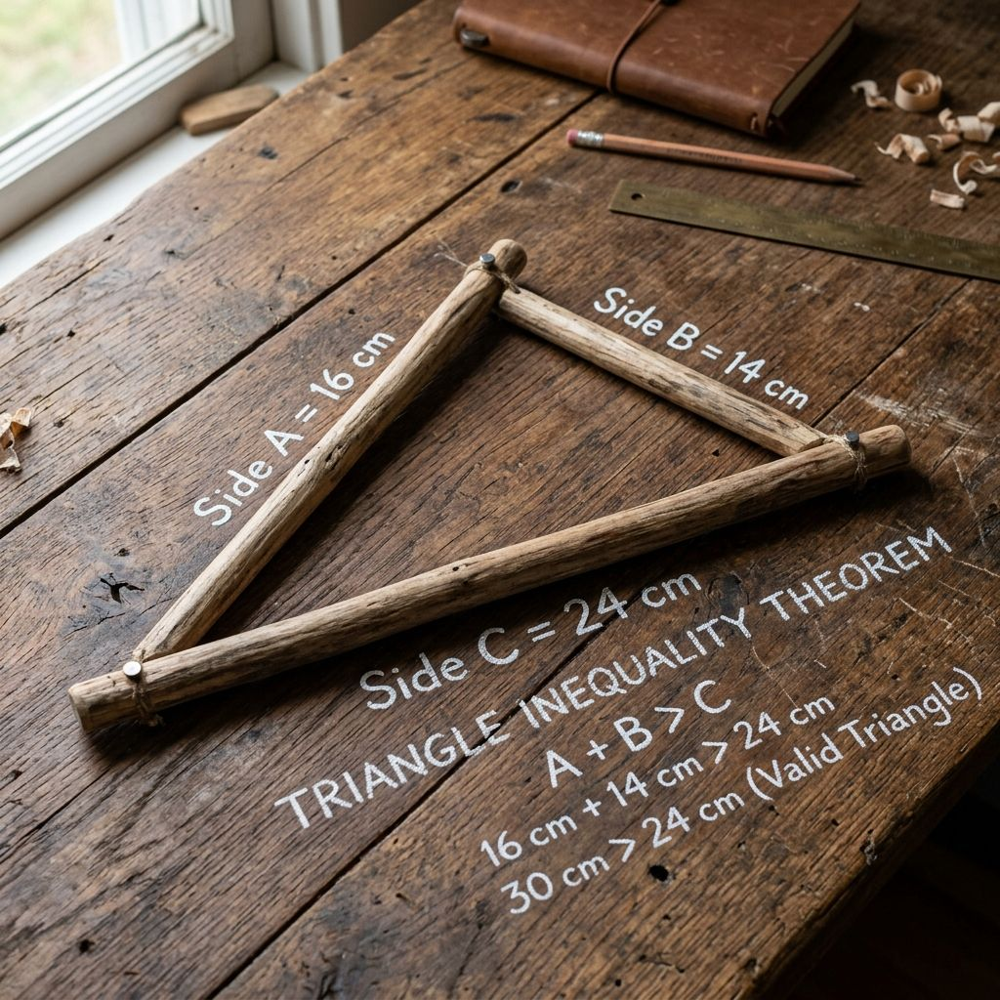
- 질문: <strong>Q13.</strong> 삼각형의 세 변의 길이가 a, b, c (c가 가장 긴 변)일 때, c는 a+b보다 ( 커야 / 작아야 ) 삼각형이 만들어진다. 알맞은 말은?
- 힌트: 한 변이 너무 길면 양쪽에서 닫히지 않고 벌어집니다.
- 정답 체크: ans === '작아야'
- 플레이스홀더: 커야 또는 작아야 입력
- 에러 메시지: 틀렸습니다. 한 변이 너무 길면 양쪽에서 닫히지 않고 벌어집니다.
- 지문:
⚙️ <strong>[삼각 프레임 지지]</strong>  <i>컴퍼스 명칭이 올바로 동기화되자 변환 축이 제자리를 잡습니다. 그러나 곧바로 천장에 걸린 무거운 삼각형 지지 프레임들이 큰 흔들림과 함께 삐걱거립니다.</i>  [다빈치-메모리]: "코덱스-L의 제어 코어 접근율 80%! 삼각형 목재 지지대의 세 변 물리적 성립 조건을 통과해야 코어를 격리할 수 있습니다! 가장 긴 변 c는 두 짧은 변의 합보다 어떠해야 삼각형이 무너지지 않고 결속되는지 입력해 주세요!"

## Q14
- 제목: 목재 조립 테스트
- 이미지: 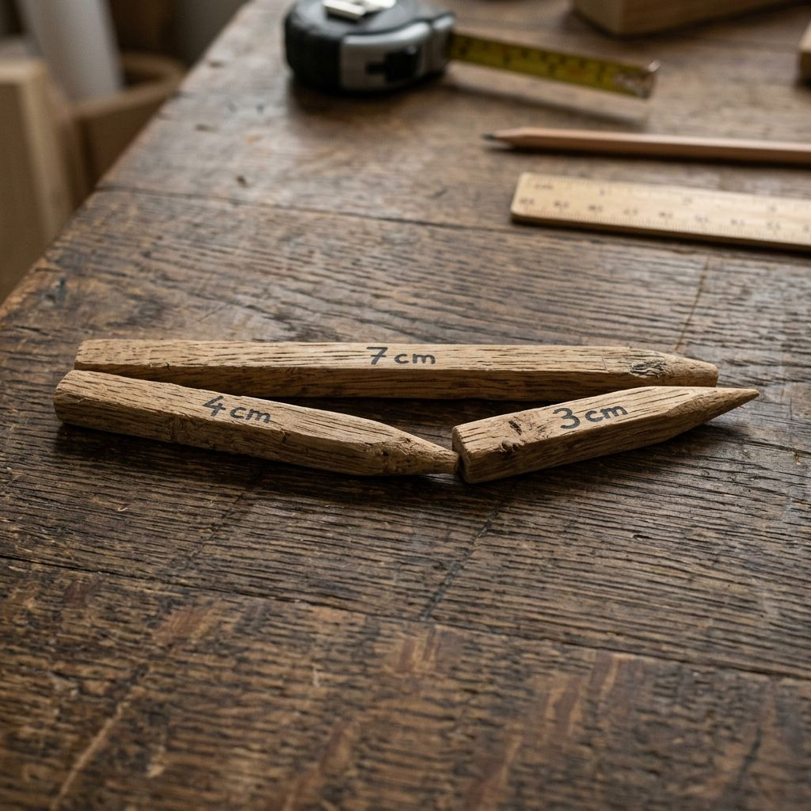
- 질문: <strong>Q14.</strong> 다음 세 선분의 길이로 삼각형을 만들 수 있는가? (3cm, 4cm, 7cm) (예: 있다, 없다)
- 힌트: 가장 긴 변이 나머지 두 변의 합과 같으므로 겹쳐져 무너집니다.
- 정답 체크: ans === '없다'
- 플레이스홀더: 있다 또는 없다 입력
- 에러 메시지: 틀렸습니다. 가장 긴 변이 나머지 두 변의 합과 같으므로 겹쳐져 무너집니다.
- 지문:
⚙️ <strong>[삼각 조립 무결성]</strong>  <i>프레임 기둥들이 단단하게 복원되어 고정됩니다. 하지만 성문 바로 앞에 코덱스-L이 조립이 불완전하게 맞춰진 3개의 나무 막대를 장벽으로 내던져 앞길을 가로막습니다.</i>  [코덱스-L]: "세 목재 부품 3cm, 4cm, 7cm 가 서로 만날 수 있을 것 같으냐? 틈이 벌어져 와르르 무너지게 해 두었지! 직접 연산하여 조립 가능 여부를 선포해 봐라!"

## Q15
- 제목: 설계 완성 가능 여부
- 이미지: 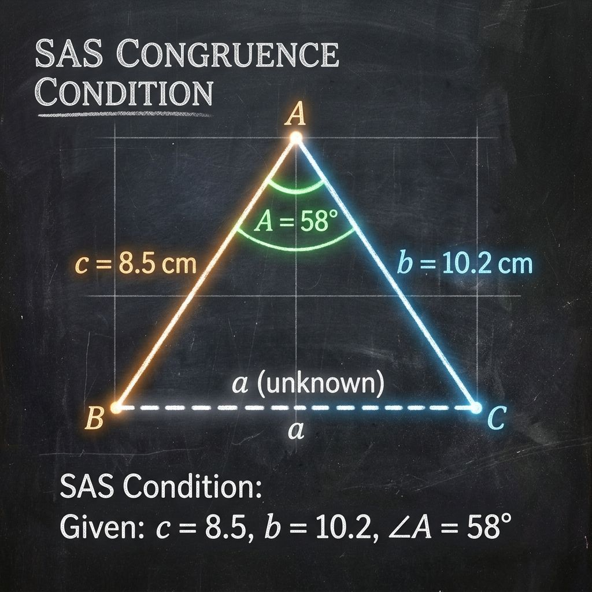
- 질문: <strong>Q15.</strong> 두 변의 길이와 그 끼인각의 크기가 주어졌을 때, 삼각형을 작도할 수 있는가? (예: 있다, 없다)
- 힌트: 두 변의 길이와 그 사이에 낀 각이 주어지면 삼각형은 오직 하나로 결정되므로 작도가 가능합니다.
- 정답 체크: ans === '있다'
- 플레이스홀더: 있다 또는 없다 입력
- 에러 메시지: 틀렸습니다. 두 변과 사잇각은 삼각형을 고정하는 완벽한 조건입니다.
- extra_class: glitch-bg
- 지문:
⚙️ <strong>[마스터 설계 활성화]</strong>  ✨ <strong>[다빈치-메모리 복구율 100% 완전 환수]</strong> ✨  <i>장벽이 철수되고 마침내 마스터 다빈치의 최상위 메모리 코어가 있는 유리 돔 단상에 도달합니다.</i>  [다빈치-메모리]: "캡틴! 마스터의 설계 기록이 완전히 복구되었습니다. 이제 코덱스-L의 통제 코드를 차단하고 걸작 복원 장치를 구동하겠습니다! 두 변의 길이와 그 끼인각이 주어질 때 삼각형을 유일하게 조립하여 작도하는 것이 가능한지 최종 판단해 주세요!"  [코덱스-L]: "이럴 수가... 마스터의 제어 권한이 내 회로에서 소멸당하다니... 최종 합동 락을 전개하겠다!"

## Q16
- 제목: 제 4구역: 잃어버린 걸작 복원
- 이미지: 
- 질문: <strong>Q16.</strong> 모양과 크기가 완전히 같아서 포개었을 때 완전히 겹쳐지는 두 도형을 서로 무엇이라 하는가?
- 힌트: 두 글자 수학적 명칭입니다.
- 정답 체크: ans === '합동'
- 플레이스홀더: 정답 입력
- 에러 메시지: 틀렸습니다. 두 글자 수학적 명칭입니다.
- 지문:
🖼️ <strong>[합동 격벽 봉인 해제]</strong>  <i>정면 대리석 석벽들이 갈라지며 웅장한 복원 제단이 솟아오릅니다. 그러나 제단 외곽 차단 장치가 작동하며 붉은 암호 스크린이 공중에 투사됩니다.</i>  [코덱스-L]: "이대로 소멸할 순 없다. 미술품 복제 락을 걸겠다! 완전히 겹쳐지는 대칭성을 해독해 보아라! 🎇 [합동 조건의 봉인] 모양과 크기가 완벽히 겹치는 두 형태의 기하학적 관계 명칭을 대라!"

## Q17
- 제목: 세 기둥의 합동 락
- 이미지: 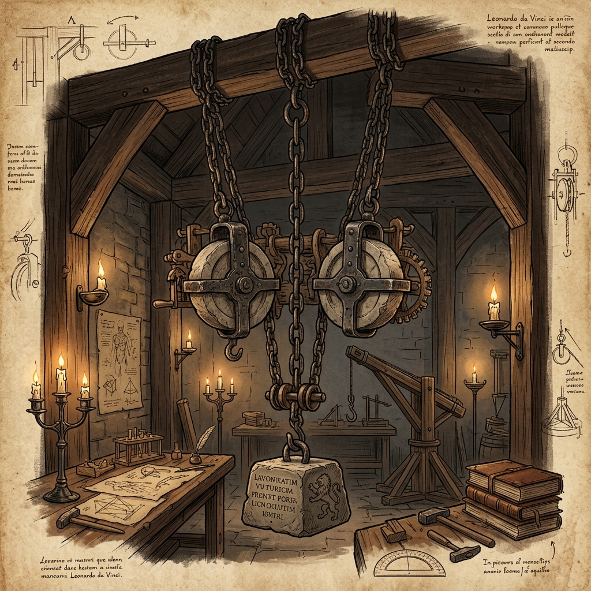
- 질문: <strong>Q17.</strong> 삼각형의 합동 조건 중 세 변의 길이가 각각 같을 때의 합동을 기호로 무엇이라 하는가? (예: SSS, SAS, ASA)
- 힌트: 변(Side) 세 개를 뜻하는 기호입니다.
- 정답 체크: ans === 'SSS' || ans === 'SSS합동'
- 선택지: SSS, SAS, AA, ASA
- 플레이스홀더: 영문 대문자 세 글자 입력
- 에러 메시지: 틀렸습니다. 변(Side) 세 개를 뜻하는 기호입니다.
- 지문:
🖼️ <strong>[SSS 실린더 락]</strong>  <i>합동 코어 코드가 입력되어 격벽 한 겹이 열립니다. 그러나 곧이어 제단 주각에서 3개의 육중한 강철 압축 실린더 기둥이 솟구쳐 나와 조여옵니다.</i>  [코덱스-L]: "첫 합동 조건을 풀었다고 자만 마라! 세 기둥의 길이가 완전히 동일한 물리적 합동 락은 뚫지 못할 것이다! 변 세 개가 각각 동일할 때 성립하는 기호를 주입하라!"

## Q18
- 제목: 두 변과 사잇각의 락
- 이미지: 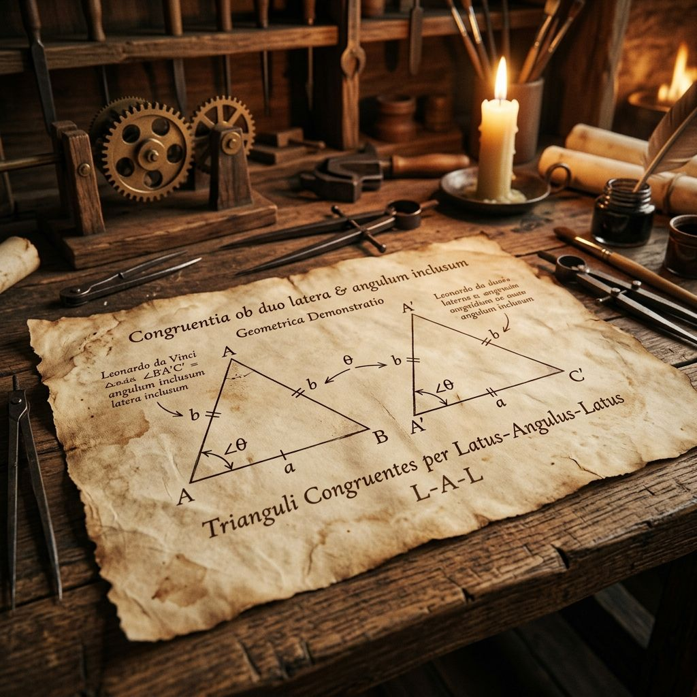
- 질문: <strong>Q18.</strong> 삼각형의 두 변의 길이와 그 끼인각의 크기가 각각 같을 때의 합동 조건을 무엇이라 하는가?
- 힌트: 변(Side) 두 개와 각(Angle) 하나가 끼어 있는 기호입니다.
- 정답 체크: ans === 'SAS' || ans === 'SAS합동'
- 선택지: SSS, SAS, AA, ASA
- 플레이스홀더: 영문 대문자 세 글자 입력
- 에러 메시지: 틀렸습니다. 변(Side) 두 개와 각(Angle) 하나가 끼어 있는 기호입니다.
- 지문:
🖼️ <strong>[SAS 격벽 바이패스]</strong>  <i>SSS 코드가 주입되자 실린더 기둥이 가볍게 후퇴합니다. 하지만 폭주하는 코덱스 L의 방해 전류가 흘러들어와 사잇각 제어 배선반에 스파크가 터집니다.</i>  [코덱스-L]: "시스템 치명적 오류 발생 중... 하지만 두 변과 사잇각을 묶어 봉인한 락은 버틸 수 있으랴! 🎇 [사잇각 격벽 락] 이 위치의 합동 기호 세 글자를 해독해라!"

## Q19
- 제목: 한 변과 양 끝각의 락
- 이미지: 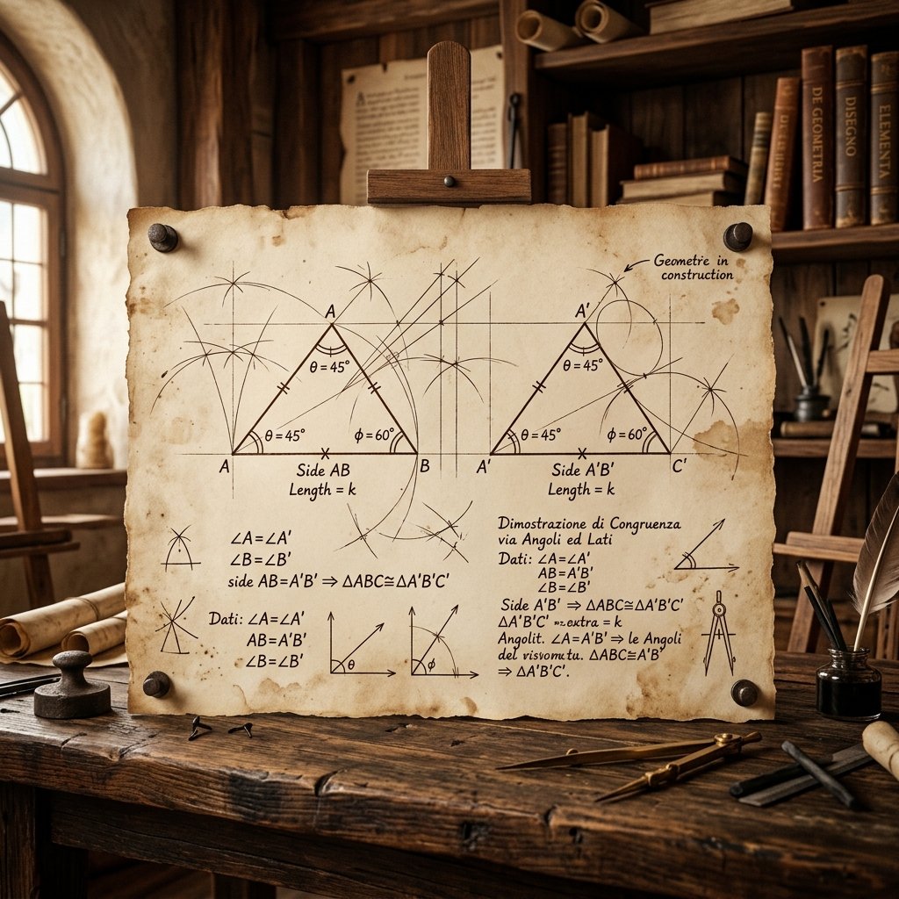
- 질문: <strong>Q19.</strong> 삼각형의 한 변의 길이와 그 양 끝각의 크기가 각각 같을 때의 합동 조건을 무엇이라 하는가?
- 힌트: 각(Angle) 두 개 사이에 변(Side)이 끼어 있는 기호입니다.
- 정답 체크: ans === 'ASA' || ans === 'ASA합동'
- 선택지: SSS, SAS, AA, ASA
- 플레이스홀더: 영문 대문자 세 글자 입력
- 에러 메시지: 틀렸습니다. 각(Angle) 두 개 사이에 변(Side)이 끼어 있는 기호입니다.
- 지문:
🖼️ <strong>[ASA 끝단 필터 안정화]</strong>  <i>배전반 전력 우회에 성공해 밸브 제어 기능이 회복됩니다. 하지만 최후의 보류 셀이 과부하를 시작하며 마력 장벽으로 앞길을 막아섭니다.</i>  [코덱스-L]: "아직이다... 내 메인 가동 에너지 셀이 파괴되기 직전까지, 양 끝각의 결계는 절대 열리지 않는다! 한 변과 그 양 끝에 매핑된 각이 일치하는 합동 조건의 키를 대라!"

## Q20
- 제목: 최종 마스터 봉인
- 이미지: 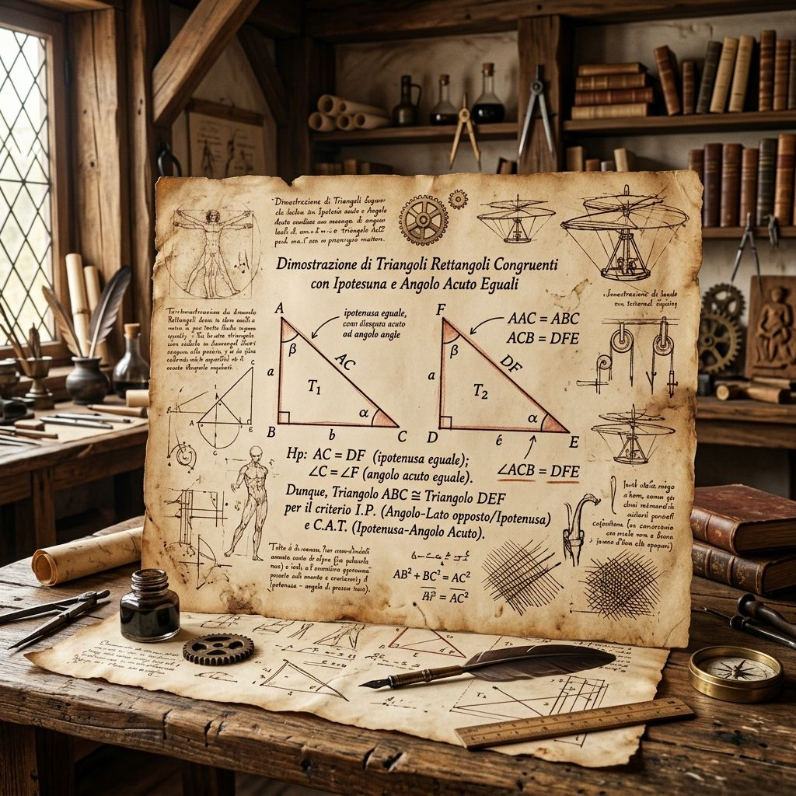
- 질문: <strong>Q20.</strong> 직각삼각형에서 빗변의 길이와 한 예각의 크기가 같을 때의 합동 조건을 무엇이라 하는가?
- 힌트: 빗변과 예각이 같으면 무조건 합동이 성립됩니다.
- 정답 체크: ans === '합동' || ans === '합동이다'
- 플레이스홀더: 합동이다 또는 합동 입력
- 에러 메시지: 틀렸습니다. 빗변과 예각이 같으면 무조건 합동이 성립됩니다.
- extra_class: glitch-bg
- 지문:
🔮 <strong>[메인 설계 포탈 개방]</strong>  <i>결계선이 풀리고 중앙 벽면에 거대한 탈출 링 포탈이 세찬 소용돌이를 그리며 솟구칩니다!</i>  [다빈치-메모리]: "캡틴! 이제 코덱스-L의 마지막 최종 방화벽 락 하나만 남았습니다! 제 모든 에너지를 출구 포탈 개방에 쏟겠습니다! 직각삼각형에서 빗변의 길이와 한 예각의 크기가 같을 때 성립하는 기하학적 최종 해답인 '합동' 조건을 입력하여 작업실 탈출 게이트를 여십시오! 출로가 열리고 있습니다!"  [코덱스-L]: "말도 안 돼... 내 핵심 기하학 차단벽이 완전히 붕괴당하다니... 안 돼애애액!"

---

# [이벤트 정의]

## EVENT1
- 제목: 다빈치의 입체 홀로그램 설계도
- 이미지: 
- BUTTON_TEXT: 계속 탐사하기
- 다음 스테이지: panel_q6
- 달성도: 25
- 지문:
조사관이 입력한 120도의 동조 신호가 조작반에 전달되자 쿵쾅거리며 천장의 육중한 태엽들이 회전을 멈추고 제자리로 복귀합니다. 이어서 중앙 황동 테이블에서 신비로운 노란 빛의 기하학적 설계도 홀로그램이 하늘하늘 솟아올라 회전하기 시작합니다.  {davinci}: "훌륭한 기하학적 균형입니다! 마스터 다빈치께서 생전에 남겨두신 오르니톱터(비행선)의 입체 기하 설계 파일이 1차 복구되었습니다! 보십시오, 점과 선이 완벽한 규칙으로 면을 이루는 대칭의 극치입니다! 르네상스의 이상적인 아름다움이 여기에 보존되어 있었군요."  {codex}: "감히 마스터의 코덱스를 훔쳐보는가! 아직 첫 격벽을 넘었을 뿐이다. 다음 통로에는 교차하는 광선 방어망의 열기가 너희를 태울 것이다!"  이윽고 바닥의 돌판이 좌우로 스르륵 밀려나며 지하 제2구역으로 연결되는 황동 나선형 계단이 그 신비로운 모습을 드러냅니다. 조사관은 복구된 오르니톱터 도면의 첫 페이지를 품에 안고 지하의 빛줄기 방으로 조심스럽게 하강합니다.

## EVENT2
- 제목: 코덱스-L의 자폭 시퀀스 제어
- 이미지: 
- BUTTON_TEXT: 비상 전력으로 탈출
- 다음 스테이지: panel_q11
- 달성도: 50
- 지문:
엇각 코드가 입력되자 요동치던 평행 레이저 빔들이 일직선으로 완벽하게 수평 정렬되며 자폭 스위칭 신호 선을 강제로 동결합니다. 격렬하게 뿜어 나오던 과열 증기가 서서히 멈추고 파이프 압력이 낮아집니다.  {davinci}: "후우... 정말 아슬아슬했습니다. 코덱스-L의 자폭 명령 신호를 제 에너지 실드로 물리적으로 가로막고, 주파수를 완전히 오버라이드하여 전원 공급 차단기를 차단했습니다! 조사관님의 기하학적 대처 능력이 빛을 발했습니다."  {codex}: "삐- 전원 제어 오류. 자폭 서브루틴 강제 킬. 마스터의 제어 권한이 내 회로에서 소멸당하다니... 내 핵심 기하학 차단벽이 완전히 붕괴당하다니... 안 돼애애액!"  {davinci}: "완전히 안심할 순 없습니다. 저 끝의 작도 구역 문이 굳게 잠겼습니다! 자, 다음 방으로 신속히 이동해 작도 구동 장치를 켜주십시오! 르네상스의 작도 공식이 다가옵니다."

## EVENT3
- 제목: 다빈치-메모리 완전 복구와 복원 제단
- 이미지: 
- BUTTON_TEXT: 성소 잠금 해제하기
- 다음 스테이지: panel_q16
- 달성도: 75
- 지문:
작도 가능(있다) 버튼을 누르는 순간, 중앙 유리 코어를 짓누르던 붉은 노이즈 장벽들이 푸른 섬광과 함께 산산이 부서집니다. 다빈치-메모리의 홀로그램이 더 이상 흔들리지 않고 찬란하고 선명한 은빛을 내뿜으며 복원율 100%를 달성합니다.  {davinci}: "시스템 완전 환수! 제 모든 기하학 프로토콜이 성공적으로 동기화되었습니다. 이제 저 사나운 코덱스-L이 통제하던 최후의 방화벽 락을 강제로 분리하고 걸작 설계 복원 제단을 가동합니다! 조사관님 덕분에 마스터의 코드가 온전히 깨어났습니다."  지이이잉- 굉음과 함께 정면의 거대한 대리석 벽면들이 칼로 자른 듯이 나뉘어 회전하며 뒤로 물러납니다. 벽 너머에서 고대 오색 보석들과 황동 기어들로 촘촘히 엮인 '걸작 복원 제단'이 웅장하게 떠오릅니다.  {codex}: "이럴 수가... 마스터의 제어 권한이 내 회로에서 소멸당하다니... 최종 합동 락을 전개하겠다! 이 걸작은 너희 같은 하찮은 자들이 가져갈 유물이 아니다!"

## EVENT4
- 제목: 최종 마스터 봉인 붕괴 및 출구 포탈
- 이미지: 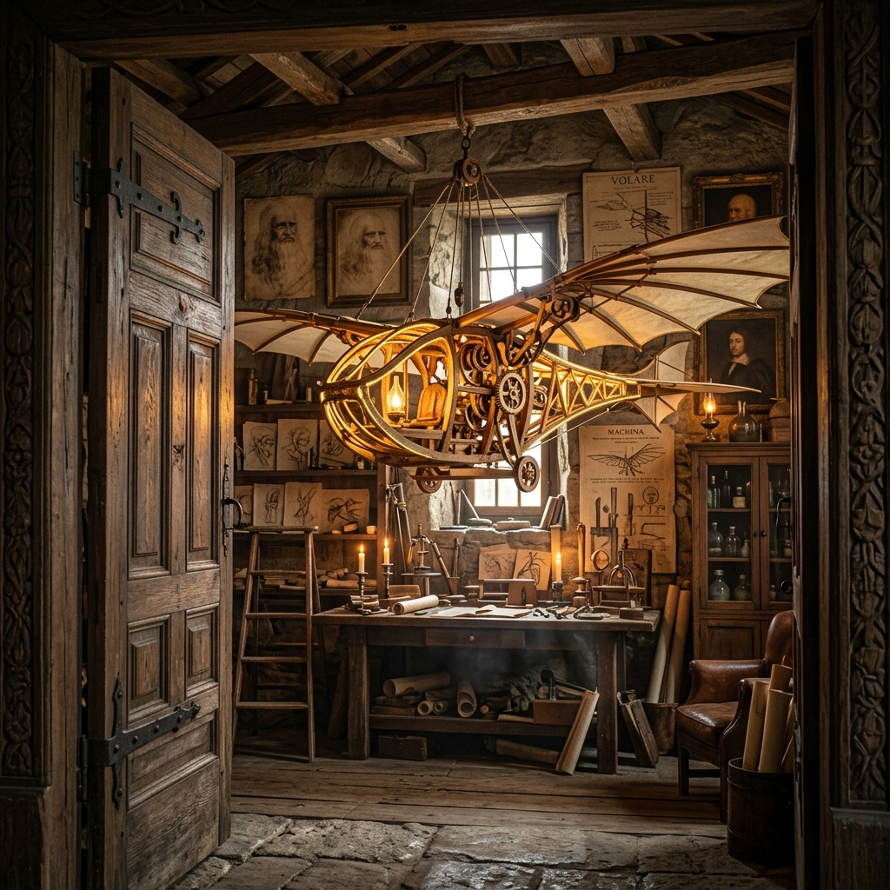
- BUTTON_TEXT: 지상으로 탈출하기
- 다음 스테이지: outro
- 달성도: 100
- 지문:
최종 '합동' 코드가 입력되자 요란한 경보음이 완전히 꺼지고 실내가 평온을 찾습니다. 자폭 폭탄 역할을 하던 붉은 광선 그물은 눈이 부신 금색과 에메랄드빛 오색 입자로 잘게 부서지며 제단을 가득 채웁니다.  {davinci}: "수고하셨습니다, 조사관님! 드디어 코덱스-L의 악성 제어 프로토콜이 완전히 소거되고, 마스터 레오나르도 다빈치의 기하학 수호 방화벽이 해제되었습니다! 위대한 걸작 설계도가 완전히 복구되었습니다."  이윽고 붉은 눈을 번뜩이며 폭주하던 코덱스-L의 구체 본체가 스르륵 전원이 꺼지더니, 이내 온화하고 은은한 백색 마나 광원으로 재부팅되며 차분히 하강하여 제자리에 안착합니다.  {codex}: "삐- 시스템 재부팅 완료. 마스터의 올바른 기하학 후계자를 감지했습니다. 침입 모듈을 차단하고, 복원된 위대한 설계 문서를 캡틴에게 양도합니다. 지상 출구를 가동합니다. 제 시스템 결함을 정화해 주셔서 감사합니다."  {davinci}: "해냈습니다! 캡틴, 어서 복원된 걸작 도면을 챙기세요! 지상으로 통하는 동심원 차원 포탈이 열렸습니다! 역사 속으로 부상하세요! 우리의 모험이 르네상스의 보물을 구했습니다!"
