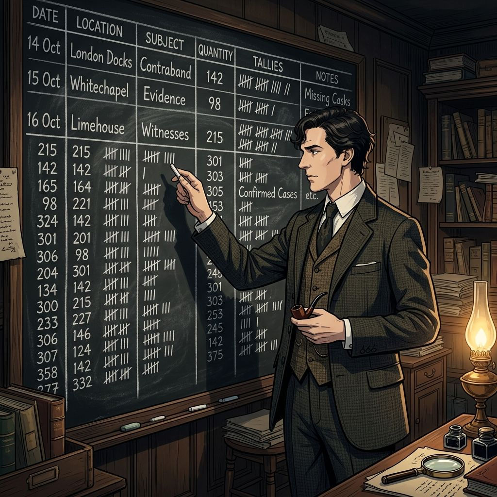
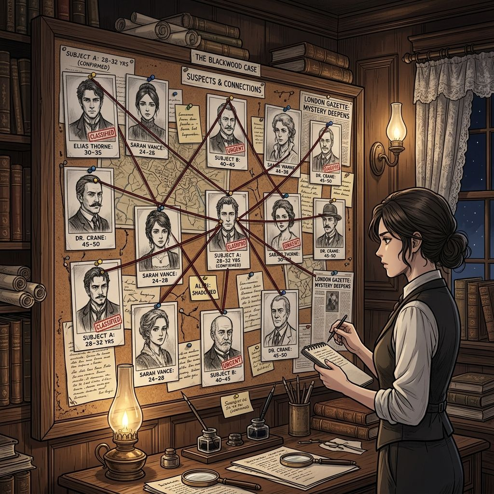
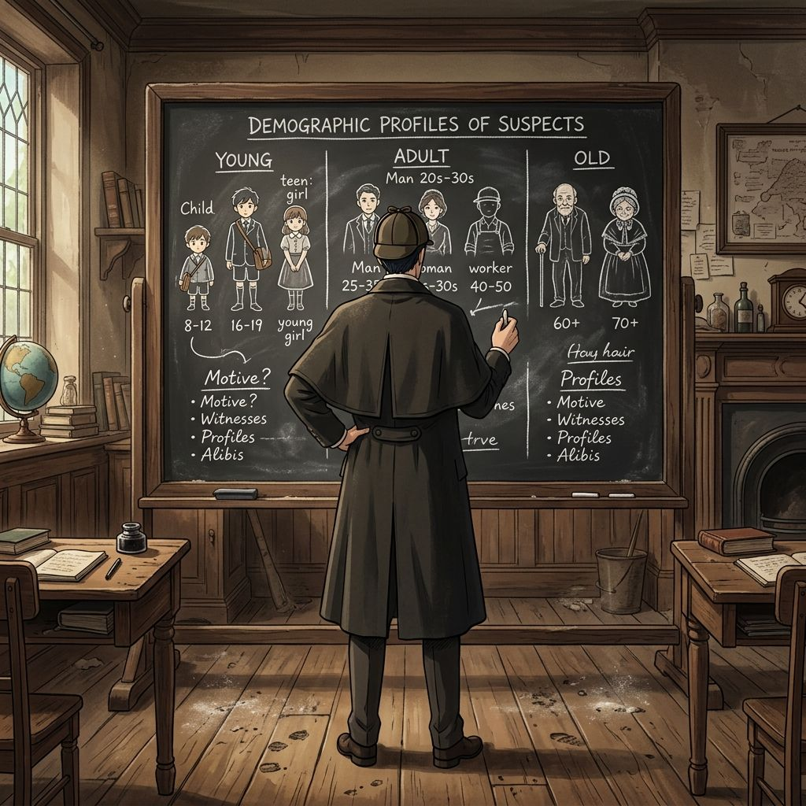

# 중1 8단원 대본집: Statistics

이 파일은 수학 방탈출 게임의 스토리 대사, 퀴즈 문항, 이벤트 씬 정보를 관리하는 원천 데이터 파일입니다.

---

# [이미지 매핑]
- intro: intro.png
- 1: q1.png
- 2: q2.png
- 3: q3.png
- 4: q4.png
- 5: q5.png
- 6: q6.png
- 7: q7.png
- 8: q8.png
- 9: q9.png
- 10: q10.png
- 11: q11.png
- 12: q12.png
- 13: q13.png
- 14: q14.png
- 15: q15.png
- 16: q16.png
- 17: q17.png
- 18: q18.png
- 19: q19.png
- 20: q20.png
- event1: event1.png
- event2: event2.png
- event3: event3.png
- event4: event4.png
- outro: outro.png

---

# [문항 정의]

## Q1
- 제목: 잎의 복원
- 이미지: 
- 질문: <strong>Q1. [줄기와 잎 그림]</strong> 위 자료를 줄기와 잎 그림으로 나타낼 때, 줄기가 2인 잎을 쉼표(,)로 구분하여 크기 순으로 모두 적으시오.
- 힌트: 줄기가 2인 데이터 변량들의 일의 자리 숫자들을 차례대로 나열해 줍니다.
- 정답 체크: ans === '3,4,7' || ans === '3, 4, 7' || ans === '347'
- 선택지: 3,4,7, 3,4,7 아님, 알 수 없음, 해 없음
- 플레이스홀더: 예: 3, 4, 7
- 에러 메시지: 장부 판독 실패! 잎을 다시 세십시오.
- 지문:
[범죄의 지배자 - 모리아티]: "크하하! 런던 통계국의 모든 차분기관 톱니바퀴 동력 장치는 내 손안에 있다! 셜록 홈즈의 풋내기 조수 녀석들이 감히 장부 보호 빗장을 뚫으려 하다니! 장부를 찢어 흩뜨려 놓겠다!"  <i>치이이- 스팀파이프에서 연기가 뿜어 나오며 통계 스크린에 깨진 데이터 테이블이 노출됩니다. 소매치기 발생 장부에서 줄기가 2인 잎의 목록을 순서대로 정렬해 전송해야 락이 해제됩니다.</i>  [존 H. 왓슨 - 왓슨]: "조사관님! 차분 기어의 수치가 엉키고 있습니다. 줄기가 2인 잎 데이터를 신속히 나열하여 정렬 다이얼을 가동해 주십시오!"

## Q2
- 제목: 변량 개수
- 이미지: 
- 질문: <strong>Q2. [변량의 개수]</strong> 위 자료에서 전체 변량의 개수는 몇 개인가?
- 힌트: 수집된 전체 데이터 샘플의 개수가 모두 몇 개인지 직접 세어 봅니다.
- 정답 체크: ans === '10' || ans === '10개'
- 선택지: 8, 10, 20, 12
- 플레이스홀더: 숫자 또는 개수 입력
- 에러 메시지: 변량 개수 불일치! 장부의 줄 수가 다릅니다.
- 지문:
[범죄의 지배자 - 모리아티]: "장부 데이터 왜곡 흔적을 겨우 한 줄 찾았을 뿐이다! 수집된 장부 상의 전체 변량 표본 개수가 어긋나면 차분기관의 놋쇠 기어가 역회전해 폭발하리라!"  <i>드르륵- 놋쇠 크랭크가 고속으로 맞물리며 마모 진동이 전달됩니다. 전체 변량 데이터 개수를 산출하십시오.</i>  [존 H. 왓슨 - 왓슨]: "놋쇠 기어가 과열되고 있습니다! 수집된 진짜 변량 표본의 개수를 구해 압력 방출 다이얼에 입력해 주십시오!"

## Q3
- 제목: 최대 분포 줄기
- 이미지: 
- 질문: <strong>Q3. [최다 잎 줄기]</strong> 위 자료에서 잎이 가장 많은 줄기는 무엇인가?
- 힌트: 줄기와 잎 그림에서 잎(오른쪽 숫자)의 개수가 가장 많이 늘어선 줄기 번호를 찾습니다.
- 정답 체크: ans === '2와3' || ans === '2,3' || ans === '2, 3'
- 선택지: 2와3, 2와3 아님, 알 수 없음, 해 없음
- 플레이스홀더: 예: 2, 3
- 에러 메시지: 탐색 실패! 잎의 최대 개수가 매칭되지 않습니다.
- 지문:
[범죄의 지배자 - 모리아티]: "오답 제출 시 밸브가 막히도록 세팅했다. 잎이 가장 집중 분포된 줄기 번호를 찾아내지 못한다면 증기 고압 가스가 방 안을 가득 메우리라!"  <i>쉬이이익- 증기 통제구 틈새로 뜨겁고 탁한 한증 기포가 새어 나오기 시작합니다. 잎의 밀도가 최고치인 줄기 번호들을 입력하여 차단하십시오.</i>  [존 H. 왓슨 - 왓슨]: "증기 가리개를 전개했습니다! 잎이 가장 많이 분포하는 핵심 줄기 코드를 입력하여 밸브를 격리 차단해 주십시오!"

## Q4
- 제목: 우범 구역 식별
- 이미지: 
- 질문: <strong>Q4. [조건 필터링]</strong> 소매치기 발생 건수가 30건 이상인 지역은 몇 곳인가?
- 힌트: 30 이상인 숫자(31, 31, 35, 42, 45)가 모두 몇 개인지 개수를 셉니다.
- 정답 체크: ans === '5' || ans === '5곳'
- 선택지: 10, 3, 7, 5
- 플레이스홀더: 숫자 또는 곳 입력
- 에러 메시지: 구역 필터링 개수가 달라 통신 오류가 발생합니다!
- 지문:
<strong>[차분 기어 조작 노이즈 발생]</strong>  [존 H. 왓슨 - 왓슨]: "치지직... 조사관님! 모리아티가 차분 기어를 조작하여 계산 종이 회전축을 비틀었습니다! 소매치기 다발 30건 이상 구역 개수를 식별해 제어용 수치 카드를 대입해야 합니다!"

## Q5
- 제목: 경미 지역 추적
- 이미지: 
- 질문: <strong>Q5. [순위 데이터]</strong> 소매치기 발생 건수가 적은 쪽에서 3번째인 지역의 건수는 얼마인가?
- 힌트: 데이터를 크기 순서대로 정렬했을 때 세 번째로 작은 건수 값을 찾습니다.
- 정답 체크: ans === '23' || ans === '23건'
- 선택지: 21, 23, 46, 25
- 플레이스홀더: 숫자 또는 건 입력
- 에러 메시지: 수치 불일치! 정렬 순서가 꼬였습니다.
- 지문:
🚨 <strong>[비상 로그: 동력 기판 과부하 위험]</strong> 🚨  [존 H. 왓슨 - 왓슨]: "과부하 경보 발생! 발생 건수가 하위 3번째에 위치한 표본 데이터를 확인하여, 동력 기판의 압력 제어 상수를 맞춰 주십시오!"  <i>파지직- 구리 연결판 주변에 불꽃이 튀며 경보 사이렌이 방 안을 난타합니다.</i>

## Q6
- 제목: 제2구역: 계급 분류
- 이미지: 
- 질문: <strong>Q6. [계급의 정의]</strong> 자료를 몇 개의 구간으로 나눌 때, 이 구간을 무엇이라 하는가?
- 힌트: 수집된 변량을 일정한 간격으로 나눈 구간을 가리키는 통계 용어입니다.
- 정답 체크: ans === '계급'
- 선택지: 계급, 계급 아님, 알 수 없음, 해 없음
- 플레이스홀더: 한글 단어 입력
- 에러 메시지: 기초 통계 용어 오류! 결계가 열리지 않습니다.
- 지문:
[범죄의 지배자 - 모리아티]: "놋쇠 동력 연결관을 수리하다니 성가신 녀석들! 하지만 용의자 연령 데이터를 일정한 단위로 토막 내어 숨겨둔 이 통계학적 구간의 명칭을 알고 있느냐?"  <i>철컥-! 콘솔 보드 상단에 슬롯 회전식 판독기가 조작 장치에서 솟아오릅니다.</i>  [존 H. 왓슨 - 왓슨]: "용의자 연령을 나누는 데이터 구간 용어를 입력해 슬롯 드럼을 회전시켜야 합니다!"

## Q7
- 제목: 도수의 정의
- 이미지: 
- 질문: <strong>Q7. [도수의 정의]</strong> 각 계급에 속하는 변량의 개수를 무엇이라 하는가?
- 힌트: 각 계급 구간에 속해 있는 자료(변량)의 개수를 의미하는 용어입니다.
- 정답 체크: ans === '도수'
- 선택지: 도수, 도수 아님, 알 수 없음, 해 없음
- 플레이스홀더: 한글 단어 입력
- 에러 메시지: 회전 기운 조절 오류! 올바른 한글 용어를 쓰십시오.
- 지문:
[범죄의 지배자 - 모리아티]: "계급 드럼을 돌렸나? 그렇다면 각 계급 세그먼트에 분류 매핑된 순수 용의자 머릿수(변량 수)를 지칭하는 진짜 통계 값을 대봐라!"  <i>드럼 슬롯이 빠른 기어 소리와 함께 다시 멈춰 서며 한글 암호 키 입력을 요합니다.</i>  [존 H. 왓슨 - 왓슨]: "각 계급 구간에 분포하는 표본의 수를 의미하는 핵심 한글 용어를 입력하십시오!"

## Q8
- 제목: 계급의 폭
- 이미지: 
- 질문: <strong>Q8. [계급의 크기]</strong> 계급의 너비(크기)는 얼마인가? (자료: 10대, 20대 식일 때의 너비)
- 힌트: 한 계급 구간의 너비(끝값 - 시작값)를 계산하여 단위를 포함하지 않은 값을 적습니다.
- 정답 체크: ans === '10' || ans === '10세'
- 선택지: 8, 10, 20, 12
- 플레이스홀더: 숫자만 입력
- 에러 메시지: 너비 부조화! 구간 세그먼트가 틀어졌습니다.
- 지문:
[범죄의 지배자 - 모리아티]: "나이 띠별 구간의 너비를 비틀었다. 용의자 연령대가 10대, 20대 등으로 묶여 있을 때, 이 통계 구조의 구간폭 크기는 얼마인지 산출해 기계 축을 고정해라!"  <i>기어 샤프트가 회전하며 흔들리고 있습니다. 정확한 구간 너비를 입력해 회전 진동을 축 상쇄해야 합니다.</i>  [존 H. 왓슨 - 왓슨]: "기어 축 손상 방지 가동! 계급 구간 크기의 숫자 수치를 빠르게 주입해 주십시오!"

## Q9
- 제목: 최대 나이 도수
- 이미지: 
- 질문: <strong>Q9. [최대 도수 계급]</strong> 도수가 가장 큰 계급은 어느 연령대인가? (자료: 10대: 4명, 20대: 8명, 30대: 5명, 40대: 3명)
- 힌트: 도수(인원수)가 8명으로 가장 많이 몰려 있는 나이대 계급을 찾습니다.
- 정답 체크: ans === '20대'
- 선택지: 20대, 20대 아님, 알 수 없음, 해 없음
- 플레이스홀더: 예: 20대
- 에러 메시지: 용의자 타겟팅 오류!
- 지문:
[범죄의 지배자 - 모리아티]: "나이 분포를 흔들어 스파이의 소속 연령을 숨겼다. 가장 많은 스파이 혐의자들이 분포한 다발적 나이대 계급을 검출해 봐라!"  <i>화면에 붉은색 막대 그래프 노이즈들이 급등락을 보이며 춤을 춥니다. 도수 분포가 압도적으로 높은 연령대 구간을 지명해야 합니다.</i>  [존 H. 왓슨 - 왓슨]: "모리아티 측 용의자들이 최다 포진한 연령대 계급 명칭을 입력 창에 전송하십시오!"

## Q10
- 제목: 청년 용의자 비율
- 이미지: 
- 질문: <strong>Q10. [백분율 계산]</strong> 나이가 30세 미만인 용의자는 전체의 몇 %인가? (단위 생략)
- 힌트: 30세 미만 인원수(4명 + 8명 = 12명)가 전체 20명 중에서 차지하는 비율을 백분율(%)로 계산합니다.
- 정답 체크: ans === '60' || ans === '60%'
- 선택지: 120, 62, 60, 58
- 플레이스홀더: 숫자만 입력
- 에러 메시지: 백분율 오차 발생! 차단 셔터 압력 증가!
- extra_class: glitch-bg
- 지문:
💥 <strong>[비상 경보: 보일러 증기압 폭발 시작!]</strong> 💥  [범죄의 지배자 - 모리아티]: "내 계산 엔진을 이렇게 깊이 헤집어 놓다니! 런던 통계국 지하의 원동기 보일러를 강제 자폭시키겠다! 5분 뒤 모두 증기 속에서 질식해 흩어지리라!"  <i>쿠구구궁- 압력 밸브 바늘이 위험 수치인 적색 대역으로 휘어지며 증기가 대량 분출됩니다. 30세 미만 용의자들의 백분율 비율 수치를 긴급 도출해 점화를 차단하십시오.</i>  [존 H. 왓슨 - 왓슨]: "비상! 증기압 해제 밸브 가동! 30세 미만 인원이 차지하는 전체 대비 백분율(%) 상수를 입력하십시오! 제가 압력 차단 패널로 폭발을 억제하고 있겠습니다!"

## Q11
- 제목: 제3구역: 히스토그램
- 이미지: 
- 질문: <strong>Q11. [히스토그램]</strong> 도수분포표를 바탕으로 가로축에 계급, 세로축에 도수를 나타내어 직사각형 모양으로 그린 그래프를 무엇이라 하는가?
- 힌트: 도수분포표를 바탕으로 가로에 계급, 세로에 도수를 매칭해 그린 직사각형 모양의 그래프 명칭입니다.
- 정답 체크: ans === '히스토그램'
- 플레이스홀더: 한글 그래프 이름 입력
- 에러 메시지: 그래프 타입 인식 불가능!
- 지문:
[존 H. 왓슨 - 왓슨]: "보일러 폭발 지연 성공! 하지만 배출용 증기 노즐이 아직 불완전하게 동축 얽혀 있습니다! ⚙️ [기둥형 장부 그림 정렬]"  <i>가로축에 계급, 세로축에 도수를 세워 설계한 고대 차분기관의 정밀 분포 직사각형 그래프 명칭을 입력해 필터를 여십시오.</i>

## Q12
- 제목: 가로폭의 속성
- 이미지: 
- 질문: <strong>Q12. [히스토그램 가로]</strong> 히스토그램에서 직사각형의 가로의 길이는 무엇을 의미하는가?
- 힌트: 도수분포표의 각 직사각형의 가로폭이 나타내는 계급의 간격 크기를 의미합니다.
- 정답 체크: ans === '계급의크기' || ans === '계급의 크기' || ans === '계급의너비' || ans === '계급의 너비'
- 플레이스홀더: 예: 계급의 크기
- 에러 메시지: 가로 기둥 정렬 에러!
- 지문:
[존 H. 왓슨 - 왓슨]: "좋습니다, 그래프 채널을 잡았으나 기둥들의 밑바닥 폭 너비 비례값이 뒤흔들리고 있습니다! ⚙️ [가로폭 눈금 보정]"  <i>지지직- 모니터 상의 직사각형 가로폭 수치가 고유 통계적 물리 속성을 나타내도록 해당 물리 명칭을 입력창에 정확히 기술해 주십시오.</i>

## Q13
- 제목: 넓이의 총합
- 이미지: 
- 질문: <strong>Q13. [히스토그램 넓이 공식]</strong> 히스토그램에서 직사각형의 넓이의 합은 (계급의 크기) × ( ? ) 이다. ?에 들어갈 알맞은 말은?
- 힌트: 모든 직사각형의 넓이 합 공식은 (계급의 크기) * (도수의 총합) 입니다.
- 정답 체크: ans === '도수의총합' || ans === '도수의 총합' || ans === '도수의합' || ans === '도수의 합'
- 플레이스홀더: 한글 단어 입력
- 에러 메시지: 넓이 총합 불일치! 차분기관 가동 정지 경보!
- 지문:
[존 H. 왓슨 - 왓슨]: "동력원 85% 결합 도달! 이제 모든 직사각형 넓이의 면적 총합을 연산하여 기어 조율기 수치에 대입해야 합니다!"  <i>직사각형 넓이의 총합 공식을 정의하기 위해, 계급의 크기에 곱해져야 하는 핵심 통계 합산 단어를 밸런서에 전송하십시오.</i>

## Q14
- 제목: 다각형 그래프
- 이미지: 
- 질문: <strong>Q14. [도수분포다각형]</strong> 히스토그램의 각 직사각형 윗변의 중점을 차례로 선분으로 연결한 그래프를 무엇이라 하는가?
- 힌트: 히스토그램의 각 직사각형 윗변의 중점들을 선분으로 이어 꺾은선 모양으로 만든 다각형 그래프입니다.
- 정답 체크: ans === '도수분포다각형'
- 플레이스홀더: 한글 그래프 이름 입력
- 에러 메시지: 꺾은선 궤적 연결 오류!
- 지문:
[존 H. 왓슨 - 왓슨]: "훌륭합니다! 이제 윗변의 중점들을 모조리 꺾은선으로 팽팽하게 당겨 묶어 잔류 궤적 노이즈를 완벽하게 격리 통제해야 합니다!"  <i>중점들을 이은 녹색 다각형 선분 그래프가 생성됩니다. 이 통계 그래프의 풀 네임을 새겨 넣어 기어를 동기화하십시오.</i>

## Q15
- 제목: 넓이의 동등성
- 이미지: 
- 질문: <strong>Q15. [넓이의 성질]</strong> 도수분포다각형과 가로축으로 둘러싸인 부분의 넓이는 히스토그램의 직사각형들의 넓이의 합과 어떠한가?
- 힌트: 도수분포다각형과 가로축이 만드는 면적은 히스토그램 전체 직사각형 넓이의 합과 항상 같은 성질을 가집니다.
- 정답 체크: ans === '같다'
- 플레이스홀더: 같다 또는 다르다 입력
- 에러 메시지: 면적 불균형! 공간 붕괴 위험!
- extra_class: glitch-bg
- 지문:
✨ <strong>[차분기관 작동 권한 100% 완전 환수]</strong> ✨  [존 H. 왓슨 - 왓슨]: "해독 대조 완료! 런던 통계국 차분기관의 작동 권한을 제가 완벽히 장악했습니다! 이제 모리아티의 조작 수치 카드들을 차분기관에서 제거하겠습니다. 다각형과 히스토그램의 면적 비례 관계를 입력하십시오!"  <i>스팀 콘솔 화면들이 일제히 차분하고 투명한 민트색 황동 프레임 조명으로 돌아옵니다.</i>  [범죄의 지배자 - 모리아티]: "말도 안 돼... 내 조작 장치들이 연산 기어에서 모조리 제거당하다니... 상대도수 균형 빗장으로 마지막 저지를 시도하겠다!"

## Q16
- 제목: 제4구역: 상대도수
- 이미지: 
- 질문: <strong>Q16. [상대도수의 정의]</strong> 각 계급의 도수를 도수의 총합으로 나눈 비율을 무엇이라 하는가?
- 힌트: 각 계급의 도수가 전체 도수 총합 중에서 차지하는 상대적인 비율을 뜻하는 용어입니다.
- 정답 체크: ans === '상대도수'
- 플레이스홀더: 한글 단어 입력
- 에러 메시지: 가중치 데이터 로드 불가!
- 지문:
[범죄의 지배자 - 모리아티]: "상대도수 비율 빗장이다! 전체 총합에서 특정 계급 도수가 차지하는 물리적 상대적 비율 값을 뜻하는 용어를 해독해 봐라!"  <i>가동 판독기 스크린에 비율 환산 다이얼 판 필드가 활성화되며 한글 키워드를 스캔하기 시작합니다.</i>

## Q17
- 제목: 상대도수 계산
- 이미지: 
- 질문: <strong>Q17. [상대도수 계산]</strong> 어떤 계급의 도수가 15, 도수의 총합이 50일 때, 이 계급의 상대도수를 구하시오. (소수로 기재)
- 힌트: 특정 계급 도(15)를 전체 도수(50)로 나눈 비율을 소수 값으로 계산합니다.
- 정답 체크: ans === '0.3'
- 플레이스홀더: 예: 0.5
- 에러 메시지: 오차 발생! 기계 증기가 더 짙어집니다.
- 지문:
[범죄의 지배자 - 모리아티]: "용의자 도수 15명, 도수 총합 50명일 때 해당하는 비율 소수 눈금 수치를 계산해 전송해라!"  <i>지이잉- 차분 기어가 흔들리며 미세 전압의 조정을 위해 정확한 소수 해를 놋쇠 눈금 창에 입력해야 합니다.</i>

## Q18
- 제목: 상대도수의 총합
- 이미지: 
- 질문: <strong>Q18. [상대도수 총합]</strong> 상대도수의 총합은 항상 얼마인가?
- 힌트: 상대적인 비율들의 총합은 항상 전체를 뜻하는 고정된 자연수 값이 나옵니다.
- 정답 체크: ans === '1'
- 플레이스홀더: 숫자만 입력
- 에러 메시지: 한계선 수치 초과! 시스템 잠금!
- 지문:
[범죄의 지배자 - 모리아티]: "상대적인 비율 조각들을 모두 주워 모아 봤자, 그 총합의 한계 상수는 정해져 있을 터!"  <i>보안 격벽의 수량 안전 레버 센서가 작동을 대기합니다. 모든 상대도수를 합쳐 나오는 고정 불변의 총합 상수를 입력하십시오.</i>

## Q19
- 제목: 분포 상태 비교
- 이미지: 
- 질문: <strong>Q19. [상대도수의 활용]</strong> 상대도수는 도수의 총합이 다른 두 집단의 분포 상태를 비교할 때 어떠한가? (유용하다 / 불필요하다)
- 힌트: 조사 대상의 전체 총인원수가 서로 다른 두 집단의 성적이나 선호도를 비율로 공평하게 비교할 때의 유용성 여부를 생각합니다.
- 정답 체크: ans === '유용하다'
- 플레이스홀더: 유용하다 또는 불필요하다 입력
- 에러 메시지: 비교 기어 작동 불능!
- 지문:
[범죄의 지배자 - 모리아티]: "총합 규모가 상이한 두 용의자 집단의 분포 비교를 비율 없이 단순 머릿수(도수)로 감당할 수 있겠느냐!"  <i>두 표본 집단의 크기가 어긋나 스크린에 경고 문구가 교차 점멸합니다. 상대도수가 비교 분석 도구로써 갖는 실질적 활용성 선언을 입력해 분석 엔진을 가동하십시오.</i>

## Q20
- 제목: 범인 도수 산출
- 이미지: 
- 질문: <strong>Q20. [도수 구하기]</strong> 상대도수가 0.2이고 전체 도수가 40명일 때, 이 계급의 도수를 구하시오.
- 힌트: (전체 인원 40명) * (상대도수 비율 0.2)를 곱하여 해당 계급의 실제 인원수를 계산합니다.
- 정답 체크: ans === '8' || ans === '8명'
- 플레이스홀더: 숫자만 입력
- 에러 메시지: 지목 실패! 스파이가 안개 속으로 도망칩니다!
- extra_class: glitch-bg
- 지문:
🔮 <strong>[최종 보안 격벽 전면 해제 작동]</strong> 🔮  [존 H. 왓슨 - 왓슨]: "조사관님! 이제 눈앞의 런던 통계국 메인 탈출용 비밀 나선 계단만 남았습니다! 제 마지막 백업 기어 동력을 계단 개방에 집중하겠습니다! 전체 40명의 통계 요원 중 상대도수 비율이 0.2를 기록한 진범 스파이 도수(인원수)를 정확히 지목해 락을 해제하십시오! 스파이를 검거할 시간입니다!"  [범죄의 지배자 - 모리아티]: "이럴 수가... 내 완벽한 조작 장부 수치 카드 조각들이... 전면 소거 정지당하다니... 끄아아앗!"

---

# [이벤트 정의]

## EVENT1
- 제목: 동력 기어 가동
- 이미지: 
- 버튼 텍스트: 계속 전진하기
- 다음 스테이지: panel_q6
- 달성도: 25
- 지문:
수많은 톱니바퀴 락이 해제되며 동력 기어가 맞물려 돌아가기 시작합니다.

[범죄의 지배자 - 모리아티]: "좋습니다! 1차 결계 동력 충전이 완료되었습니다. 어서 다음 격벽으로 부상하세요!"

## EVENT2
- 제목: 비상 차단 장치 리셋
- 이미지: 
- 버튼 텍스트: 비상 전력 가동
- 다음 스테이지: panel_q11
- 달성도: 50
- 지문:
코어실의 과열 증기가 멈추며 비상 리셋 시퀀스가 완료됩니다.

[범죄의 지배자 - 모리아티]: "후우... 기지 온도가 하강합니다. 정밀 매니퓰레이터 기어축이 올바르게 락인되었습니다. 다음 3구역으로 돌입합시다!"

## EVENT3
- 제목: 핵심 복원 제단 활성화
- 이미지: 
- 버튼 텍스트: 제단 활성화
- 다음 스테이지: panel_q16
- 달성도: 75
- 지문:
웅장한 돌벽이 좌우로 나뉘어 회전하며 보석 박힌 복원 제단이 솟구칩니다.

[범죄의 지배자 - 모리아티]: "100% 동기화 성공! 이제 기하학의 모든 비밀이 이 제단에 기입됩니다. 빌런인 존 H. 왓슨 - 왓슨의 최종 마스터 락에 도전하십시오!"

## EVENT4
- 제목: 탈출 차원 포탈 개방
- 이미지: 
- 버튼 텍스트: 지상으로 탈출
- 다음 스테이지: outro
- 달성도: 100
- 지문:
최종 합동 결계가 붕괴하고 지상으로 향하는 신비로운 황금 동심원 포탈이 소용돌이칩니다.

[범죄의 지배자 - 모리아티]: "탈출 게이트가 열렸습니다! 어서 걸작 설계도를 챙겨 포탈로 도약하십시오!"

[존 H. 왓슨 - 왓슨]: "기하학적 무결성을 인정한다... 마스터의 후계자여, 무사 탈출하라."