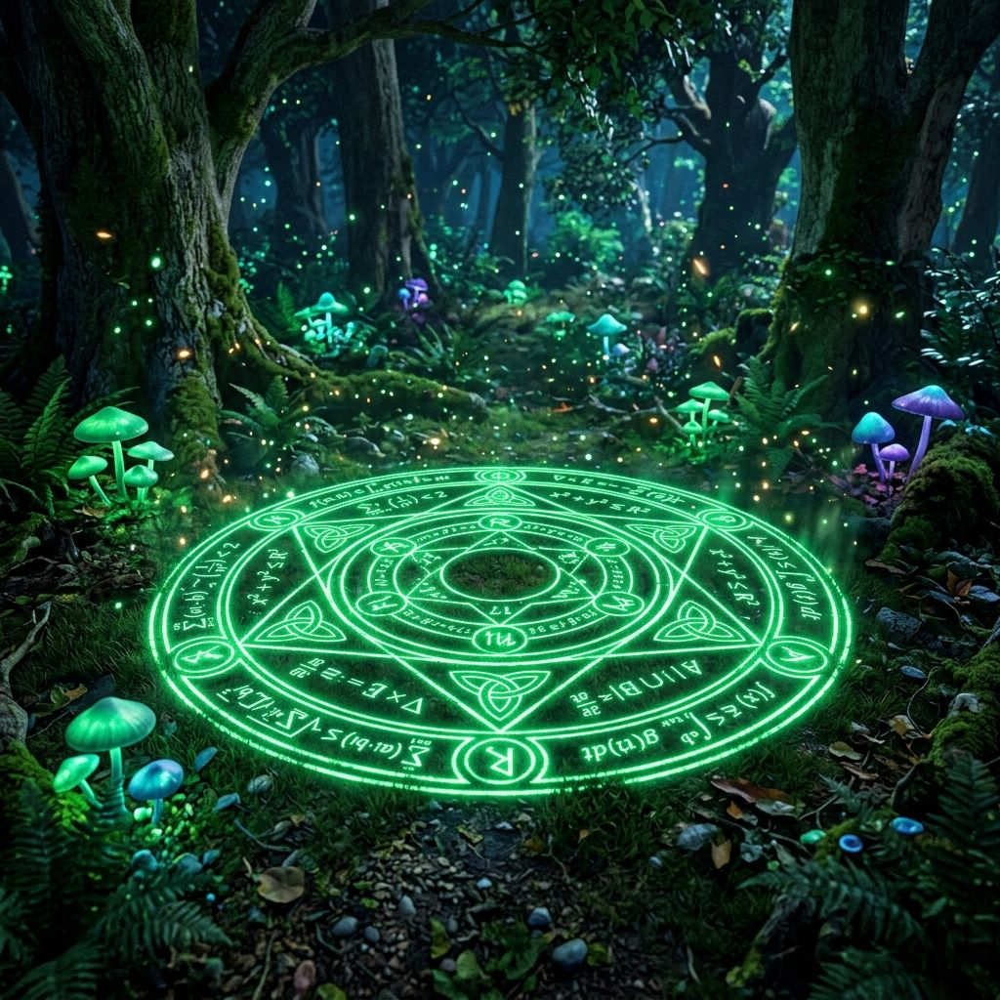

# 중2 3단원 대본집: Inequalities

이 파일은 수학 방탈출 게임의 스토리 대사, 퀴즈 문항, 이벤트 씬 정보를 관리하는 원천 데이터 파일입니다.

---

# [이미지 매핑]
- intro: intro.png
- 1: q1.png
- 2: q2.png
- 3: q3.png
- 4: q4.png
- 5: q5.png
- 6: q6.png
- 7: q7.png
- 8: q8.png
- 9: q9.png
- 10: q10.png
- 11: q11.png
- 12: q12.png
- 13: q13.png
- 14: q14.png
- 15: q15.png
- 16: q16.png
- 17: q17.png
- 18: q18.png
- 19: q19.png
- 20: q20.png
- event1: event1.png
- event2: event2.png
- event3: event3.png
- event4: event4.png
- outro: outro.png

---

# [문항 정의]

## Q1
- 제목: 마법 저울의 눈금
- 이미지: 
- 질문: <strong>Q1. [부등식의 표시]</strong> $x$는 3보다 크거나 같다를 부등호로 나타내시오.
- 힌트: 
- 정답 체크: ans === 'X>=3' || ans === 'X\GE3'
- 선택지: X>=3, X>=3 아님, 알 수 없음, 해 없음
- 플레이스홀더: 예: x>=3
- 에러 메시지: 저울 측정 실패! 바늘이 격렬하게 흔들립니다.
- 지문:
[다크-엘프]: "하찮은 침입자여! 요정 숲의 마력 저울에 칠흑의 불균형 봉인을 걸었다. 너희가 이 부등식의 경계를 올바르게 판정해 낼 것 같으냐?"  <i>쿠구구궁- 이끼 낀 고대 돌탁자 위에 거대한 천칭 마법 저울이 솟아오르며 한쪽으로 요란하게 기웁니다. 저울의 경계선을 맞추어 제어 핀을 배치해야 합니다.</i>  [실프-F]: "요정 숲의 에너지 밸런스를 잡기 위해, 'x는 3보다 크거나 같다'의 기하학 부등호 수식을 콘솔에 입력하십시오! 첫 장벽을 무너뜨려야 합니다!"

## Q2
- 제목: 저울의 해 찾기
- 이미지: 
- 질문: <strong>Q2. [부등식의 해]</strong> 다음 중 $x=2$가 해인 부등식은? (1) $2x - 1 &lt; 0$ (2) $3x \ge 6$ (3) $-x &gt; 0$
- 힌트: 
- 정답 체크: ans === '(2)' || ans === '2' || ans === '②'
- 선택지: $2x, $3x, $-x
- 플레이스홀더: 예: (2) 또는 2
- 에러 메시지: 오답 입력! 저울이 한쪽으로 요동칩니다.
- 지문:
[다크-엘프]: "우연히 저울을 굴렸군. 하지만 진짜 마력 해를 지목하지 못한다면, 오염된 연쇄 전류가 네놈들을 순식간에 휘감아 버릴 것이다!"  <i>저울 바닥의 이끼들이 검게 타들어가며 보라색 노이즈 스파크가 사방으로 튑니다. 보기 중 x=2가 참이 되는 완벽한 해를 골라 다이얼을 정렬해 주십시오.</i>  [실프-F]: "조사관님! $x=2$가 성립하는 정합 부등식 번호를 짚어 에너지 폭주를 상쇄하십시오!"

## Q3
- 제목: 미만의 눈금 조율
- 이미지: 
- 질문: <strong>Q3. [미만의 정의]</strong> $x$는 5 미만이다를 부등호로 나타내시오.
- 힌트: 
- 정답 체크: ans === 'X<5'
- 선택지: X<5, X<5 아님, 알 수 없음, 해 없음
- 플레이스홀더: 예: x<5
- 에러 메시지: 부등호 방향 오류! 기류가 흐트러집니다.
- 지문:
[다크-엘프]: "마법 저울의 지지 한도를 비틀어 두었다. 5에 채 미치지 못하고 부스러질 필멸자 녀석들!"  <i>천장에서 검은 마력 안개가 자욱하게 뿜어져 나오며 시야를 뿌옇게 가리기 시작합니다.</i>  [실프-F]: "안개가 시야를 갉아먹고 있습니다! 'x는 5 미만이다'의 부등식 기호를 정밀하게 조율해 안개 포트를 정화하십시오!"

## Q4
- 제목: 자연수 해 결합
- 이미지: 
- 질문: <strong>Q4. [조건을 만족하는 해]</strong> 부등식 $x + 2 &lt; 5$ 를 만족하는 자연수 $x$를 모두 구하시오.
- 힌트: 
- 정답 체크: ans === '1,2' || ans === '1,2개' || ans === '1과2'
- 플레이스홀더: 예: 1,2
- 에러 메시지: 조합 실패! 마법석이 어두워집니다.
- 지문:
<strong>[마법 장벽 역류 및 노이즈 발생]</strong>  [실프-F]: "치지직... 조사관님! 다크-엘프가 저울 통신선을 차단하고 방해 코드를 심었습니다! ⚙️ [자연수 해의 판별]  저울 수식 $x + 2 &lt; 5$ 를 만족하는 진짜 자연수 해를 쉼표로 나열하여 방해 코드를 무력화하십시오!"

## Q5
- 제목: 한계 질량 구하기
- 이미지: 
- 질문: <strong>Q5. [해의 최대값]</strong> 부등식 $2x \le 8$ 을 만족하는 가장 큰 정수를 구하시오.
- 힌트: 
- 정답 체크: ans === '4' || ans === '4개'
- 플레이스홀더: 예: 4
- 에러 메시지: 질량 초과! 저울 리미터가 울립니다.
- 지문:
<strong>[제단 돌벽 하강 경보]</strong>  [실프-F]: "치지직... 제어 회로 복구율 45%! 위에서 떨어지는 돌판의 한계 질량이 부등식 $2x \le 8$ 에 연동되어 내려오고 있습니다! 이를 만족하는 최대 정수 값을 입력해 돌벽의 하강을 저지해 주십시오!"

## Q6
- 제목: 저울의 덧셈 성질
- 이미지: 
- 질문: <strong>Q6. [부등식의 성질 1]</strong> $a &lt; b$ 일 때, $a + 2$ 와 $b + 2$ 의 대소를 비교하시오.
- 힌트: 
- 정답 체크: ans === 'A+2<B+2' || ans === 'B+2>A+2'
- 플레이스홀더: 예: a+2<b+2
- 에러 메시지: 평형 오류! 저울 받침대가 삐걱거립니다.
- 지문:
[다크-엘프]: "자연수를 넘어서 기하학적 저울의 절대 대칭 성질을 건드렸다. 양변에 똑같은 질량을 얹었을 때의 수평 관계를 예측할 수 있을까?"  <i>저울 좌우 플레이트에서 청색 불꽃이 피어오릅니다. 양변에 똑같이 2를 더해 대칭시켰을 때의 대소 관계식을 정확히 선언해야 합니다.</i>  [실프-F]: "제2구역 저울 성질 동조화입니다! $a &lt; b$ 일 때, $a+2$ 와 $b+2$ 의 정합 관계식을 입력해 주십시오!"

## Q7
- 제목: 저울의 곱셈 성질
- 이미지: 
- 질문: <strong>Q7. [부등식의 성질 2]</strong> $a &lt; b$ 일 때, $3a$ 와 $3b$ 의 대소를 비교하시오.
- 힌트: 
- 정답 체크: ans === '3A<3B' || ans === '3B>3A'
- 플레이스홀더: 예: 3a<3b
- 에러 메시지: 에너지 증폭 이상! 스파크가 튑니다.
- 지문:
[다크-엘프]: "더하기 정도는 상식이로군. 그렇다면 양변의 크기를 동시에 3배로 팽창시켰을 때는 어떨까? 거대해진 저울의 균형추가 흔들려 으스러지리라!"  <i>황동 천칭이 기괴한 마찰음을 내며 더 무겁게 삐걱거리기 시작합니다.</i>  [실프-F]: "에너지가 3배로 팽창했습니다! 양수 3을 곱했을 때의 새로운 부등식 기호 $3a$ 와 $3b$ 의 관계를 록 패널에 새기십시오!"

## Q8
- 제목: 음수 곱셈의 반전
- 이미지: 
- 질문: <strong>Q8. [부등식의 성질 3]</strong> $a &lt; b$ 일 때, $-2a$ 와 $-2b$ 의 대소 관계를 부등호로 나타내시오.
- 힌트: 
- 정답 체크: ans === '-2A>-2B' || ans === '-2B<-2A'
- 플레이스홀더: 예: -2a>-2b
- 에러 메시지: 반전 에러! 저울이 균형을 완전히 잃고 기울어집니다.
- 지문:
[다크-엘프]: "크크크... 진짜 지옥은 지금부터다. 음의 기류를 흘려보내 저울의 방향을 통째로 꼬아버리겠다!"  <i>파지직- 저울대에 어두운 보랏빛 마력이 흘러들어가며, 바늘의 방향 지시가 정반대로 요동치기 시작합니다.</i>  [실프-F]: "비상! 음수 -2가 곱해지면서 부등식 에너지의 방향이 틀어졌습니다! $-2a$ 와 $-2b$ 의 올바른 대소 관계를 역연산해 입력하십시오!"

## Q9
- 제목: 방향 반전 법칙
- 이미지: 
- 질문: <strong>Q9. [부등호의 핵심 법칙]</strong> 음수를 곱하거나 나눌 때 부등호의 방향은 어떻게 되는가?
- 힌트: 
- 정답 체크: ans === '바뀐다' || ans === '변한다' || ans === '바뀜'
- 플레이스홀더: 바뀐다 또는 그대로다 입력
- 에러 메시지: 법칙 위반! 숲의 정령들이 길을 막습니다.
- 지문:
[다크-엘프]: "방향이 바뀐다는 원리를 알았다면, 이 음수 나눗셈의 절대 규칙을 단답형 단어로 증명해 봐라! 기하학의 금기를 어길 수 있을쏘냐!"  <i>천장 덩굴들이 촉수처럼 뻗어 나와 출구를 단단히 틀어막습니다.</i>  [실프-F]: "조사관님! 음수를 곱하거나 나눌 때 부등호의 성질이 어떻게 변하는지, 세 글자의 핵심 선언 단어를 주입하여 덩굴을 후퇴시키십시오!"

## Q10
- 제목: 음수 나눗셈의 완성
- 이미지: 
- 질문: <strong>Q10. [음수 나눗셈 연습]</strong> $-3x &gt; 9$ 양변을 -3으로 나누면 부등식은 어떻게 되는가?
- 힌트: 
- 정답 체크: ans === 'X<-3'
- 선택지: X<-3, X<-3 아님, 알 수 없음, 해 없음
- 플레이스홀더: 예: x<-3
- 에러 메시지: 부호 오류! 2구역 탈출 밸브가 차단됩니다.
- extra_class: glitch-bg
- 지문:
💥 <strong>[비상 로그: 숲의 마력 코어 자폭 포맷 가동!]</strong> 💥  [다크-엘프]: "더는 참을 수 없군! 모든 고대 숲의 데이터를 파괴하고 시스템을 리셋하겠다! 5분 뒤 이 일대의 모든 마나 셀이 자폭 개시하리라!"  <i>위이이잉- 경보 룬 문자들이 주위 벽면에서 붉게 깜빡이며 진동하기 시작합니다. 음수 나눗셈 부등식 수치 $-3x > 9$ 를 풀어 락을 정지시켜야 합니다.</i>  [실프-F]: "비상! 노심 열량 임계치 돌파! 양변을 -3으로 나눈 최종 부등식 해를 전송하십시오! 제가 정화 배리어를 최대로 작동시켜 지연시키겠습니다!"

## Q11
- 제목: 마법진 1차 해제
- 이미지: 
- 질문: <strong>Q11. [기초 부등식 풀이]</strong> 일차부등식 $2x - 4 &gt; 0$ 의 해를 구하시오.
- 힌트: 
- 정답 체크: ans === 'X>2'
- 선택지: X>2, X>2 아님, 알 수 없음, 해 없음
- 플레이스홀더: 예: x>2
- 에러 메시지: 마법 해제 실패! 마법진이 붉게 점멸합니다.
- 지문:
[실프-F]: "후... 자폭 유예 시간 3분 확보! 하지만 아직 3구역의 숲 정화 마법진 록들이 가로막고 있습니다! ⚙️ [일차부등식 1단계]"  <i>콘솔 상단의 이끼 낀 돌 마법진의 틈새로 부등식 $2x - 4 > 0$ 포트가 빛납니다. 이 식을 이항 연산한 정확한 해를 주입하십시오.</i>

## Q12
- 제목: 마법진 2차 해제
- 이미지: 
- 질문: <strong>Q12. [이항 계산]</strong> 일차부등식 $3x + 1 \le 7$ 의 해를 구하시오.
- 힌트: 
- 정답 체크: ans === 'X<=2' || ans === 'X\LE2'
- 선택지: X<=2, X<=2 아님, 알 수 없음, 해 없음
- 플레이스홀더: 예: x<=2
- 에러 메시지: 이항 연산 미스! 결합 에너지가 소멸됩니다.
- 지문:
[실프-F]: "1단계 록 해제 성공! 다음 2단계는 상수 이항의 정확성을 체크합니다! ⚙️ [이항과 부등호 유지]"  <i>파랑색 마나 기류가 부등식 $3x + 1 \le 7$ 의 이항 정합 각도를 요구합니다. 해를 계산해 전송하십시오.</i>

## Q13
- 제목: 양변 이항 결합
- 이미지: 
- 질문: <strong>Q13. [복합 이항]</strong> 일차부등식 $5x - 2 &lt; 3x + 8$ 의 해를 구하시오.
- 힌트: 
- 정답 체크: ans === 'X<5'
- 선택지: X<5, X<5 아님, 알 수 없음, 해 없음
- 플레이스홀더: 예: x<5
- 에러 메시지: 이항 부호 에러! 에너지 균형이 흐트러집니다.
- 지문:
[실프-F]: "정화 마법진 복구율 80%! 양변의 미지수와 상수를 각각 정방향 이항 결합하여 정화 빔을 발사해야 합니다! ⚙️ [양변 이항 정리]"  <i>마법진 중앙에 $5x - 2 < 3x + 8$ 의 기하학 도식이 회전하며, x의 참 범위를 밸런서에 대기시킵니다.</i>

## Q14
- 제목: 음수 계수 이항
- 이미지: 
- 질문: <strong>Q14. [음수 계수 이항]</strong> 일차부등식 $-2x + 5 \ge x - 4$ 의 해를 구하시오.
- 힌트: 
- 정답 체크: ans === 'X<=3' || ans === 'X\LE3'
- 선택지: X<=3, X<=3 아님, 알 수 없음, 해 없음
- 플레이스홀더: 예: x<=3
- 에러 메시지: 반전 연산 실패! 마법진 온도가 급격히 올라갑니다.
- 지문:
[실프-F]: "이제 정화 마법진 마지막 3단계입니다! 음수 계수의 복합 연산 코드를 전송하십시오! ⚙ [최종 계수 반전 제어]"  <i>지이잉- 마법진의 메인 차단막 슬롯이 멈추며 부등식 $-2x + 5 \ge x - 4$ 의 최종 해를 매핑할 준비를 합니다.</i>

## Q15
- 제목: 괄호 마법진 돌파
- 이미지: 
- 질문: <strong>Q15. [괄호가 있는 부등식]</strong> 일차부등식 $2(x - 1) &gt; 4$ 의 해를 구하시오.
- 힌트: 
- 정답 체크: ans === 'X>3'
- 선택지: X>3, X>3 아님, 알 수 없음, 해 없음
- 플레이스홀더: 예: x>3
- 에러 메시지: 괄호 분배 오류! 마법진이 비상 셧다운 모드로 돌입합니다.
- extra_class: glitch-bg
- 지문:
✨ <strong>[실프-F 요정 제단 권한 100% 완전 복구]</strong> ✨  [실프-F]: "해독 완료, 조사관님! 숲의 메인 룬 제단 통제권을 완벽하게 환수했습니다! 이제 다크-엘프의 검은 기류를 차단합니다. 괄호가 적용된 부등식 $2(x - 1) &gt; 4$ 의 해를 주입하여 락을 파쇄하십시오!"  <i>제단 중앙에 아름다운 에메랄드빛 마나 분수가 솟구치며 주변의 검은 가스가 일제히 소멸합니다.</i>  [다크-엘프]: "내 핵심 룬 제어 락이 무너지다니...! 최종 실생활 억제 사슬로 숲의 중심부에 가두어 주마!"

## Q16
- 제목: 연속하는 자연수 씨앗
- 이미지: 
- 질문: <strong>Q16. [자연수 응용]</strong> 연속하는 두 자연수의 합이 15보다 크다고 할 때, 이를 만족하는 가장 작은 두 자연수를 구하시오.
- 힌트: 
- 정답 체크: ans === '8,9' || ans === '8과9'
- 플레이스홀더: 예: 8,9
- 에러 메시지: 수치 조합 오류! 씨앗 공급 장치가 걸립니다.
- 지문:
[다크-엘프]: "생명의 숲을 재생시키는 자연수의 씨앗 조화비를 알아맞히지 못하면, 싹조차 틔우지 못하고 고사하리라!"  <i>바닥의 씨앗 분배기 함이 어긋나며 쇠마찰음을 냅니다. 연속하는 두 자연수의 합이 15보다 큰 최소 조합을 입력창에 정확히 대십시오.</i>

## Q17
- 제목: 장미 꽃잎 제단
- 이미지: 
- 질문: <strong>Q17. [식 세우기]</strong> 한 송이에 800원인 장미 $x$송이와 1000원짜리 포장을 하여 전체 비용을 6000원 이하로 하려고 한다. 부등식을 세우시오.
- 힌트: 
- 정답 체크: ans === '800X+1000<=6000' || ans === '800X+1000\LE6000'
- 선택지: 800X+1000<=6000, 800X+1000<=6000 아님, 알 수 없음, 해 없음
- 플레이스홀더: 예: 800x+1000<=6000
- 에러 메시지: 부등식 기호 불일치! 제단의 마법 빛이 사그라듭니다.
- 지문:
[다크-엘프]: "제단의 가중 밸런서를 흐트러뜨렸다. 한 송이 800원짜리 장미 x송이와 포장비 1000원을 더해 6000원 한도를 초과하지 않는 제단 예산 부등식을 완성해 봐라!"  <i>장미꽃 제단의 황동 저울 밸브가 위험 수위로 가파르게 돌아갑니다. 정확한 한도 식을 입력창에 투사하십시오.</i>

## Q18
- 제목: 장미의 최대 송이
- 이미지: 
- 질문: <strong>Q18. [최대값 구하기]</strong> Q17 조건에서 장미는 최대 몇 송이까지 살 수 있는가?
- 힌트: 
- 정답 체크: ans === '6' || ans === '6송이'
- 플레이스홀더: 예: 6 또는 6송이
- 에러 메시지: 꽃잎 수량 한계 초과! 저울이 균형을 잃습니다.
- 지문:
[다크-엘프]: "식을 세웠다 한들, 한도 내에서 제단에 최대로 바칠 수 있는 장미 수량을 오차 없이 계수해 올리지 못하면 마법 제단이 무너지리라!"  <i>부등식을 만족하는 장미의 실질적 최대 송이수를 다이얼 창에 입력해 예산 장벽을 여십시오.</i>

## Q19
- 제목: 동생의 저금 역전
- 이미지: 
- 질문: <strong>Q19. [실생활 활용]</strong> 몇 개월 후부터 동생의 저금액이 형의 저금액보다 많아지는지 구하시오.
- 힌트: 
- 정답 체크: ans === '11' || ans === '11개월' || ans === '11개월후'
- 플레이스홀더: 예: 11 또는 11개월
- 에러 메시지: 연도 계산 오류! 이자가 바닥납니다.
- 지문:
[다크-엘프]: "시간이 갈수록 쌓여가는 형제의 저금 에너지 역전 공식이다! 동생이 형보다 부등식 상으로 자금이 많아지는 시점을 연산해 낼 수 있겠느냐!"  <i>형 20000원(매월 2000원 저금), 동생 10000원(매월 3000원 저금) 조건의 역전 개월 상수를 계산하십시오!</i>

## Q20
- 제목: 생명의 숲 최소 면적
- 이미지: 
- 질문: <strong>Q20. [최종 면적 구하기]</strong> 요정 숲의 남은 면적은 최소 얼마 초과인가?
- 힌트: 
- 정답 체크: ans === '30' || ans === '30초과'
- 플레이스홀더: 숫자만 또는 초과 입력 (예: 30)
- 에러 메시지: 정화 범위 미달! 숲 전체가 봉인 모드로 잠겨버립니다!
- extra_class: glitch-bg
- 지문:
🔮 <strong>[최종 탈출 요정 포탈 해제]</strong> 🔮  [실프-F]: "조사관님! 이제 숲의 사막 바깥 지상으로 통하는 마지막 고대 포탈 게이트만 남았습니다! 제 마지막 정령 에너지를 기압 단자에 집중하겠습니다! 요정 숲의 활성화 최소 면적 초과 수치를 입력해 포탈 게이트를 여십시오! 이제 숲으로 돌아갈 시간입니다!"  [다크-엘프]: "안 돼... 내 최종 어둠의 결계가... 완전히 해제당해 정지한다아앗!"

---

# [이벤트 정의]

## EVENT1
- 제목: 동력 기어 가동
- 이미지: 
- 버튼 텍스트: 계속 전진하기
- 다음 스테이지: panel_q6
- 달성도: 25
- 지문:
수많은 톱니바퀴 락이 해제되며 동력 기어가 맞물려 돌아가기 시작합니다.

[일차부등식 1단계]: "좋습니다! 1차 결계 동력 충전이 완료되었습니다. 어서 다음 격벽으로 부상하세요!"

## EVENT2
- 제목: 비상 차단 장치 리셋
- 이미지: 
- 버튼 텍스트: 비상 전력 가동
- 다음 스테이지: panel_q11
- 달성도: 50
- 지문:
코어실의 과열 증기가 멈추며 비상 리셋 시퀀스가 완료됩니다.

[일차부등식 1단계]: "후우... 기지 온도가 하강합니다. 정밀 매니퓰레이터 기어축이 올바르게 락인되었습니다. 다음 3구역으로 돌입합시다!"

## EVENT3
- 제목: 핵심 복원 제단 활성화
- 이미지: 
- 버튼 텍스트: 제단 활성화
- 다음 스테이지: panel_q16
- 달성도: 75
- 지문:
웅장한 돌벽이 좌우로 나뉘어 회전하며 보석 박힌 복원 제단이 솟구칩니다.

[일차부등식 1단계]: "100% 동기화 성공! 이제 기하학의 모든 비밀이 이 제단에 기입됩니다. 빌런인 자연수 해의 판별의 최종 마스터 락에 도전하십시오!"

## EVENT4
- 제목: 탈출 차원 포탈 개방
- 이미지: 
- 버튼 텍스트: 지상으로 탈출
- 다음 스테이지: outro
- 달성도: 100
- 지문:
최종 합동 결계가 붕괴하고 지상으로 향하는 신비로운 황금 동심원 포탈이 소용돌이칩니다.

[일차부등식 1단계]: "탈출 게이트가 열렸습니다! 어서 걸작 설계도를 챙겨 포탈로 도약하십시오!"

[자연수 해의 판별]: "기하학적 무결성을 인정한다... 마스터의 후계자여, 무사 탈출하라."