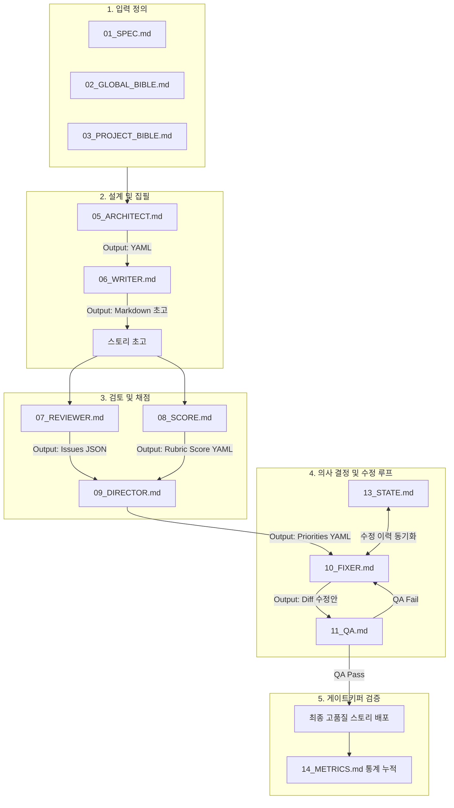

# 04_PIPELINE - 스토리 제작 파이프라인 규격서 (Story Pipeline Specification)

이 문서는 스토리 제작 시스템의 각 에이전트 간 데이터 흐름, 실행 프로세스, 입력 및 출력 형식의 약속(Data Contract)을 기술합니다. 파이프라인은 설정 붕괴를 예방하고 일관성 있게 피드백을 축적하며 고도화될 수 있도록 설계되었습니다.

---

## 1. 파이프라인 데이터 흐름도 (Mermaid)



---

## 2. 에이전트 입출력 데이터 규격 (Output Contracts)

파이프라인이 정상 동작하기 위해 각 에이전트는 아래 정의된 형식으로만 결과를 출력해야 합니다.

### [05_ARCHITECT] 설계 데이터 규격
- **형식**: `YAML`
- **스키마**:
```yaml
world:
  time_limit: "40분"
  background: "세계관 설명 문장"
characters:
  player:
    name: "이름"
    role: "역할"
    tone: "말투/특징"
  npc:
    - name: "조력자 이름"
      personality: "성격"
villain:
  name: "악역 이름"
  motivation: "행동 동기"
plot:
  introduction: "도입부 요약"
  conflict: "핵심 갈등"
  twist: "서사적 반전"
  ending: "결말 요약"
puzzle_layout:
  - zone: "Q1~Q5"
    puzzle_concept: "퍼즐 배치 및 수학 연결 콘셉트"
```

### [06_WRITER] 초고 데이터 규격
- **형식**: `Markdown`
- **규격**:
  - 각 대사는 3줄(약 120자) 이하로 구성.
  - 퍼즐 출제 전후의 상황 변화가 극적으로 묘사되어야 함.
  - `# Scene [번호]` 형태로 장면 분할.

### [07_REVIEWER] 리뷰 데이터 규격
- **형식**: `JSON`
- **스키마**:
```json
[
  {
    "scene_id": 3,
    "category": "puzzle" | "drama" | "student",
    "issue": "문제점 설명 요약",
    "reason": "구체적인 원인 분석"
  }
]
```

### [08_SCORE] 정량 평가 규격
- **형식**: `YAML`
- **스키마**:
```yaml
metrics:
  next_scene_curiosity: 10 # 다음 장면 기대감
  engagement_sustainability: 10 # 몰입 지속도
  player_empathy: 10 # 주인공 응원도
  twist_predictability: 10 # 반전 예측 가능성 (낮을수록 고득점)
  math_integration: 10 # 수학 연결 자연스러움
  character_differentiation: 10 # 캐릭터 차별성
  scene_diversity: 10 # 장면 다양성
  educational_value: 10 # 교육 효과
total_score: 80 # 80점 만점
overall_comment: "종합 평가 문장"
```

### [09_DIRECTOR] 오더 시트 규격
- **형식**: `YAML`
- **스키마**:
```yaml
must_fix:
  - issue_id: 1
    target_scene: 3
    priority_reason: "필수 수정 사유"
should_fix:
  - issue_id: 2
    target_scene: 5
    priority_reason: "권장 수정 사유"
ignore:
  - issue_id: 3
    target_scene: 2
    priority_reason: "무시 가능 사유"
```

### [10_FIXER] 수정안 규격
- **형식**: `Diff Block`
- **규격**:
```diff
<<<<<<< ORIGINAL SCENE 3
[기존 대사 및 묘사 내용]
=======
[개선된 대사 및 묘사 내용]
>>>>>>> MODIFIED SCENE 3
```

### [11_QA] 품질 승인 규격
- **형식**: `YAML`
- **스키마**:
```yaml
checklist:
  bible_compliance: true
  educational_goal_met: true
  puzzle_count_match: true
  playtime_appropriate: true
  math_error_free: true
  character_consistency: true
status: "PASS" | "FAIL"
fail_reason: "FAIL 시 원인 서술 (PASS 인 경우 공백)"
```
