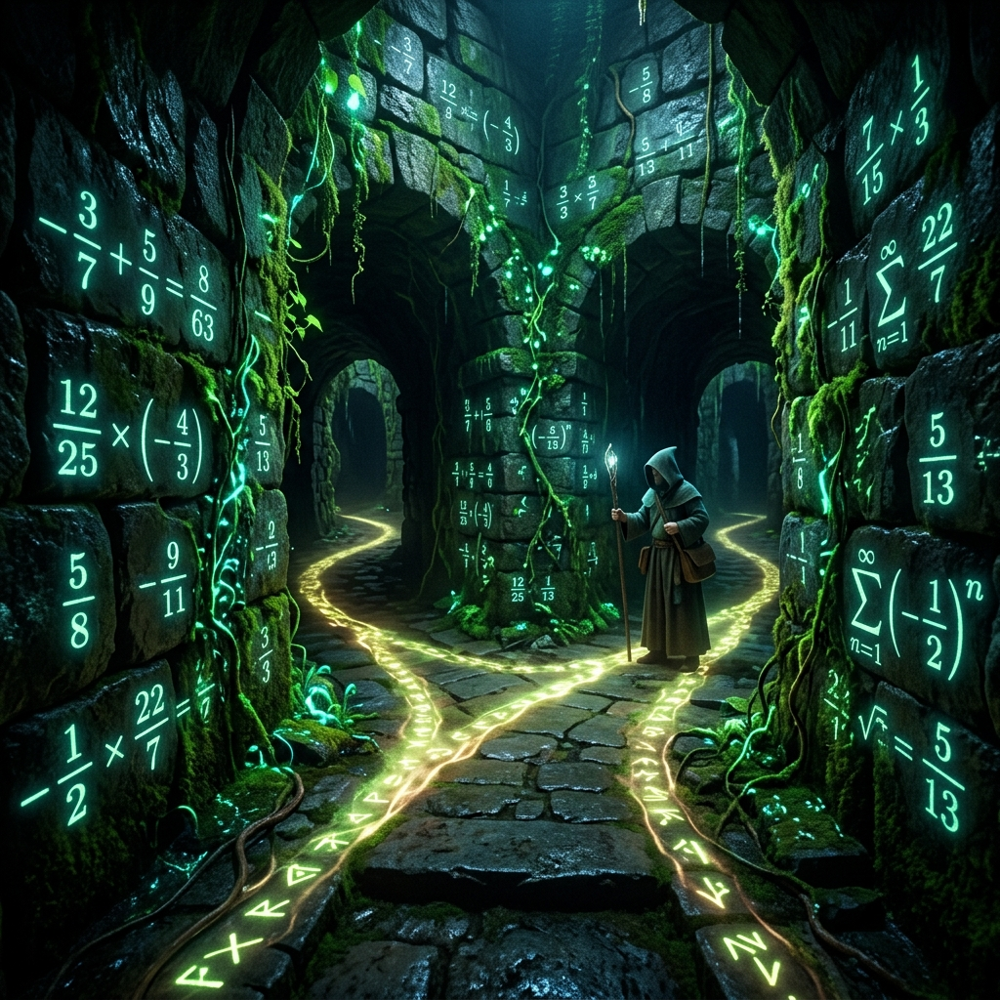
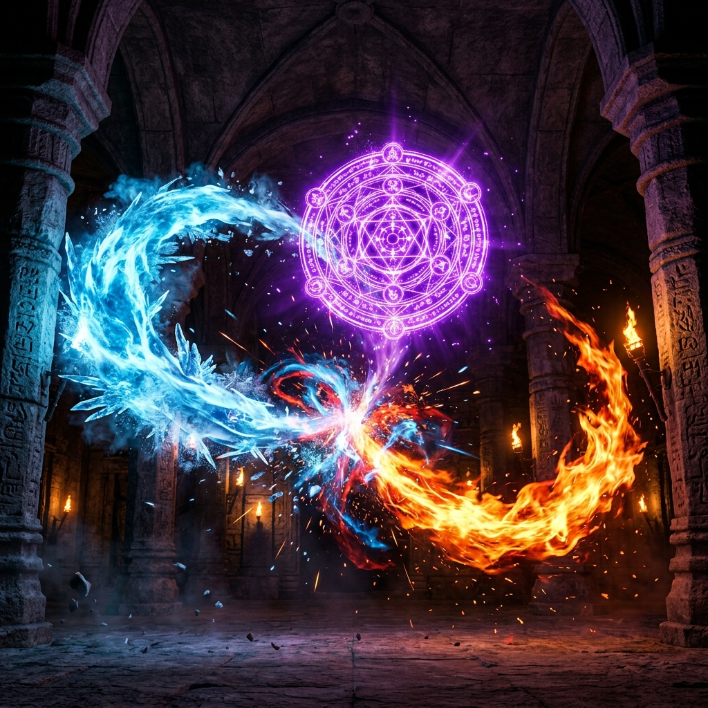
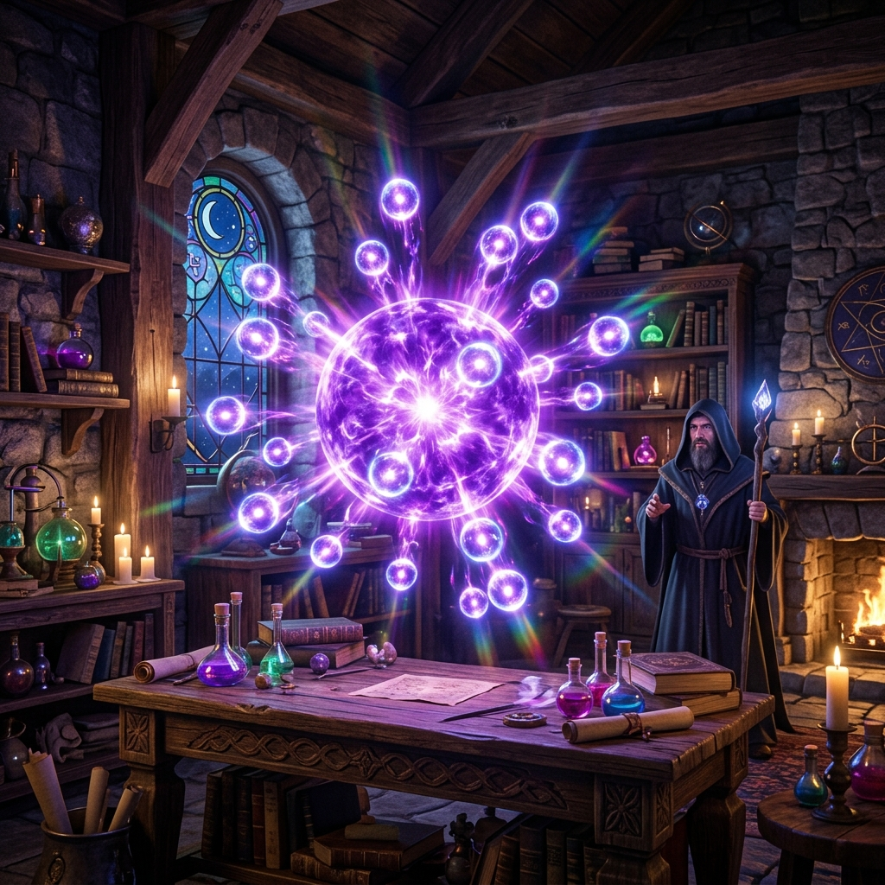
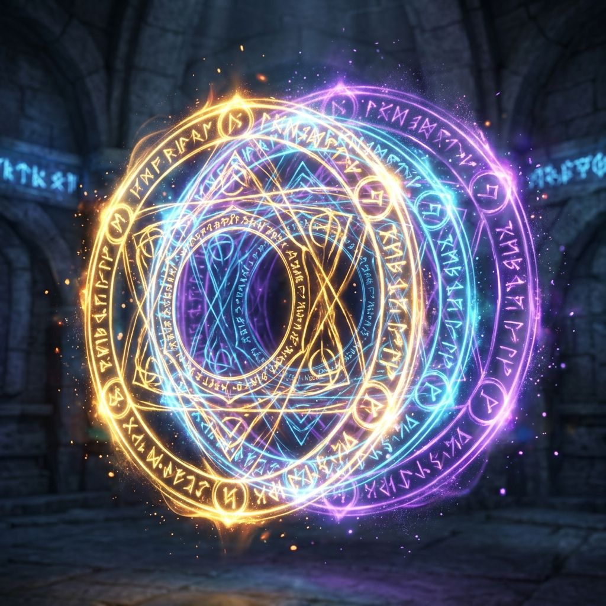
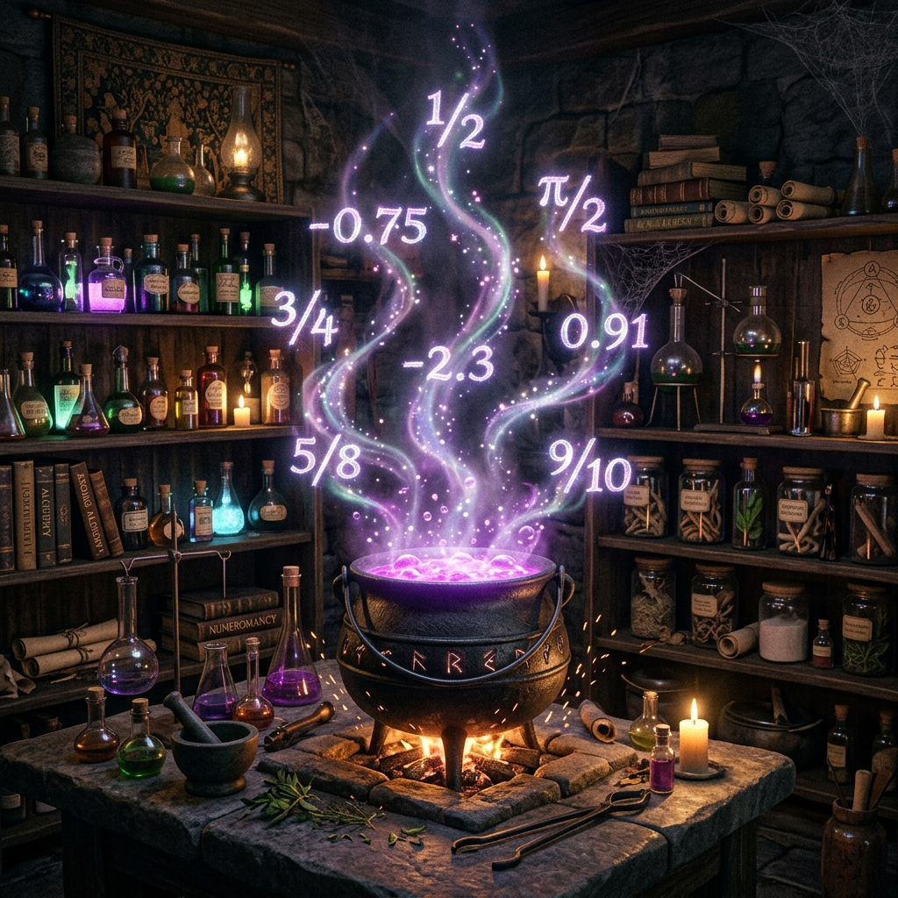

# grade1 2단원 대본집: Rational Numbers

이 파일은 수학 방탈출 게임의 스토리 대사, 퀴즈 문항, 이벤트 씬 정보를 관리하는 원천 데이터 파일입니다.

---

# [이미지 매핑]
- intro: intro.png
- 1: q1.png
- 2: q2.png
- 3: q3.png
- 4: q4.png
- 5: q5.png
- 6: q6.png
- 7: q7.png
- 8: q8.png
- 9: q9.png
- 10: q10.png
- 11: q11.png
- 12: q12.png
- 13: q13.png
- 14: q14.png
- 15: q15.png
- 16: q16.png
- 17: q17.png
- 18: q18.png
- 19: q19.png
- 20: q20.png
- event1: event1.png
- event2: event2.png
- event3: event3.png
- event4: event4.png
- outro: outro.png

---

# [문항 정의]

## Q1
- 제목: 빛과 어둠의 대비
- 이미지: 
- 질문: <strong>Q1. [양수와 음수]</strong> 해발 1000m를 +1000m로 나타낼 때, 해저 500m는 어떻게 나타내는가?
- 힌트: 
- 정답 체크: ans === '-500m' || ans === '-500'
- 선택지: -500m, -500m 아님, 알 수 없음, 해 없음
- 플레이스홀더: 예: -300m
- 에러 메시지: 마력이 충돌합니다! 방향과 부호를 다시 확인하십시오.
- 지문:
[보이드-마스터]: "크하하! 이 아르카나 시험장은 내 공허(Void)에 잠식당했다! 감히 보안 격벽을 통과할 수 있을 것 같으냐?"  <i>스산한 공허의 기운이 조종 패널 주위를 휘감으며, 해수면을 기준으로 하는 고대 마법 축이 공중에 드러납니다. 해발 고도와 해저 심도를 구분하여 보안 기호를 반전시켜야 합니다.</i>  [그리무어-G]: "치직... 캡틴, 그리무어 시스템이 가까스로 접속했습니다! 마법 해발 수치를 부호 기준에 매칭해 포탈 방향을 설정하십시오!"

## Q2
- 제목: 정수의 조건
- 이미지: 
- 질문: <strong>Q2. [정수의 판별]</strong> 다음 중 정수가 아닌 것의 번호를 쓰시오. (1) -3 &nbsp;&nbsp;(2) 0 &nbsp;&nbsp;(3) 1.5 &nbsp;&nbsp;(4) 7
- 힌트: 
- 정답 체크: ans === '3' || ans === '1.5' || ans === '(3)'
- 선택지: -3, 0, 1.5, 7
- 플레이스홀더: 보기 번호 입력
- 에러 메시지: 스파크가 튑니다! 정수가 아닌 수를 다시 골라 보십시오.
- 지문:
[보이드-마스터]: "첫 단계를 우회하다니 기특하구나. 하지만 정수가 아닌 불순물 숫자가 섞인 채로는 마법진의 순도가 떨어져 붕괴하고 말 것이다!"  <i>네 개의 스크롤 상자가 연단 위로 떠오르고, 각각의 상자에서 푸른 마나 흐름이 흘러나옵니다. 정수의 범주에 속하지 않는 불안정한 속성을 골라내어 소거해야 격벽이 열립니다.</i>  [그리무어-G]: "캡틴! 마법진의 평형을 위해 정수가 아닌 유리수 스크롤을 지정해 주십시오!"

## Q3
- 제목: 수직선의 기점
- 이미지: 
- 질문: <strong>Q3. [원점]</strong> 수직선에서 0을 나타내는 점을 무엇이라 하는가?
- 힌트: 
- 정답 체크: ans === '원점'
- 선택지: 원점, y축, x축, 좌표평면
- 플레이스홀더: 한글 단어 입력
- 에러 메시지: 수직선 기점이 정렬되지 않습니다!
- 지문:
[보이드-마스터]: "마법의 기준축조차 정의하지 못하는 미숙아에게는 공허의 심연만이 허락될 뿐이다! 기준이 되는 점의 이름을 대라!"  <i>공중에 투사된 황금빛 수직선의 한가운데에서 불안정한 백색 스파크가 튀며 다이얼 입력창이 솟아오릅니다. 모든 숫자의 기점이자 힘이 시작되는 중심의 이름을 묻고 있습니다.</i>  [그리무어-G]: "캡틴! 수직선의 시작이자 중심이 되는 바로 그 고유 명칭을 한글로 입력해 락을 해제하세요!"

## Q4
- 제목: 정수의 개수
- 이미지: 
- 질문: <strong>Q4. [두 수 사이의 정수]</strong> -5와 3 사이에 있는 정수는 모두 몇 개인가?
- 힌트: 
- 정답 체크: ans === '7' || ans === '7개'
- 선택지: 5, 14, 7, 9
- 플레이스홀더: 숫자 또는 개수 입력
- 에러 메시지: 수치가 맞지 않아 문이 닫힙니다!
- 지문:
<strong>[시스템 통신 장애 및 붉은 노이즈 발생]</strong>  [그리무어-G]: "치지직... 보이드-마스터의 교란 코드가 영역 내부에 정수 지뢰를 매설했습니다! -5와 3 사이의 안전 구역에 매설된 정수의 개수를 파악해 해독 코드로 전송하십시오! 빨리!"  <i>지지직- 조종 스크린이 심하게 떨리며 회로 라인이 검붉은 색으로 오염되어 갑니다.</i>

## Q5
- 제목: 속성 에너지 융합
- 이미지: 
- 질문: <strong>Q5. [수직선 위의 점]</strong> 두 정수 a, b에 대하여 a는 원점으로부터의 거리가 4이고, b는 -2보다 3만큼 큰 수이다. a가 양수일 때 a+b의 값을 구하시오.
- 힌트: 
- 정답 체크: ans === '5'
- 선택지: 10, 3, 7, 5
- 플레이스홀더: 숫자만 입력
- 에러 메시지: 융합 실패! 에너지 폭발 조짐이 보입니다.
- 지문:
🚨 <strong>[조종석 내부 기온 급강하 및 결계 압축]</strong>  [그리무어-G]: "치직... 제어 복구율 50%! 실내 온도가 마이너스로 치닫고 있습니다! 두 지점 a와 b의 마력 평형 상태인 a+b 값을 계산해 제어 노드에 강제 주입하십시오! 결계 압력을 낮추어야 합니다!"  <i>사방의 냉기 벽면이 쩍쩍 갈라지는 소리를 내며 조종 패널을 조여오기 시작합니다.</i>

## Q6
- 제목: 마법 절댓값 장벽
- 이미지: 
- 질문: <strong>Q6. [절댓값 계산]</strong> |-7| + |3| 의 값을 구하시오.
- 힌트: 
- 정답 체크: ans === '10'
- 선택지: 8, 10, 20, 12
- 플레이스홀더: 숫자만 입력
- 에러 메시지: 장벽의 절댓값이 꿈쩍도 하지 않습니다!
- 지문:
[보이드-마스터]: "하찮은 조력자의 방어막은 내 절댓값 보라색 중력장 앞에서는 무용지물이다! 짓눌려 소멸해라!"  <i>쿠구구궁- 통로 정면에 거대한 자줏빛 마력 구체가 형성되며 주변 중력이 급격히 증가해 숨을 쉬기 힘들어집니다. 두 에너지의 절댓값 합을 연산해 중력 역전 상수로 주입해야 합니다.</i>  [그리무어-G]: "캡틴, 엄청난 중력 압박입니다! 각 마력의 절대 크기를 합산해 반중력 펄스를 생성하십시오!"

## Q7
- 제목: 상반되는 속성의 거리
- 이미지: 
- 질문: <strong>Q7. [절댓값의 성질]</strong> 절댓값이 4인 두 수의 차를 구하시오. (큰 수에서 작은 수를 뺌)
- 힌트: 
- 정답 체크: ans === '8'
- 선택지: 16, 6, 8, 10
- 플레이스홀더: 숫자만 입력
- 에러 메시지: 수치 동조 실패! 축의 거리가 맞지 않습니다.
- 지문:
[보이드-마스터]: "중력장을 돌파했다고? 하지만 절댓값 양극단의 괴리를 메우지 못한다면 이 공간의 차원 왜곡에 갇히게 될 것이다!"  <i>치지직- 수직선 양방향으로 뻗어나간 두 개의 타오르는 화염 링이 차원의 벽면을 강하게 타격합니다. 절댓값 힘이 4인 양극단 지점의 실제 차원 거리를 도출해야 게이트가 열립니다.</i>  [그리무어-G]: "차원 균열이 감지되었습니다! 두 지점 사이의 물리적 거리를 구해 왜곡을 안정화하십시오!"

## Q8
- 제목: 최강의 절댓값 보석
- 이미지: 
- 질문: <strong>Q8. [절댓값의 대소]</strong> 다음 수 중 절댓값이 가장 큰 수를 쓰시오. [-2.5, 3, -4, 0, 1.5]
- 힌트: 
- 정답 체크: ans === '-4'
- 선택지: -8, -6, -4, -2
- 플레이스홀더: 해당 수 입력 (부호 포함)
- 에러 메시지: 제단이 보석을 밀어냅니다!
- 지문:
[보이드-마스터]: "내 다섯 봉인의 에너지 중 가장 파괴적인 절댓값을 가진 어둠의 원석이 무엇인지 찾을 수 있겠는가? 잘못 선택하면 이 방의 대기가 완전히 소멸될 것이다!"  <i>제단 위에 다섯 개의 오라클 마력석이 칠흑 같은 빛을 내뿜으며 차례로 정렬됩니다. 이 중 절대적인 인장 강도가 가장 큰 에너지를 판별해 원래 수치를 입력하십시오.</i>  [그리무어-G]: "경고! 각 원석의 마력 절댓값을 대조하십시오! 절대력이 가장 강력한 원석의 값을 주입해야 제단 락이 분해됩니다!"

## Q9
- 제목: 부등식과 영역
- 이미지: 
- 질문: <strong>Q9. [부등호의 이해]</strong> -3 < x <= 2 를 만족하는 정수 x의 개수를 구하시오.
- 힌트: 
- 정답 체크: ans === '5' || ans === '5개'
- 선택지: 10, 3, 7, 5
- 플레이스홀더: 숫자 또는 개수 입력
- 에러 메시지: 압력이 새어나갑니다! 다시 계산하십시오.
- 지문:
[보이드-마스터]: "슬슬 에너지가 바닥나는군. 공허의 압력 벨브를 격리하겠다. 한계를 초과하는 밀도 속에 갇혀서 서서히 질식해라!"  <i>쉬이이익- 고온의 증기가 배출관에서 뿜어져 나오며 통로 전체가 격리벽으로 굳게 폐쇄되기 시작합니다. 조건식 -3 < x <= 2 를 만족하는 정수 마나의 총 개수를 해독해야 안전 밸브가 열립니다.</i>  [그리무어-G]: "압력이 한계에 달했습니다! 조건 영역 안의 정수 마나 개수를 입력해 가스 우회 방출을 시도해 주십시오!"

## Q10
- 제목: 균형의 추
- 이미지: 
- 질문: <strong>Q10. [한가운데 있는 수]</strong> 수직선에서 -4와 8의 한가운데 있는 점이 나타내는 수를 구하시오.
- 힌트: 
- 정답 체크: ans === '2'
- 선택지: 4, 2, 0, 10
- 플레이스홀더: 숫자만 입력
- 에러 메시지: 조율 실패! 추가 비대칭으로 기울어집니다.
- extra_class: glitch-bg
- 지문:
💥 <strong>[비상 로그: 강제 자폭 코어 온라인!]</strong> 💥  [보이드-마스터]: "크하하! 더는 두고 볼 수 없군! 모든 시험 데이터를 포맷하고 아카데미 메인 프레임을 자폭시키겠다! 5분 내로 전부 먼지로 변하거라!"  <i>경보 사일렌이 울리며 조종 콘솔 한가운데의 균형 추가 급격히 비대칭으로 요동치기 시작합니다. 수직선 위의 -4와 8의 정중앙 균형점 수치를 찾아 자폭 코드를 상쇄해야 합니다.</i>  [그리무어-G]: "캡틴! 마력로 온도가 급상승 중입니다! 대칭 균형점의 위치를 찾아 정밀 평형 코드로 전송하십시오! 제가 방화벽으로 에너지를 버티겠습니다!"

## Q11
- 제목: 기초 마법진 덧셈
- 이미지: 
- 질문: <strong>Q11. [정수의 덧셈]</strong> (-5) + (+8) 의 값을 구하시오.
- 힌트: 
- 정답 체크: ans === '3'
- 플레이스홀더: 숫자만 입력
- 에러 메시지: 마법진에 스파크가 튊니다! 연산이 틀렸습니다.
- 지문:
[그리무어-G]: "방화벽 출력 75%! 연산 상수를 지속적으로 입력하여 열에너지를 상쇄하고 마법진을 우회 통과해야 합니다! 🪄 [덧셈 마법진]"  <i>바닥의 거대한 기하학 마법진이 스파크를 튀기며 과열되기 시작합니다. 식 (-5) + (+8)의 정밀 값을 도출하여 마력로 덧셈 노드에 안전하게 주입하십시오.</i>  [보이드-마스터]: "계산해 봤자 결코 폭발 한계를 늦추지 못할 것이다!"

## Q12
- 제목: 기초 마법진 뺄셈
- 이미지: 
- 질문: <strong>Q12. [정수의 뺄셈]</strong> (+3) - (-7) 의 값을 구하시오.
- 힌트: 
- 정답 체크: ans === '10'
- 플레이스홀더: 숫자만 입력
- 에러 메시지: 반전 에너지가 제어되지 않습니다!
- 지문:
[그리무어-G]: "성공입니다! 온도가 내려가기 시작했습니다. 하지만 이어서 반전 뺄셈 노드가 가로막고 있습니다. 에너지를 역제어해야 합니다! 🪄 [뺄셈 에너지 반전]"  <i>흐르는 마력 배선의 뺄셈 펄스에 대입할 (+3) - (-7)의 연산 결과치를 전송하여, 회로의 고압 마나가 흐르도록 평형 전압을 조절해 주십시오.</i>  [보이드-마스터]: "에너지의 방향을 꺾는다고? 어림없다! 역류하는 고압 펄스에 타버려라!"

## Q13
- 제목: 소수점 마나 정렬
- 이미지: 
- 질문: <strong>Q13. [유리수의 덧셈]</strong> (-2.5) + (-1.5) 의 값을 구하시오.
- 힌트: 
- 정답 체크: ans === '-4'
- 플레이스홀더: 숫자만 입력 (부호 포함)
- 에러 메시지: 마나 강도 어긋남! 폭주 위험!
- 지문:
[그리무어-G]: "휴... 마력 평형이 다시 흔들립니다! 소수점으로 분열된 음의 마나 결성체들을 정렬해야 합니다! 🪄 [유리수의 덧셈]"  <i>제어 화면에서 조각난 유리수 마나 노드들이 거칠게 회전하며 경고음을 울립니다. (-2.5) + (-1.5)의 연산 결과치를 입력하여 유리수 마나를 안전하게 결합하십시오.</i>

## Q14
- 제목: 3중 혼합 마나
- 이미지: 
- 질문: <strong>Q15. [정수의 덧뺄셈 혼합]</strong> 5 - 9 + 3 의 값을 구하시오.
- 힌트: 
- 정답 체크: ans === '-1'
- 플레이스홀더: 숫자만 입력 (부호 포함)
- 에러 메시지: 과전류 차단 실패! 회로 차단 경고!
- 지문:
[그리무어-G]: "과전류 유입 극도로 상승! 세 갈래로 얽힌 혼합 수식의 락을 즉시 해제해야 전류가 상쇄됩니다! 🪄 [혼합 연산]"  <i>지이잉- 콘솔 보드에 세 개의 전하 루프가 과전하를 뿜어내고 있습니다. 수식 5 - 9 + 3 의 정답 수치를 입력하여 고압 마나를 차단 프로토콜로 상쇄시키십시오!</i>

## Q15
- 제목: 기억의 왜곡 복원
- 이미지: 
- 질문: <strong>Q15. [식의 바른 계산]</strong> 어떤 수에서 -3을 빼야 할 것을 잘못하여 더했더니 5가 되었다. 바르게 계산한 답을 구하시오.
- 힌트: 
- 정답 체크: ans === '11'
- 플레이스홀더: 숫자만 입력
- 에러 메시지: 왜곡 복원 실패! 기억 마법이 정지됩니다.
- extra_class: glitch-bg
- 지문:
✨ <strong>[그리무어-G 메인 프레임 권한 100% 완전 복구]</strong> ✨  [그리무어-G]: "해독 성공! 드디어 아카데미 시스템 제어권을 보이드-마스터로부터 완벽히 탈환했습니다. 이제 역정화 주문을 실행합니다! 왜곡된 마법 기억 공식을 원상태로 복원하십시오!"  <i>조종석 전체가 부드러운 청색 아우라로 뒤덮이고 에러 메시지들이 정화 코드로 교체됩니다.</i>  [보이드-마스터]: "크으으윽... 하찮은 인간 녀석들이 내 서버의 심연을 정화하러 들어오다니! 하지만 마지막 관문은 뚫지 못할 것이다!"

## Q16
- 제목: 대마법 곱셈 시전
- 이미지: 
- 질문: <strong>Q16. [정수의 곱셈]</strong> (-4) × (+6) 의 값을 구하시오.
- 힌트: 
- 정답 체크: ans === '-24'
- 플레이스홀더: 숫자만 입력 (부호 포함)
- 에러 메시지: 곱셈 역류 발생! 차단막이 두꺼워집니다.
- 지문:
[보이드-마스터]: "아직 끝난 것이 아니다! 내 마지막 어둠의 사칙연산 장벽으로 서버를 무한히 왜곡시켜 주마! 🎇 [어둠의 곱셈]"  <i>벽면 격벽에 거대한 검은색 기호들이 떠돌며 차례로 전력을 차단합니다. 음과 양의 교차 곱셈 수식인 (-4) × (+6)의 파장값을 입력해 전하를 소거하십시오!</i>

## Q17
- 제목: 대마법 나눗셈 시전
- 이미지: 
- 질문: <strong>Q17. [정수의 나눗셈]</strong> (-15) ÷ (-3) 의 값을 구하시오.
- 힌트: 
- 정답 체크: ans === '5'
- 플레이스홀더: 숫자만 입력
- 에러 메시지: 마나가 불균일하게 분열됩니다!
- 지문:
[보이드-마스터]: "음의 에너지들이 충돌하여 소멸해봤자, 남은 파편들이 내 서버를 무한 분열시킬 뿐이다! 어디 몫을 계산해 보아라! 🎇 [음수의 분열]"  <i>격벽 전면의 레이저 링들이 음수 충돌 상태를 형성합니다. (-15) ÷ (-3)의 정밀 나눗셈 결과 몫을 입력해 결계 파장을 안정시키십시오.</i>

## Q18
- 제목: 거듭제곱 마법
- 이미지: 
- 질문: <strong>Q18. [거듭제곱]</strong> $(-2)^3$ 의 값을 구하시오.
- 힌트: 
- 정답 체크: ans === '-8'
- 플레이스홀더: 숫자만 입력 (부호 포함)
- 에러 메시지: 메아리가 너무 큽니다! 귀를 막고 다시 입력하세요.
- 지문:
[보이드-마스터]: "내 공허의 비명이 세 번 거듭하여 울려 퍼질 때, 네 정신과 고막은 차원의 저편으로 영원히 조각나 흩어질 것이다! 🎇 [거듭제곱 메아리]"  <i>웅웅웅- 온 조종실 전체가 강렬한 공진 주파수로 뒤흔들리며 고주파 소음 장벽이 옥죄어 옵니다. 음수 -2의 3제곱 연산 수치를 도출해 전방의 소리 장벽을 무력화하십시오!</i>

## Q19
- 제목: 사칙 혼합 제어
- 이미지: 
- 질문: <strong>Q19. [유리수의 사칙혼합 1]</strong> $(-2) 	imes (-3) - (+10) \div (-2)$ 의 값을 구하시오.
- 힌트: 
- 정답 체크: ans === '11'
- 플레이스홀더: 숫자만 입력
- 에러 메시지: 해킹 방어 프로토콜 작동! 수치 리셋 경고!
- 지문:
[보이드-마스터]: "끝까지 버티는군! 하지만 사칙연산이 다중 융합된 복합 매핑 프로토콜을 해독할 지능이 네놈들에게 존재할까? 🎇 [연산 제어 스크린]"  <i>천장에서 하강하는 다중 격자 레이저 그물이 통로를 조각내며 빠르게 내려오기 시작합니다. 식 $(-2) 	imes (-3) - (+10) \div (-2)$ 의 최종 값을 주입하여 방화벽 보안 그물을 강제로 무력화하십시오!</i>

## Q20
- 제목: 최종 마법진의 해
- 이미지: 
- 질문: <strong>Q20. [유리수의 사칙혼합 2]</strong> $12 - [ 5 - \{ (-2) 	imes 3 - 4 \} ]$ 의 값을 구하시오.
- 힌트: 
- 정답 체크: ans === '-3'
- 플레이스홀더: 숫자만 입력 (부호 포함)
- 에러 메시지: 시험 통과 실패! 최종 마나 코어가 작동하지 않습니다.
- 지문:
🔮 <strong>[최종 탈출 포탈 방화벽 해제]</strong> 🔮  [그리무어-G]: "캡틴! 이제 보이드-마스터의 메인 포탈 격벽 하나만이 남았습니다. 제 전력 셀 에너지를 전부 동력 포탈에 투사하겠습니다! 마지막 복합 다중 락 수식인 $12 - [ 5 - \{ (-2) 	imes 3 - 4 \} ]$ 의 해를 입력하여 이곳을 탈출하십시오!"  [보이드-마스터]: "안 돼... 내 공허 제어 코어가... 정지하고 있어어어!"

---

# [이벤트 정의]

## EVENT1
- 제목: 동력 기어 가동
- 이미지: 
- 버튼 텍스트: 계속 전진하기
- 다음 스테이지: panel_q6
- 달성도: 25
- 지문:
크리스탈 제단의 마나 빗장이 해제되며 영롱한 오색 보석들이 회전하며 빛의 공명을 시작합니다.

[그리무어-G]: "좋습니다! 1차 마나 마법 장벽이 해제되었습니다. 어서 서고의 다음 격실로 전진하십시오!"

## EVENT2
- 제목: 비상 차단 장치 리셋
- 이미지: 
- 버튼 텍스트: 비상 전력 가동
- 다음 스테이지: panel_q11
- 달성도: 50
- 지문:
과열되던 마법 봉인 핵의 붉은 열기가 식어 내리며 안정적인 마법 비상 제어가 완료됩니다.

[그리무어-G]: "후우... 마나 안정도가 복구되었습니다. 정밀 마나 레일 락이 해제되었습니다. 다음 3구역으로 돌입합시다!"

## EVENT3
- 제목: 핵심 복원 제단 활성화
- 이미지: 
- 버튼 텍스트: 제단 활성화
- 다음 스테이지: panel_q16
- 달성도: 75
- 지문:
서고 중앙의 대리석 석조들이 돌며 보라색 마나를 발산하는 고대 마법 제단이 솟아오릅니다.

[그리무어-G]: "100% 동기화 성공! 이제 마법 기하학의 모든 비밀이 기입됩니다. 빌런인 폭주 마법인격의 최종 마스터 락에 도전하십시오!"

## EVENT4
- 제목: 탈출 차원 포탈 개방
- 이미지: 
- 버튼 텍스트: 지상으로 탈출
- 다음 스테이지: outro
- 달성도: 100
- 지문:
최종 이중 봉인이 파괴되며 은하수가 흐르는 영롱한 파란빛 차원 워프 포탈이 소용돌이칩니다.

[그리무어-G]: "탈출 게이트가 열렸습니다! 어서 고대 현자의 유산 양가죽 고서를 챙겨 도약하십시오!"

[폭주 마법인격]: "마법의 무결성을 인정하노라... 후계자여, 무사히 탈출하여라."

