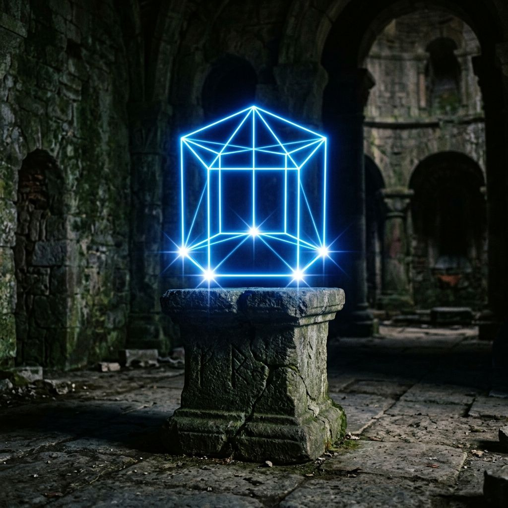
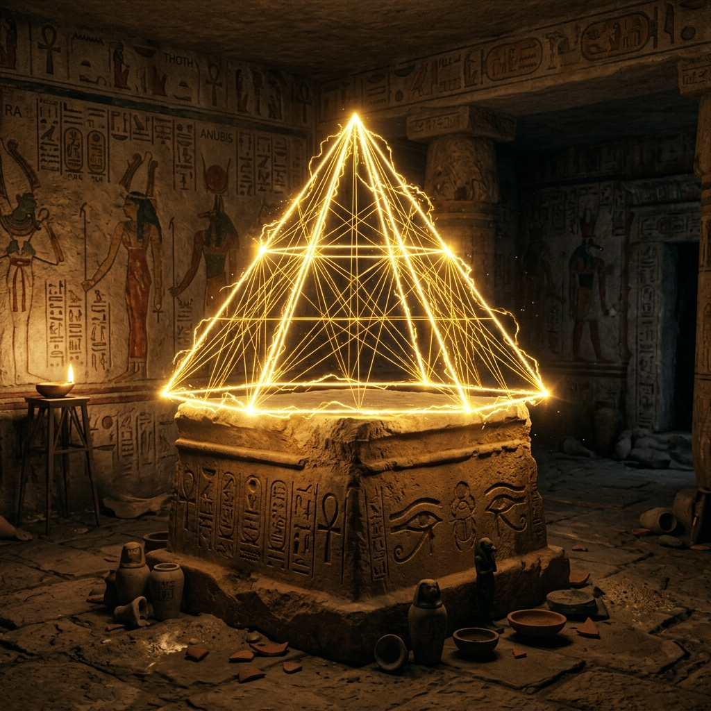
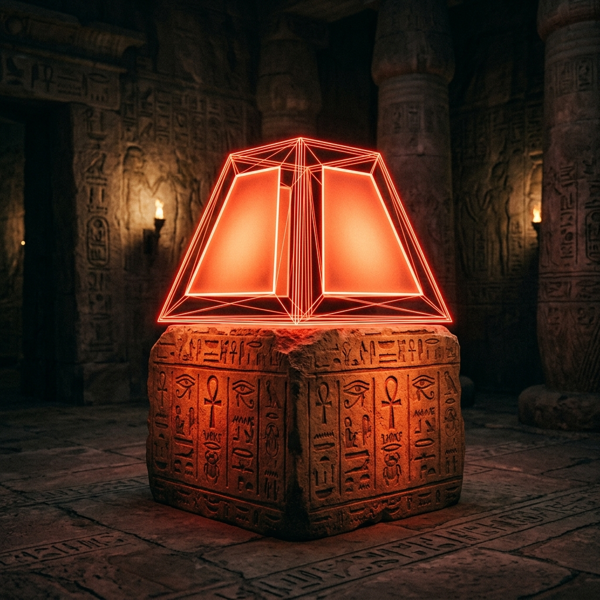
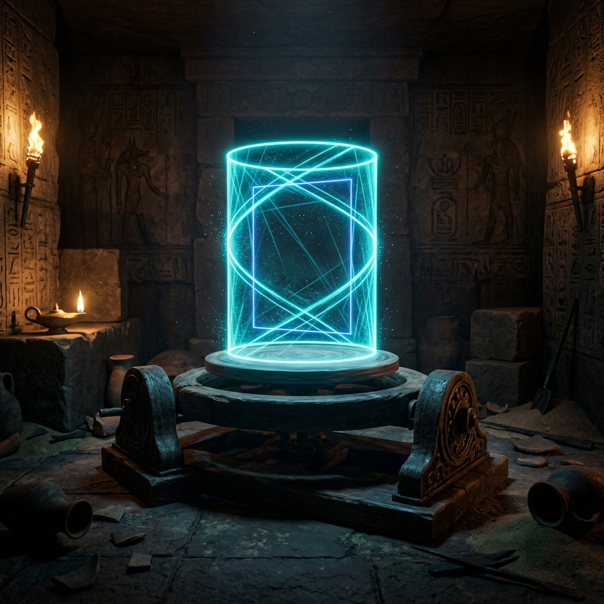
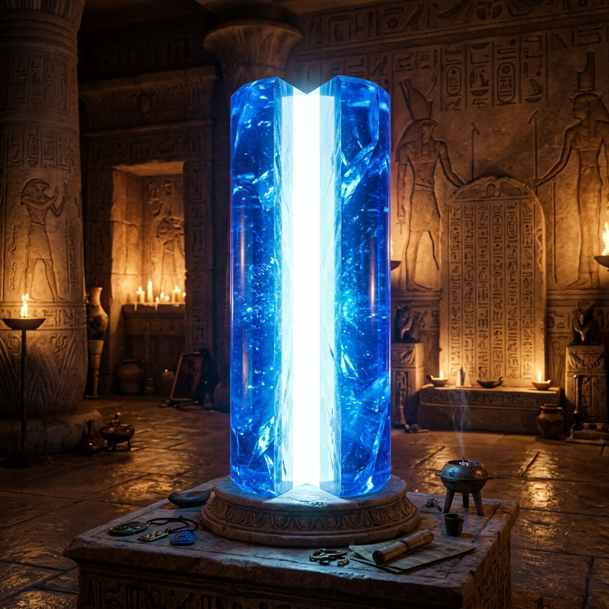
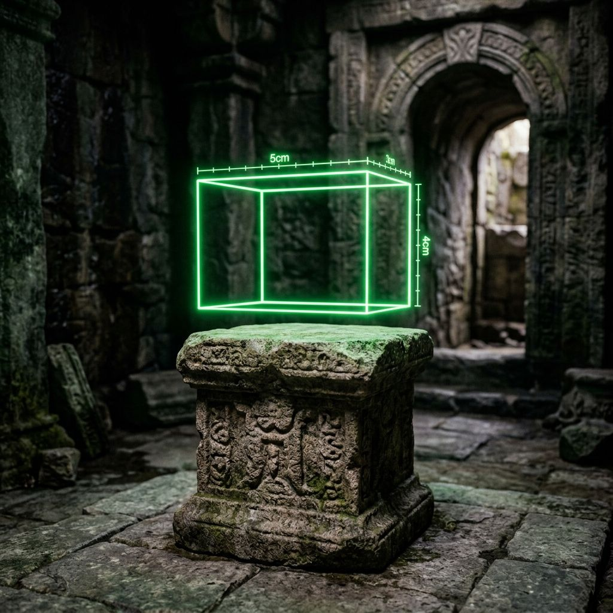
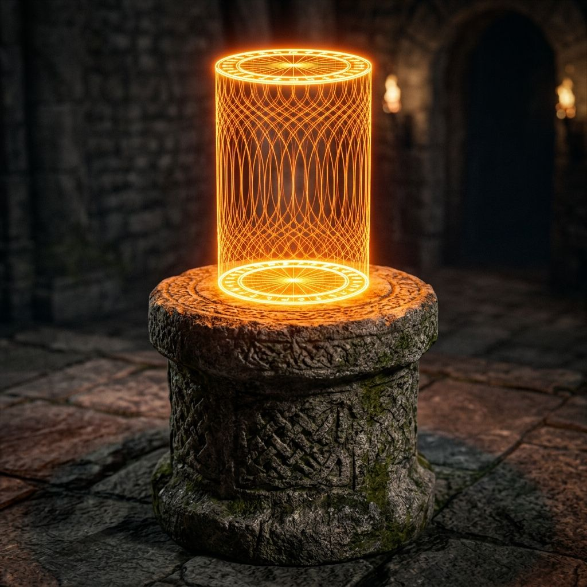
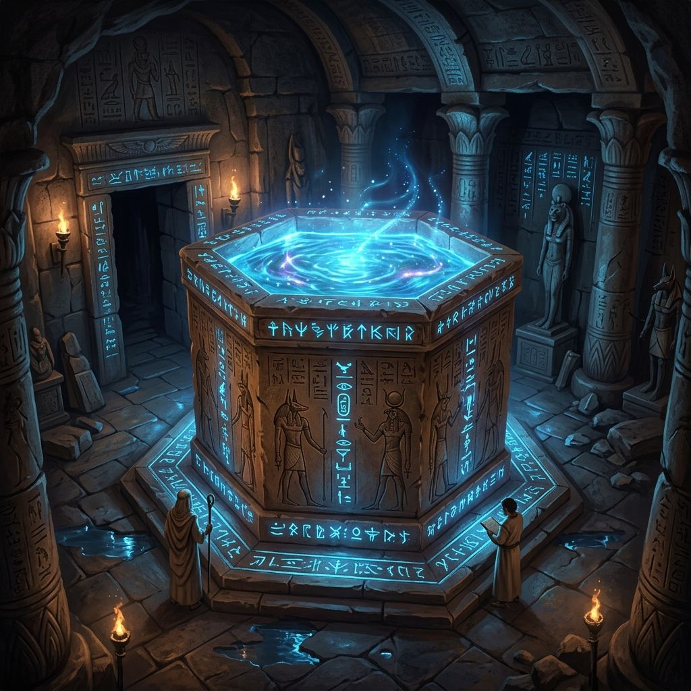
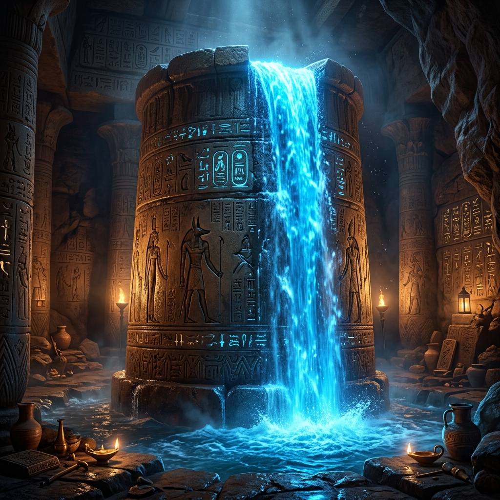
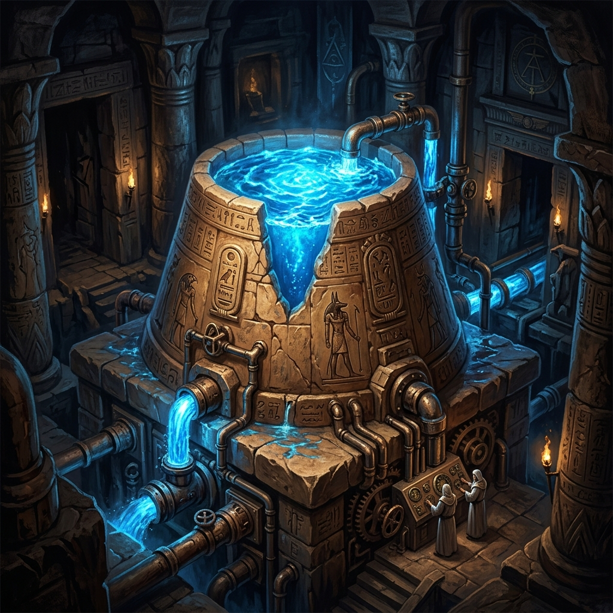

# grade1 7단원 대본집: Solid Geometry

이 파일은 수학 방탈출 게임의 스토리 대사, 퀴즈 문항, 이벤트 씬 정보를 관리하는 원천 데이터 파일입니다.

---

# [이미지 매핑]
- intro: intro.png
- 1: q1.png
- 2: q2.png
- 3: q3.png
- 4: q4.png
- 5: q5.png
- 6: q6.png
- 7: q7.png
- 8: q8.png
- 9: q9.png
- 10: q10.png
- 11: q11.png
- 12: q12.png
- 13: q13.png
- 14: q14.png
- 15: q15.png
- 16: q16.png
- 17: q17.png
- 18: q18.png
- 19: q19.png
- 20: q20.png
- event1: event1.png
- event2: event2.png
- event3: event3.png
- event4: event4.png
- outro: outro.png

---

# [문항 정의]

## Q1
- 제목: 기둥의 성질
- 이미지: 
- 질문: <strong>Q1. [다면체의 이해]</strong> 옆면이 모두 직사각형인 다면체를 무엇이라 부르는가? (힌트: 기둥)
- 힌트: 옆면의 모양이 모두 직사각형인 입체도형 계열의 명칭을 떠올려 봅니다.
- 정답 체크: ans === '각기둥'
- 선택지: 각기둥, 각기둥 아님, 알 수 없음, 해 없음
- 플레이스홀더: 예: 각뿔
- 에러 메시지: 도형 이름 오류!
- 지문:
[모래의 침입자 - 도굴꾼]: "크하하! 이 피라미드 지하의 천문 기단은 내가 차지했다! 감히 이 입체도형 봉인을 뚫고 나갈 수 있을 것 같으냐? 기하학의 무덤에 갇힌 것을 환영한다!"  <i>쿠구구궁- 돌문 너머로 모래 톱니 기계 장치가 돌출되며 첫 번째 다면체 봉인 락이 드러납니다. 옆면이 모두 직사각형으로 일치하는 고대 다면체의 가문명을 새겨 넣어야 격벽이 올라갑니다.</i>

## Q2
- 제목: 오각기둥 락
- 이미지: 
- 질문: <strong>Q2. [꼭짓점의 개수]</strong> 밑면이 오각형인 오각기둥의 꼭짓점의 개수를 구하시오.
- 힌트: n각기둥의 꼭짓점 개수 공식은 2n 입니다.
- 정답 체크: ans === '10'
- 선택지: 8, 10, 20, 12
- 플레이스홀더: 숫자만 입력
- 에러 메시지: 개수 오류!
- 지문:
[모래의 침입자 - 도굴꾼]: "함정의 천장이 천천히 내려앉기 시작하는군! 오각기둥 밑판을 고정하는 꼭짓점의 총개수만큼 황동 레버를 당기지 않으면 완전히 짓눌려 뭉개지리라!"  <i>쩍쩍- 소리를 내며 천장의 육중한 돌판이 미궁 바닥 높이까지 하강하기 시작합니다. 오각기둥의 꼭짓점 개수만큼 레버를 고정시켜 압축을 저지하십시오!</i>

## Q3
- 제목: 육각뿔 모서리
- 이미지: 
- 질문: <strong>Q3. [모서리의 개수]</strong> 밑면이 육각형인 육각뿔의 모서리의 개수를 구하시오.
- 힌트: n각뿔의 모서리 개수 공식은 2n 입니다.
- 정답 체크: ans === '12'
- 선택지: 14, 24, 10, 12
- 플레이스홀더: 숫자만 입력
- 에러 메시지: 개수 오류!
- 지문:
[모래의 침입자 - 도굴꾼]: "사방에서 솟구치는 육각뿔 형태의 창날 함정이다! 육각뿔 장치의 모든 날카로운 모서리 개수를 맞춰야만 창날이 다시 바닥으로 들어가리라!"  <i>슈슉- 바닥의 석판 틈새로 은빛 금속 침을 지닌 육각뿔 장치들이 날카롭게 튀어나옵니다.</i>

## Q4
- 제목: 뿔대 봉인
- 이미지: 
- 질문: <strong>Q4. [면의 개수]</strong> 사각뿔대의 면의 개수를 구하시오.
- 힌트: n각뿔대의 면의 개수는 밑면 2개와 옆면 n개를 더해 n+2 개입니다.
- 정답 체크: ans === '6'
- 선택지: 4, 6, 8, 12
- 플레이스홀더: 숫자만 입력
- 에러 메시지: 개수 오류!
- 지문:
<strong>[수로의 먼지 폭풍 및 모래바람 차단]</strong>  [신전의 사제 - 임호텝]: "치지직... 조사관님! 피라미드의 바람 통풍 기단이 멈추었습니다! 도굴꾼의 사악한 흑마법 기운이 회로를 차단하고 있습니다! 사각뿔대 모양 정화 부적의 면 개수를 연산해 비상 배출 장치를 긴급 구동하십시오!"

## Q5
- 제목: 성스러운 다면체
- 이미지: 
- 질문: <strong>Q5. [정다면체]</strong> 각 면이 모두 합동인 정삼각형이고 한 꼭짓점에 모이는 면의 개수가 3개인 정다면체의 이름을 구하시오.
- 힌트: 면이 정삼각형인 정다면체 중 한 꼭짓점에 모이는 면의 개수가 3개인 첫 번째 도형입니다.
- 정답 체크: ans === '정사면체'
- 선택지: 정사면체, 정사면체 아님, 알 수 없음, 해 없음
- 플레이스홀더: 예: 정육면체
- 에러 메시지: 정다면체 이름 오류!
- 지문:
🚨 <strong>[비상 로그: 이집트 왕의 방 수은 압력 폭발 위기]</strong> 🚨  [신전의 사제 - 임호텝]: "수은 수조의 물길 높이가 급격히 차오릅니다! 정삼각형 4개로 결합된 고대 성스러운 정다면체 이름을 입력해 배수 놋쇠 빗장의 기운을 조화롭게 정렬해 주십시오! 빨리!"  <i>구리 파이프 내부의 은빛 수은 액체가 붉은색 파이프라인을 타고 무섭게 격동하기 시작합니다.</i>

## Q6
- 제목: 제2구역: 도자기 방
- 이미지: 
- 질문: <strong>Q6. [회전체의 이해]</strong> 평면도형을 한 직선을 축으로 하여 1회전 시킬 때 생기는 입체도형을 무엇이라 부르는가?
- 힌트: 평면도형을 한 직선을 축으로 하여 1회전 시킬 때 생기는 입체도형의 총칭입니다.
- 정답 체크: ans === '회전체'
- 선택지: 회전체, 회전체 아님, 알 수 없음, 해 없음
- 플레이스홀더: 예: 다면체
- 에러 메시지: 도형 종류 오류!
- 지문:
[모래의 침입자 - 도굴꾼]: "제2구역 도자기 방에 들어왔군. 회전의 기둥 축을 한 바퀴 돌려 입체적인 도자기를 빚어내는 고대 연금술의 도형 범주명을 알고 있느냐?"  <i>방 한가운데 거대한 돌판 물레가 회전하기 시작하고, 공중에 입체 형상 아지랑이들이 요동치며 모래 장벽을 형성합니다.</i>  [신전의 사제 - 임호텝]: "조사관님! 회전축을 기준으로 1회전하여 만들어지는 모든 입체도형의 통합 분류명을 입력해 봉인을 해제해 주십시오!"

## Q7
- 제목: 세로 절단면
- 이미지: 
- 질문: <strong>Q7. [회전축과 단면 1]</strong> 원기둥을 회전축을 포함하는 평면으로 자를 때 생기는 단면의 모양은 무엇인가?
- 힌트: 원기둥의 가운데 회전축을 포함하도록 위에서 아래로 세로로 자른 단면의 평면 모양을 생각합니다.
- 정답 체크: ans === '직사각형'
- 선택지: 직사각형, 직사각형 아님, 알 수 없음, 해 없음
- 플레이스홀더: 예: 사각형
- 에러 메시지: 단면 모양 오류!
- 지문:
[모래의 침입자 - 도굴꾼]: "원기둥 결계의 회전축을 세로로 쪼갰을 때 드러나는 단면의 모양을 정의해라. 잘못된 모형을 제출하는 순간 톱니바퀴 칼날이 작동하리라!"  <i>천장에 매달린 거대한 칼날들이 회전을 대기하며 차갑게 번뜩입니다. 세로 절단했을 때의 정확한 단면 형상 이름을 대십시오.</i>  [신전의 사제 - 임호텝]: "조사관님! 원기둥을 회전축을 포함하는 세로 평면으로 잘랐을 때 나타나는 직관적인 사각형 명칭을 입력창에 전송하십시오!"

## Q8
- 제목: 가로 절단면
- 이미지: 
- 질문: <strong>Q8. [회전축과 단면 2]</strong> 원뿔을 회전축에 수직인 평면으로 자를 때 생기는 단면의 모양은 무엇인가?
- 힌트: 원뿔을 밑면에 평행하게(회전축에 수직으로) 가로로 자를 때 나타나는 단면의 모양을 생각합니다.
- 정답 체크: ans === '원'
- 선택지: 원, 원 아님, 알 수 없음, 해 없음
- 플레이스홀더: 예: 타원
- 에러 메시지: 단면 모양 오류!
- 지문:
[모래의 침입자 - 도굴꾼]: "축에 수직인 수평 방향으로 가로 쪼개기를 실행하면 어떨까? 원뿔 모양의 장벽 단면이 어떤 기하학 무늬를 이루겠나?"  <i>가로 방향으로 푸른 신화의 화염이 원뿔 봉인을 관통하여 잘림을 작동시킵니다.</i>  [신전의 사제 - 임호텝]: "밑면에 평행하게 수평으로 가로 자른 단면의 완벽한 원형 형태 명칭을 한 글자로 입력해 빗장을 푸십시오!"

## Q9
- 제목: 직각삼각형 회전
- 이미지: 
- 질문: <strong>Q9. [회전체의 종류]</strong> 직각삼각형을 직각을 낀 한 변을 축으로 하여 1회전 시킬 때 생기는 도형은 무엇인가?
- 힌트: 직각삼각형을 한 변을 축으로 돌리면 고깔모자나 고깔콘 형태의 입체도형이 만들어집니다.
- 정답 체크: ans === '원뿔'
- 선택지: 원뿔, 원뿔 아님, 알 수 없음, 해 없음
- 플레이스홀더: 예: 원기둥
- 에러 메시지: 도형 이름 오류!
- 지문:
[모래의 침입자 - 도굴꾼]: "회전 궤적의 형태마저 맞출 수 있겠느냐? 직각삼각형 석판의 한 모서리를 기준으로 원심 회전을 시키면 나타나는 모형은?"  <i>연단 위의 황동 물레에 고정된 직각삼각형 기어가 거칠게 회전하기 시작합니다. 완성되는 3차원 입체 모형의 이름을 맞추십시오.</i>  [신전의 사제 - 임호텝]: "기어의 마찰로 불꽃이 튀고 있습니다! 회전 기어 모형인 고깔 모양의 입체도형 이름을 전송하십시오!"

## Q10
- 제목: 구의 단면
- 이미지: 
- 질문: <strong>Q10. [구의 성질]</strong> 구를 어떤 평면으로 자르더라도 그 단면은 항상 어떤 모양인가?
- 힌트: 구를 어떤 방향으로 자르더라도 그 단면의 평면 모양은 항상 완벽한 원이 됩니다.
- 정답 체크: ans === '원'
- 선택지: 원, 원 아님, 알 수 없음, 해 없음
- 플레이스홀더: 예: 타원
- 에러 메시지: 단면 오류!
- extra_class: glitch-bg
- 지문:
💥 <strong>[비상: 신전 기단의 마력 폭주 및 신전 붕괴 작동!]</strong> 💥  [모래의 침입자 - 도굴꾼]: "쥐새끼 같은 파편 코드가 내 핵심 제단을 잠식하다니...! 이집트 신전의 붕괴 주술을 기동한다! 5분 뒤 전부 모래바람 속에 폭파 소멸되리라!"  <i>경보 굉음이 요란하게 울려 퍼지며 기단 중앙 뒤쪽의 원형 마나 보석이 붉은색으로 불타오릅니다. 구를 어느 평면으로 잘라도 불변하는 단면의 명칭을 입력해 붕괴를 억제하십시오.</i>  [신전의 사제 - 임호텝]: "조사관님! 마력 온도가 임계점에 임박했습니다! 완벽한 대칭 구의 단면 형상 이름을 즉시 주입해 정화의 결계로 폭주를 방어해 주십시오!"

## Q11
- 제목: 제3구역: 각기둥 도금
- 이미지: 
- 질문: <strong>Q11. [각기둥의 겉넓이]</strong> 밑면이 가로 3cm, 세로 4cm인 직사각형이고, 높이가 5cm인 직육면체의 겉넓이를 구하시오.
- 힌트: 세 모서리가 a, b, c인 직육면체의 겉넓이는 모든 면의 넓이 합이므로 2(ab + bc + ca) 입니다.
- 정답 체크: ans === '94'
- 플레이스홀더: 숫자만 입력
- 에러 메시지: 도금 면적 오류!
- 지문:
[신전의 사제 - 임호텝]: "휴... 유예 시간 3분 확보! 하지만 각기둥 방열판의 금도금 면적이 어긋나 온도가 다시 치솟습니다! ⚙️ [겉넓이 표면 정렬]"  <i>가로 3cm, 세로 4cm, 높이 5cm인 각기둥 황금 챔버의 총 표면 겉넓이 상수를 계산해 방열판 전류 동조 장치에 입력하십시오.</i>

## Q12
- 제목: 원기둥 겉넓이
- 이미지: 
- 질문: <strong>Q12. [원기둥의 겉넓이]</strong> 밑면의 반지름이 2cm이고 높이가 6cm인 원기둥의 겉넓이를 구하시오.
- 힌트: 원기둥의 밑면 2개의 넓이(2 * 파이 * r^2)와 옆면 펼친 직사각형 넓이(2 * 파이 * r * h)를 더합니다.
- 정답 체크: ans === '32파이'
- 플레이스홀더: 예: 10파이
- 에러 메시지: 도금 면적 오류!
- 지문:
[신전의 사제 - 임호텝]: "안정화 수치를 전송했으나, 이번엔 보조 원기둥 히터의 겉넓이 압력 밸브가 밀리고 있습니다! ⚙️ [원기둥 겉넓이 동조]"  <i>쉿-! 하는 마찰 연기와 함께 반지름 2cm, 높이 6cm 원기둥 파이프 표면이 붉게 달아오릅니다. 파이를 이용해 겉넓이 해를 구해 주입하십시오.</i>

## Q13
- 제목: 정사각뿔 상자
- 이미지: 
- 질문: <strong>Q13. [사각뿔의 겉넓이]</strong> 밑면이 한 변의 길이가 4cm인 정사각형이고, 옆면의 삼각형의 높이가 5cm인 정사각뿔의 겉넓이를 구하시오.
- 힌트: 밑면 정사각형의 넓이(4*4)와 합동인 옆면 삼각형 4개의 넓이 합을 더합니다.
- 정답 체크: ans === '56'
- 플레이스홀더: 숫자만 입력
- 에러 메시지: 도금 면적 오류!
- 지문:
[신전의 사제 - 임호텝]: "엔진 열교환기 80% 가동 중! 중앙 제어 장치의 사각뿔 덮개 내부 압력을 제어하기 위해 덮개 겉넓이를 계산해야 합니다!"  <i>중앙 콘솔의 유리 돔 내부에 밑면 한 변 4cm, 옆면 삼각형 높이 5cm인 정사각뿔 모형이 은은하게 발광합니다. 겉넓이 수치를 산출하십시오.</i>

## Q14
- 제목: 원뿔 제단
- 이미지: 
- 질문: <strong>Q14. [원뿔의 겉넓이]</strong> 밑면의 반지름이 3cm이고, 모선의 길이가 5cm인 원뿔의 겉넓이를 구하시오.
- 힌트: 원뿔의 겉넓이 공식인 (밑면 원 넓이) + (옆면 부채꼴 넓이) = 파이*r^2 + 파이*r*l 을 적용합니다.
- 정답 체크: ans === '24파이'
- 플레이스홀더: 예: 10파이
- 에러 메시지: 도금 면적 오류!
- 지문:
[신전의 사제 - 임호텝]: "거의 완료되었습니다! 마지막으로 원뿔 조준대의 겉넓이 위상을 매칭해 레이저 필터를 활성화해 주십시오!"  <i>반지름 3cm, 모선 길이 5cm인 원뿔 전자기 필터의 표면 겉넓이 수치(파이 포함)를 계산해 제어 노드에 입력하십시오.</i>

## Q15
- 제목: 구의 표면적
- 이미지: 
- 질문: <strong>Q15. [구의 겉넓이]</strong> 반지름의 길이가 3cm인 구의 겉넓이를 구하시오.
- 힌트: 반지름이 r인 구의 겉넓이 공식은 4 * 파이 * r^2 입니다.
- 정답 체크: ans === '36파이'
- 플레이스홀더: 예: 10파이
- 에러 메시지: 도금 면적 오류!
- extra_class: glitch-bg
- 지문:
✨ <strong>[임호텝 메인 통제권 100% 완전 복구]</strong> ✨  [신전의 사제 - 임호텝]: "조사관님! 마법의 모래시계 제어권이 저희에게 완전히 복귀되었습니다! 이제 도굴꾼의 탁한 기운을 완전히 격리합니다. 마지막 구형 코어의 겉넓이를 산출하십시오!"  <i>콘솔 중앙에 반지름 3cm인 황금빛 마나 구형 구체가 환하게 떠오르며 안정적으로 돌아가기 시작합니다.</i>  [모래의 침입자 - 도굴꾼]: "이럴 수가... 내 제단 중심의 황동 빗장이 차단되다니... 최종 생명의 수조 부피 봉인으로 가둬 주마!"

## Q16
- 제목: 제4구역: 생명의 수조
- 이미지: 
- 질문: <strong>Q16. [각기둥의 부피]</strong> 밑면의 넓이가 20cm²이고 높이가 8cm인 각기둥의 부피를 구하시오.
- 힌트: 모든 기둥의 부피는 (밑넓이) * (높이)로 일정하게 구합니다.
- 정답 체크: ans === '160'
- 플레이스홀더: 숫자만 입력
- 에러 메시지: 수압 조절 실패!
- 지문:
[모래의 침입자 - 도굴꾼]: "출구를 차단한 거대 수조의 수압을 이기지 못할 것이다. 수조의 부피 수량을 정확히 입력하지 못하면 물폭탄이 신전을 집어삼키리라!"  <i>철컹-! 바닥이 열리며 거대 각기둥 수조가 드러나고, 밸브가 물소리를 내며 작동을 대기합니다. 밑면 넓이 20cm², 높이 8cm인 수조의 총 부피(용량)를 구하여 동기화하십시오.</i>

## Q17
- 제목: 원기둥 부피
- 이미지: 
- 질문: <strong>Q17. [원기둥의 부피]</strong> 밑면의 반지름이 4cm이고 높이가 5cm인 원기둥의 부피를 구하시오.
- 힌트: 원기둥의 부피 공식인 (밑면 원 넓이) * (높이) = 파이 * r^2 * h 를 적용합니다.
- 정답 체크: ans === '80파이'
- 플레이스홀더: 예: 10파이
- 에러 메시지: 물이 넘칩니다!
- 지문:
[모래의 침입자 - 도굴꾼]: "수압을 고정했나? 하지만 원기둥형 메인 필터 수량이 불일치하면 여과 배관이 터져 역류할 것이다!"  <i>지이잉- 반지름 4cm, 높이 5cm인 원기둥 정밀 여과 필터 챔버에 물이 유입되기 시작합니다. 파이를 이용해 필터 내부 부피를 계산해 주입하십시오!</i>

## Q18
- 제목: 원뿔 여과기
- 이미지: 
- 질문: <strong>Q18. [원뿔의 부피]</strong> 밑면의 반지름이 3cm이고 높이가 4cm인 원뿔의 부피를 구하시오.
- 힌트: 모든 뿔의 부피는 동일한 기둥 부피의 1/3을 차지하므로, (1/3) * 파이 * r^2 * h 입니다.
- 정답 체크: ans === '12파이'
- 플레이스홀더: 예: 10파이
- 에러 메시지: 물이 넘칩니다!
- 지문:
[모래의 침입자 - 도굴꾼]: "아직이다! 원뿔 모양 배출 노즐의 3분의 1 부피 평형비를 통과해야만 출구 배관의 압력이 열릴 것이다!"  <i>반지름 3cm, 높이 4cm 원뿔 모양 배출 여과 장치 부피 수치를 산출해 제어 압력 상수로 전송하십시오.</i>

## Q19
- 제목: 구형 물탱크
- 이미지: 
- 질문: <strong>Q19. [구의 부피]</strong> 반지름의 길이가 3cm인 구의 부피를 구하시오.
- 힌트: 반지름이 r인 구의 부피 공식은 (4/3) * 파이 * r^3 입니다.
- 정답 체크: ans === '36파이'
- 플레이스홀더: 예: 10파이
- 에러 메시지: 물이 부족합니다!
- 지문:
[모래의 침입자 - 도굴꾼]: "마지막 대피 펌프 압축 구체의 부피를 계산해 내라! 물탱크 내부 부피가 오차 없이 동기화되어야 게이트 실린더가 후퇴하리라!"  <i>반지름 3cm인 완벽한 구형 마력 구체가 연단 위에서 푸르게 요동칩니다. 구의 정밀 부피를 입력해 주십시오.</i>

## Q20
- 제목: 부피의 비례
- 이미지: 
- 질문: <strong>Q20. [부피의 비]</strong> 밑면의 반지름과 높이가 모두 같은 원뿔, 구, 원기둥의 부피의 비를 구하시오.
- 힌트: 높이와 밑면이 같은 원뿔, 구, 원기둥의 부피의 비를 가장 간단한 자연수의 비로 나타내 봅니다.
- 정답 체크: ans === '1:2:3'
- 플레이스홀더: 예: 1:2:3
- 에러 메시지: 코드가 틀렸습니다!
- extra_class: glitch-bg
- 지문:
🔮 <strong>[최종 봉인의 차단막 해제 게이트 작동]</strong> 🔮  [신전의 사제 - 임호텝]: "조사관님! 이제 눈앞의 사막 지상으로 이어지는 최후의 석문 게이트만 남았습니다! 제 마지막 영적 에너지를 집중하겠습니다! 밑면 반지름과 높이가 모두 일치하는 원뿔, 구, 원기둥의 황금 부피 비율 상수를 입력하십시오! 이제 지상으로 나갈 시간입니다!"  [모래의 침입자 - 도굴꾼]: "이럴 수가... 내 핵심 봉인의 주술 데이터가... 정지해 소멸한다아앗!"

---

# [이벤트 정의]

## EVENT1
- 제목: 동력 기어 가동
- 이미지: 
- 버튼 텍스트: 계속 전진하기
- 다음 스테이지: panel_q6
- 달성도: 25
- 지문:
신전의 대리석 기둥 기어 빗장이 어긋나 맞춰 돌며 대리석 회전 통로가 개방되기 시작합니다.

[테세우스]: "좋습니다! 1차 신전 지하 석문이 정렬되었습니다. 어서 다음 원통 격벽으로 진입하십시오!"

## EVENT2
- 제목: 비상 차단 장치 리셋
- 이미지: 
- 버튼 텍스트: 비상 전력 가동
- 다음 스테이지: panel_q11
- 달성도: 50
- 지문:
지하 수압 터빈의 밸브가 복구되며 비상 배수가 리셋 가동됩니다.

[테세우스]: "후우... 신전 수온과 압력이 내려갑니다. 회전체 동축 락이 올바르게 고정되었습니다. 다음 3구역으로 전진하십시오!"

## EVENT3
- 제목: 핵심 복원 제단 활성화
- 이미지: 
- 버튼 텍스트: 제단 활성화
- 다음 스테이지: panel_q16
- 달성도: 75
- 지문:
거대한 조각상 돌벽이 갈라지며 오색으로 회전하며 반짝이는 다면체 보석 결정석 제단이 솟아오릅니다.

[테세우스]: "100% 동기화 성공! 이제 기하학의 모든 신성 기하 공식이 기입됩니다. 빌런인 미노타우로스의 최종 마스터 락에 도전하십시오!"

## EVENT4
- 제목: 탈출 차원 포탈 개방
- 이미지: 
- 버튼 텍스트: 지상으로 탈출
- 다음 스테이지: outro
- 달성도: 100
- 지문:
최종 석화 결계가 부서지고 그리스 지상으로 연결되는 에메랄드색 오색 차원 링 포탈이 소용돌이칩니다.

[테세우스]: "탈출 게이트가 개방되었습니다! 어서 결정 서판 유산을 챙겨 뛰어듭니다!"

[미노타우로스]: "입체의 무결성을 인정하노라... 무사 탈출하라."

