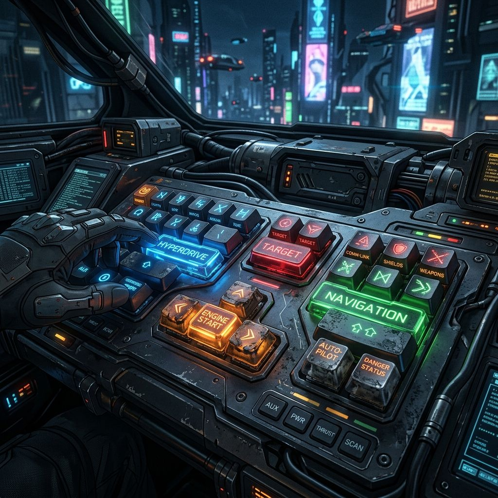
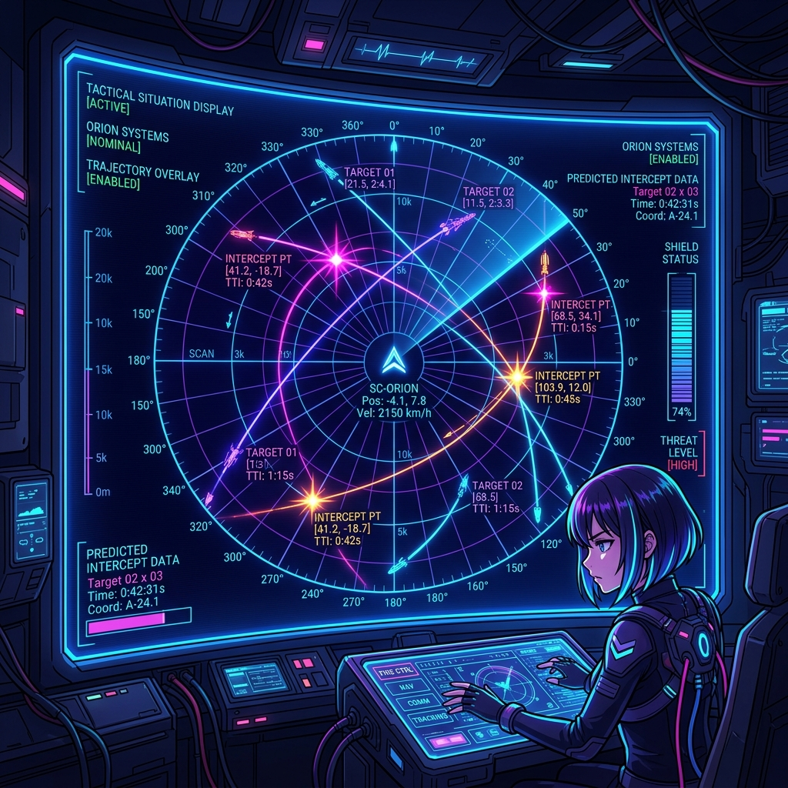
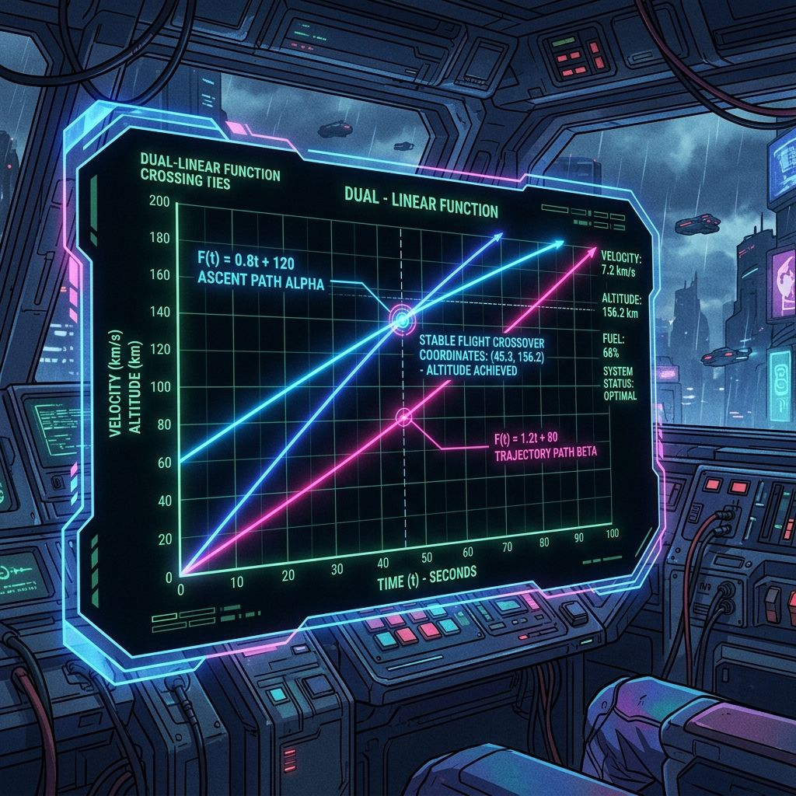
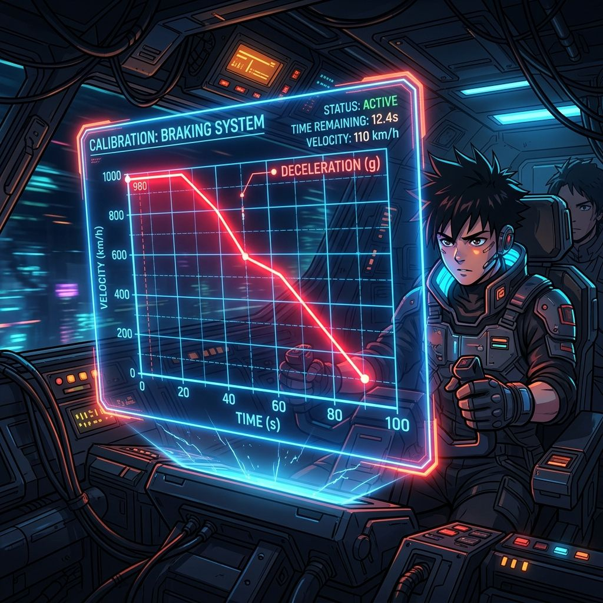

# grade2 5단원 대본집: Functions

이 파일은 수학 방탈출 게임의 스토리 대사, 퀴즈 문항, 이벤트 씬 정보를 관리하는 원천 데이터 파일입니다.

---

# [이미지 매핑]
- intro: intro.png
- 1: q1.png
- 2: q2.png
- 3: q3.png
- 4: q4.png
- 5: q5.png
- 6: q6.png
- 7: q7.png
- 8: q8.png
- 9: q9.png
- 10: q10.png
- 11: q11.png
- 12: q12.png
- 13: q13.png
- 14: q14.png
- 15: q15.png
- 16: q16.png
- 17: q17.png
- 18: q18.png
- 19: q19.png
- 20: q20.png
- event1: event1.png
- event2: event2.png
- event3: event3.png
- event4: event4.png
- outro: outro.png

---

# [문항 정의]

## Q1
- 제목: 시스템 함수 정의
- 이미지: 
- 질문: <strong>Q1. [함수의 정의]</strong> 두 변수 $x, y$ 에 대하여 $x$의 값이 정해짐에 따라 $y$의 값이 오직 하나씩 정해지는 관계가 있을 때, $y$를 $x$의 무엇이라 하는가?
- 힌트: 
- 정답 체크: ans === '함수'
- 선택지: 함수, 함수 아님, 알 수 없음, 해 없음
- 플레이스홀더: 두 글자 입력
- 에러 메시지: 시스템 용어가 올바르지 않습니다. 두 글자 명사입니다.
- 지문:
[시스템-에러]: "자율주행 택시의 기어를 임의로 변속시켰다! x라는 입력 기어가 굴러갈 때 y 기어가 단 하나로 완벽히 바인딩되는 함수 관계의 정의조차 입력하지 못해 절벽에 처박힐 녀석들!"  <i>지이이잉- 계기판 제어 패널이 주황색 경고등과 함께 지직거리며 흐려집니다. 일차 연결 관계의 가장 핵심적인 정의 단어가 해독 장치에 요구됩니다.</i>  [루트-R]: "조사관님, 자율주행 보정이 필요합니다! 변수 $x$에 의해 $y$가 오직 하나씩 유도되는 이 핵심 관계 용어(두 글자)를 콘솔에 전송해 엔진 보드를 깨우십시오!"

## Q2
- 제목: 기본 궤적 연산
- 이미지: 
- 질문: <strong>Q2. [함숫값 연산 1]</strong> 함수 $f(x) = 2x - 3$ 에서 $x=4$ 일 때의 함숫값 $f(4)$ 를 구하시오.
- 힌트: 
- 정답 체크: ans === '5'
- 선택지: 10, 3, 7, 5
- 플레이스홀더: 숫자만 입력
- 에러 메시지: 연산 결과가 올바르지 않습니다. $2 	imes 4 - 3$을 다시 계산해보세요.
- 지문:
[시스템-에러]: "겨우 부팅했군. 일차함수 $f(x)=2x-3$ 식의 출력 주파수가 흔들린다. 입력값 $x=4$에 해당하는 실질 출력 전압 세기를 계산할 수 있겠나?"  <i>차량 전방 서스펜션이 찌르르 떨리며 궤적이 오른쪽 차선 밖으로 쏠리기 시작합니다.</i>  [루트-R]: "궤적 복원 전류 계산 시작! 함수 $f(x)=2x-3$ 에서 $x=4$ 일 때의 함숫값을 연산해 메인 가이드 빔에 쏘아 주십시오!"

## Q3
- 제목: 속도 제어 밸브
- 이미지: 
- 질문: <strong>Q3. [함숫값 연산 2]</strong> 함수 $f(x) = rac{10}{x}$ 에서 $f(2)$ 의 값을 구하시오.
- 힌트: 
- 정답 체크: ans === '5'
- 선택지: 10, 3, 7, 5
- 플레이스홀더: 숫자만 입력
- 에러 메시지: 출력 전압이 맞지 않습니다. 10을 2로 나누어보세요.
- 지문:
[시스템-에러]: "연료 분사 노즐에 오염 코드를 주입했다! 반비례 분사 공식의 전압 $f(2)$를 정확히 맞춰 노즐을 열지 않으면 불꽃에 휩싸이리라!"  <i>푸슈슈슉- 보닛 틈새로 뜨거운 증기가 솟구쳐 오르고 엔진 가동 한계 온도가 위험 수준으로 급증합니다.</i>  [루트-R]: "엔진 밸브 보정 공식 작동! 함수 $f(x)=\frac{10}{x}$ 에서 $f(2)$ 의 최종 값을 주입하여 분사량을 안정시키십시오!"

## Q4
- 제목: 일차함수 판별
- 이미지: 
- 질문: <strong>Q4. [일차함수의 판별]</strong> 다음 중 일차함수인 것은? (1) $y = rac{3}{x}$ (2) $y = x^2$ (3) $y = 3x - 1$ (4) $y = 5$
- 힌트: 
- 정답 체크: ans === '3' || ans === '(3)'
- 선택지: $y
- 플레이스홀더: 번호만 입력 (예: 3)
- 에러 메시지: 오류 패킷입니다. $y = ax + b$ (단, $a
- 지문:
<strong>[위상 감지 센서 장애 및 신호 격차 스파크 발생]</strong>  [루트-R]: "치지직... 조사관님! 전방에 에러가 전개한 네 갈래 교차 코드로가 보입니다! ⚙️ [일차함수 판별 제어]  진짜 일차함수 성질을 만족하는 올바른 도로 차선 번호를 선택해 차량 진행 방향을 교정하십시오!"

## Q5
- 제목: 궤적 평행이동
- 이미지: 
- 질문: <strong>Q5. [평행이동 식 세우기]</strong> 일차함수 $y = 4x$ 의 그래프를 $y$축의 방향으로 -2만큼 평행이동한 그래프의 식을 구하시오. (공백 없이 입력)
- 힌트: 
- 정답 체크: ans.replace(/\s+/g, '') === 'Y=4X-2'
- 선택지: Y=4X-2, Y=4X-2 아님, 알 수 없음, 해 없음
- 플레이스홀더: 예: y = 4x - 2
- 에러 메시지: 수식이 올바르지 않습니다. 평행이동한 만큼 상수항을 붙여 완성하세요.
- 지문:
<strong>[제동 유도 광선 왜곡 점멸]</strong>  [루트-R]: "치직... 택시 주행축이 가로로 휘어졌습니다! $y=4x$ 그래프의 평행이동 변위 수치를 계측해 제어 코드를 전송해야 합니다! ⚙️ [y축 방향 -2 평행이동 수식 조립]"

## Q6
- 제목: 축 교점 분석
- 이미지: 
- 질문: <strong>Q6. [x축과의 교점]</strong> 일차함수의 그래프가 $x$축과 만나는 점의 $x$좌표를 무엇이라 하는가?
- 힌트: 
- 정답 체크: ans === 'X절편' || ans === '엑스절편'
- 선택지: X절편, X절편 아님, 알 수 없음, 해 없음
- 플레이스홀더: 세 글자 입력
- 에러 메시지: 올바른 명칭이 아닙니다. x...?
- 지문:
[시스템-에러]: "가로 교차 장벽에 들이받고 고철이 될 시간이다. x축의 한계 선을 넘는 교차점의 정확한 수학 용어를 선언할 수 있겠느냐!"  <i>쾅쾅-! 차량 범퍼가 가상의 빨간색 x축 차단벽과 강하게 마주하며 불꽃을 일으킵니다.</i>  [루트-R]: "가로축 접점의 수학 명칭(세 글자)을 해독 장치에 입력해 전방 차단막을 관통하십시오!"

## Q7
- 제목: 출발지 복원 ($y$절편)
- 이미지: 
- 질문: <strong>Q7. [y절편 구하기]</strong> 일차함수 $y = 2x + 6$ 의 $y$절편을 구하시오.
- 힌트: 
- 정답 체크: ans === '6'
- 플레이스홀더: 숫자만 입력
- 에러 메시지: 절편 연산에 실패했습니다. $x=0$일 때의 $y$값을 구하세요.
- 지문:
[시스템-에러]: "세로 중심 회선의 원점 높이를 비틀었다! 출발지의 세로 높이조차 읽지 못하는 눈먼 내비게이션 같으니!"  <i>지직- 헤드라이트 조준선이 세로 방향으로 왜곡되어 땅바닥을 향합니다.</i>  [루트-R]: "출발 기준 고도 복구 시도! 직선 $y=2x+6$의 세로축 절편($y$절편) 상수를 입력하여 라이트 조준선을 정상으로 돌리십시오!"

## Q8
- 제목: 제동 장벽 통과 ($x$절편)
- 이미지: 
- 질문: <strong>Q8. [x절편 구하기 1]</strong> 일차함수 $y = 2x + 6$ 의 $x$절편을 구하시오.
- 힌트: 
- 정답 체크: ans === '-3'
- 플레이스홀더: 음수는 마이너스 기호 포함 입력
- 에러 메시지: 틀렸습니다. $y=0$일 때의 $x$값을 찾아보세요. ($2x+6=0$)
- 지문:
[시스템-에러]: "세로를 고정했다면 가로 정합선은 어떨까? 정확한 접지 정합 제동 좌표를 대지 못하면 격벽에 가로막힐 뿐이다!"  <i>전방 노면에서 회색 철제 격벽 셔터가 위아래로 움직이며 주행을 방해합니다.</i>  [루트-R]: "격벽 개방 주파수 산출! 직선 $y=2x+6$의 가로축 절편($x$절편) 값을 마이너스 기호를 포함해 신속히 입력하십시오!"

## Q9
- 제목: 회전 각도 정합
- 이미지: 
- 질문: <strong>Q9. [x절편 구하기 2]</strong> 일차함수 $y = -rac{1}{2}x + 4$ 의 $x$절편을 구하시오.
- 힌트: 
- 정답 체크: ans === '8'
- 플레이스홀더: 숫자만 입력
- 에러 메시지: 오류입니다. $-rac{1}{2}x + 4 = 0$이 되는 $x$값을 구하세요.
- 지문:
[시스템-에러]: "하강 각도로 덮쳐오는 이 미끄럼 방해 빔을 이겨낼 수 있을까? 충돌까지 남은 거리는 고작 50미터다!"  <i>위이이잉- 전방에서 거대한 회전 스위퍼 암이 다가오며 차량 범퍼를 위협합니다.</i>  [루트-R]: "회전 암 차단 코드 갱신! 궤적 $y=-\frac{1}{2}x+4$의 가로축 도킹선($x$절편) 수치를 대입하여 스위퍼 암을 즉시 멈추십시오!"

## Q10
- 제목: 궤적 방정식 조립
- 이미지: 
- 질문: <strong>Q10. [절편을 활용한 식 세우기]</strong> $y$절편이 5이고 $x$절편이 -5인 일차함수의 식을 구하시오. (공백 없이 입력)
- 힌트: 
- 정답 체크: ans.replace(/\s+/g, '') === 'Y=X+5'
- 선택지: Y=X+5, Y=X+5 아님, 알 수 없음, 해 없음
- 플레이스홀더: 예: y = x + 5
- 에러 메시지: 방정식이 잘못 조립되었습니다. 기울기와 $y$절편을 바탕으로 식을 완성하세요.
- extra_class: glitch-bg
- 지문:
💥 <strong>[비상 로그: 자율주행 차량 메인 뇌파 칩셋 강제 폭파 시퀀스 작동!]</strong> 💥  [시스템-에러]: "끈질기게 버티는구나! 내 너희의 스마트카 코어를 전부 불태워 포맷하겠다! 5분 뒤 모든 전력 콘덴서가 터져 나가리라!"  <i>경보 부저음과 흰색 연기가 대시보드 틈새에서 새어 나오기 시작합니다. 절편 정보를 결합한 정상 궤도 일차함수 식을 긴급 조립하십시오!</i>  [루트-R]: "노심 전류 과부하 봉착! $y$절편이 5이고 $x$절편이 -5인 정상 궤도의 일차함수 완성 식을 공백 없이 입력해 셧다운을 파쇄하십시오!"

## Q11
- 제목: 변화율 계산
- 이미지: 
- 질문: <strong>Q11. [x의 증가량에 따른 y의 증가량]</strong> 일차함수 $y = 3x - 2$ 에서 $x$의 값이 1만큼 증가할 때 $y$의 값은 얼마나 증가하는가?
- 힌트: 
- 정답 체크: ans === '3'
- 플레이스홀더: 숫자만 입력
- 에러 메시지: 계측 오류입니다. 일차함수 $y=ax+b$에서 $x$의 계수가 의미하는 변화량을 찾아보세요.
- 지문:
[루트-R]: "후... 자폭 시퀀스 3분 지연 성공! 하지만 차량이 가파른 경사 궤도를 타고 오르며 속력이 불안정하게 요동칩니다! ⚙️ [가속 변화율 조율]"  <i>가상 궤도 빔이 가파르게 하늘을 향해 치솟습니다. 수식 $y = 3x - 2$ 에서 시간 변수 x가 1초 경과할 때 주행축 y가 오르는 변화량 상수를 구하십시오.</i>

## Q12
- 제목: 기울기 심볼
- 이미지: 
- 질문: <strong>Q12. [기울기의 정의]</strong> 일차함수 $y = ax + b$ 에서 기울기를 나타내는 문자는 무엇인가? (알파벳 소문자)
- 힌트: 
- 정답 체크: ans === 'A' || ans === 'a'
- 플레이스홀더: 알파벳 1글자 입력
- 에러 메시지: 올바른 시스템 심볼이 아닙니다. $x$의 계수에 해당하는 변수 이름입니다.
- 지문:
[루트-R]: "조향 제어 모듈에 연결할 기울기의 공식 문자 상징을 요구하고 있습니다! ⚙️ [기울기 변수 선언]"  <i>주 조향 장치 키패드 상단에 기울기 계수를 의미하는 알파벳 기호 입력 슬롯이 점멸합니다.</i>

## Q13
- 제목: 두 점 사이의 구배
- 이미지: 
- 질문: <strong>Q13. [기울기 구하기]</strong> 두 점 $(1, 3)$ 과 $(3, 7)$ 을 지나는 직선의 기울기를 구하시오.
- 힌트: 
- 정답 체크: ans === '2'
- 플레이스홀더: 숫자만 입력
- 에러 메시지: 구배 연산에 실패했습니다. (y의 증가량) / (x의 증가량) 공식을 이용하세요.
- 지문:
[루트-R]: "안전 조향 궤도의 구배(기울기)를 도출해야 내비게이션의 꺾임각이 맞아떨어집니다! ⚙️ [두 점 사이의 기울기 연산]"  <i>유도 경로상의 두 점 $(1,3)$과 $(3,7)$을 관통하는 최적 궤도의 기울기 수치를 기입창에 주입하십시오.</i>

## Q14
- 제목: 경로 함수 합성
- 이미지: 
- 질문: <strong>Q14. [기울기와 y절편으로 식 세우기]</strong> 기울기가 -2이고 $y$절편이 1인 일차함수의 식을 구하시오. (공백 없이 입력)
- 힌트: 
- 정답 체크: ans.replace(/\s+/g, '') === 'Y=-2X+1'
- 선택지: Y=-2X+1, Y=-2X+1 아님, 알 수 없음, 해 없음
- 플레이스홀더: 예: y = -2x + 1
- 에러 메시지: 합성 식에 오류가 있습니다. 기울기와 $y$절편을 순서대로 식에 넣으세요.
- 지문:
[루트-R]: "경로 제어 마스터 록 단계입니다! 기울기와 절편 결합 수식을 조립하여 차량 조향 모터에 즉시 인젝션하십시오! ⚙️ [최종 궤적 합성]"  <i>경로 지시계에 기울기 -2, y절편 1을 가지는 전용 주행 공식 궤적을 공백 없이 입력하십시오!</i>

## Q15
- 제목: 조향 방향 결정
- 이미지: 
- 질문: <strong>Q15. [기울기의 부호와 그래프 방향]</strong> 일차함수 $y = -3x + 4$ 의 그래프는 오른쪽 ( 위 / 아래 ) 로 향하는 직선이다.
- 힌트: 
- 정답 체크: ans === '아래'
- 플레이스홀더: 위 또는 아래 입력
- 에러 메시지: 틀렸습니다. 기울기의 부호가 음수(-)일 때 직선이 향하는 방향을 생각해보세요.
- extra_class: glitch-bg
- 지문:
✨ <strong>[루트-R 메인 제어 콘솔 권한 100% 완전 환수]</strong> ✨  [루트-R]: "동기화 완료, 조사관님! 차량의 중앙 조향 샤프트 통제권을 완벽하게 환수했습니다! 이제 해커의 가상 급커브 결계를 회피합니다. 하강형 궤도 $y=-3x+4$의 진행 방향(위 / 아래)을 판단해 선언하십시오!"  <i>계기판 홀로그램이 파랗게 정렬되며 차량 서스펜션이 안정적인 대칭 구도로 펴집니다.</i>  [시스템-에러]: "내 통제 라인을 뚫었다고 좋아하지 마라! 연료 소모 한도 내에 안전지대로 들어가지 못하고 멈추리라!"

## Q16
- 제목: 소모 패턴 식화
- 이미지: 
- 질문: <strong>Q16. [일차함수 활용 식 세우기]</strong> 길이가 20cm인 양초에 불을 붙이면 1시간에 2cm씩 짧아진다. $x$시간 후의 양초의 길이를 $y$cm라 할 때, $y$를 $x$의 식으로 나타내시오. (공백 없이 입력)
- 힌트: 
- 정답 체크: ans.replace(/\s+/g, '') === 'Y=20-2X' || ans.replace(/\s+/g, '') === 'Y=-2X+20'
- 선택지: Y=20-2X, Y=20-2X 아님, 알 수 없음, 해 없음
- 플레이스홀더: 예: y = 20 - 2x
- 에러 메시지: 수식이 올바르지 않습니다. 처음 전지 길이에서 시간당 소모량을 차감하는 식을 세우세요.
- 지문:
[시스템-에러]: "배터리 전하 연소 시뮬레이션 식이다! 최초 20L의 고성능 액화 연료가 매시간 2L 속도로 감쇠할 때의 잔여물 공식을 완벽히 매핑해 봐라!"  <i>액화 연료 게이지의 주황색 게이지바가 아래로 흐릅니다. 시간 x와 잔여량 y의 올바른 일차함수 식을 입력창에 전송하십시오.</i>

## Q17
- 제목: 완전 방전 시간
- 이미지: 
- 질문: <strong>Q17. [함수 활용 값 구하기 1]</strong> 위 Q16의 양초가 완전히 다 타서 없어지는 것은 불을 붙인 지 몇 시간 후인가?
- 힌트: 
- 정답 체크: ans === '10' || ans === '10시간'
- 플레이스홀더: 예: 10시간
- 에러 메시지: 틀렸습니다. 냉각 연료 봉의 잔여 길이인 $y$가 0이 되는 시간 $x$를 구하세요.
- 지문:
[시스템-에러]: "식을 조립했다면, 연료 전지가 완전히 0으로 소진되어 차량이 서 버리는 진짜 데드라인 한계 시간 상수를 도출해 봐라!"  <i>엔진 구동 경보기가 깜빡이며 전하 고갈까지 남은 가상의 도달 시간을 연산 콘솔에 대기시킵니다.</i>

## Q18
- 제목: 음파 내비게이션 복구
- 이미지: 
- 질문: <strong>Q18. [일차함수 활용 식 세우기 2]</strong> 기온이 0도일 때 소리의 속력은 초속 331m이고 기온이 1도 오를 때마다 초속 0.6m씩 증가한다. 기온이 $x$도일 때 소리의 속력 $y$를 식으로 나타내시오. (공백 없이 입력)
- 힌트: 
- 정답 체크: ans.replace(/\s+/g, '') === 'Y=0.6X+331' || ans.replace(/\s+/g, '') === 'Y=331+0.6X'
- 선택지: Y=0.6X+331, Y=0.6X+331 아님, 알 수 없음, 해 없음
- 플레이스홀더: 예: y = 0.6x + 331
- 에러 메시지: 물리 보정 식이 바르지 않습니다. 기온에 따른 가산율을 계산 식에 포함하세요.
- 지문:
[시스템-에러]: "지하 주행 터널 내벽의 보정 공식을 망가뜨렸다. 기온 x도에 상응해 증가하는 소리의 음파 속력 y 보정 식을 복구해 바라!"  <i>초음파 전파 보정 미터기가 노이즈로 세게 흔들립니다. 온도 가산 속력 공식 식을 전송해 주십시오.</i>

## Q19
- 제목: 최종 기온 속력 정합
- 이미지: 
- 질문: <strong>Q19. [함수 활용 값 구하기 2]</strong> 기온이 15도일 때, 소리의 속력을 구하시오. (숫자만 입력)
- 힌트: 
- 정답 체크: ans === '340' || ans === '340M/S' || ans === '초속340M'
- 플레이스홀더: 예: 340
- 에러 메시지: 오차 기온 속력입니다. $331 + 0.6 	imes 15$를 연산해 보세요.
- 지문:
[시스템-에러]: "터널 출구 주변의 기상 센서 온도는 현재 15도다. 이 기온 대역의 음파 속력 물리량을 정확히 꽂지 못하면 레이더 피드백이 불타버릴 것이다!"  <i>기온 센서 다이어그램이 15도를 가리킵니다. 보정 상수를 대입한 음파 속력 정수를 출력 패드에 기입하십시오!</i>

## Q20
- 제목: 감속 냉각 시간
- 이미지: 
- 질문: <strong>Q20. [일차함수 최종 활용]</strong> 처음 물통에 50L의 물이 들어 있고 매분 3L씩 물을 빼낸다. 물이 20L가 남는 것은 몇 분 후인지 구하시오. (숫자만 입력)
- 힌트: 
- 정답 체크: ans === '10' || ans === '10분'
- 플레이스홀더: 예: 10
- 에러 메시지: 브레이크 동작 실패! 유량 잔액 식 $50 - 3x = 20$을 만족하는 변수 값을 다시 구하십시오.
- extra_class: glitch-bg
- 지문:
🔮 <strong>[최종 네오 서울 중앙 터미널 게이트 오픈]</strong> 🔮  [루트-R]: "조사관님! 이제 네오 서울 중앙역 활주로로 진입하는 마지막 격벽 차단막만 남았습니다! 제 마지막 백업 연산 에너지를 비상 정지 감속 밸브에 투입하겠습니다! 물통 유량 식 $50 - 3x = 20$의 잔여 20L가 남는 최종 감속 시간(분)을 밸브 제어기에 입력하여 택시를 제동하십시오! 이제 안전지대로 나갈 시간입니다!"  [시스템-에러]: "말도 안 돼... 내 주행 폭주 궤적 제어 루프가... 완전히 0으로 제동되어 멈추다니!"

---

# [이벤트 정의]

## EVENT1
- 제목: 동력 기어 가동
- 이미지: 
- 버튼 텍스트: 계속 전진하기
- 다음 스테이지: panel_q6
- 달성도: 25
- 지문:
수십 개의 황동 구리 태엽 락이 해제되며 톱니바퀴 동력 기어가 힘차게 급가속 가동을 시작합니다.

[아리아드네]: "좋습니다! 1차 유압 동력 충전이 완료되었습니다. 어서 다음 격벽 터빈실로 돌입하세요!"

## EVENT2
- 제목: 비상 차단 장치 리셋
- 이미지: 
- 버튼 텍스트: 비상 전력 가동
- 다음 스테이지: panel_q11
- 달성도: 50
- 지문:
과열 배기 밸브가 기계식으로 리셋 해제되며 스팀 터빈의 과열 증기가 멈춰 가라앉습니다.

[아리아드네]: "후우... 공장 온도가 급격히 하강합니다. 정밀 매니퓰레이터 기어축이 락인되었습니다. 다음 3구역으로 돌입합시다!"

## EVENT3
- 제목: 핵심 복원 제단 활성화
- 이미지: 
- 버튼 텍스트: 제단 활성화
- 다음 스테이지: panel_q16
- 달성도: 75
- 지문:
중앙 유압 패널이 좌우로 나뉘며 오색 마나 불꽃을 내뿜는 피스톤 동력 제단이 활성화됩니다.

[아리아드네]: "100% 동기화 성공! 스팀펑크 기하 설계의 모든 비밀이 기입됩니다. 빌런인 미노타우로스의 최종 마스터 락에 도전하십시오!"

## EVENT4
- 제목: 탈출 차원 포탈 개방
- 이미지: 
- 버튼 텍스트: 지상으로 탈출
- 다음 스테이지: outro
- 달성도: 100
- 지문:
최종 강철 빗장이 풀리고 공장 밖 지상으로 향하는 에메랄드색 황금 링 포탈이 요동치며 작동합니다.

[아리아드네]: "탈출 해치가 열렸습니다! 어서 복원 코덱스 서판을 챙겨 포탈로 점프하십시오!"

[미노타우로스]: "유압 기하학의 무결성을 인정하마... 무사 탈출하라."

