# grade2 6단원 대본집: Geometry1

이 파일은 수학 방탈출 게임의 스토리 대사, 퀴즈 문항, 이벤트 씬 정보를 관리하는 원천 데이터 파일입니다.

---

# [이미지 매핑]
- intro: intro.png
- 1: q1.png
- 2: q2.png
- 3: q3.png
- 4: q4.png
- 5: q5.png
- 6: q6.png
- 7: q7.png
- 8: q8.png
- 9: q9.png
- 10: q10.png
- 11: q11.png
- 12: q12.png
- 13: q13.png
- 14: q14.png
- 15: q15.png
- 16: q16.png
- 17: q17.png
- 18: q18.png
- 19: q19.png
- 20: q20.png
- event1: event1.png
- event2: event2.png
- event3: event3.png
- event4: event4.png
- outro: outro.png

---

# [문항 정의]

## Q1
- 제목: 설계도의 기본 뼈대
- 이미지: 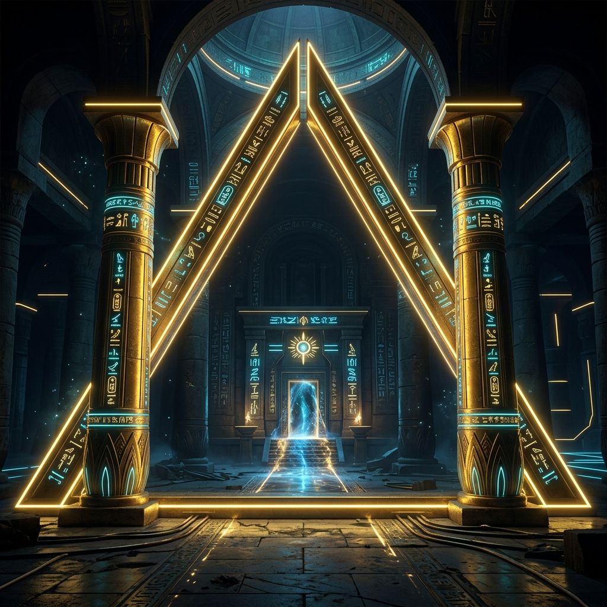
- 질문: <strong>Q1. [삼각형의 기본]</strong> 두 변의 길이가 같은 삼각형을 무엇이라 하는가?
- 힌트: 
- 정답 체크: ans === '이등변삼각형'
- 선택지: 이등변삼각형, 이등변삼각형 아님, 알 수 없음, 해 없음
- 플레이스홀더: 이등변삼각형 입력
- 에러 메시지: 삼각형의 명칭이 올바르지 않습니다.
- 지문:
[사원의 약탈자 - 도굴꾼]: "크하하! 이 무덤의 상형문자 봉인 격벽은 우리 도굴단이 전부 잠가 버렸다. 고대 피라미드 설계 지식조차 없는 어리석은 서생 녀석들!"  <i>스스스스- 바닥의 모래가 소용돌이치며, 고대 청동 눈금판 위로 삼각형 뼈대 도안이 부조로 솟아오릅니다. 설계도의 기초가 되는 고유 삼각형의 명칭을 기입하십시오.</i>  [신전의 수호 정령 - 임호텝]: "외지인들이여, 내 무덤의 골조를 정렬해 주십시오. 두 기둥(변)의 길이가 일치해 수평 균형을 유지하는 이 기본적인 삼각형의 기하학적 명칭은 무엇입니까?"

## Q2
- 제목: 대칭의 각도
- 이미지: 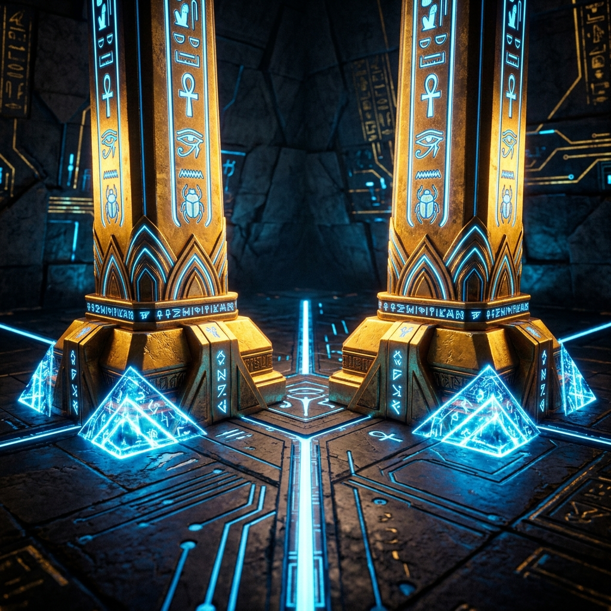
- 질문: <strong>Q2. [이등변삼각형의 성질 1]</strong> 이등변삼각형의 두 ( ? )의 크기는 같다. (두 글자)
- 힌트: 
- 정답 체크: ans === '밑각'
- 선택지: 밑각, 밑각 아님, 알 수 없음, 해 없음
- 플레이스홀더: 두 글자 입력
- 에러 메시지: 틀렸습니다. 밑변에 접하는 두 각의 이름입니다.
- 지문:
[사원의 약탈자 - 도굴꾼]: "단순히 이름만 안다고 문이 열릴 줄 알았느냐? 삼각형의 주춧돌이 하중을 견디기 위한 대칭각의 법칙을 대 보아라!"  <i>드르륵- 바닥 돌판이 아래로 10센티미터 주저앉으며 가벼운 마찰 진동이 일어납니다.</i>  [신전의 수호 정령 - 임호텝]: "이등변삼각형이 무너지지 않고 하중을 완벽하게 양분하기 위한 두 밑바닥 각의 명칭을 가로 질러 봉인을 푸십시오."

## Q3
- 제목: 기단의 경사각 계산
- 이미지: 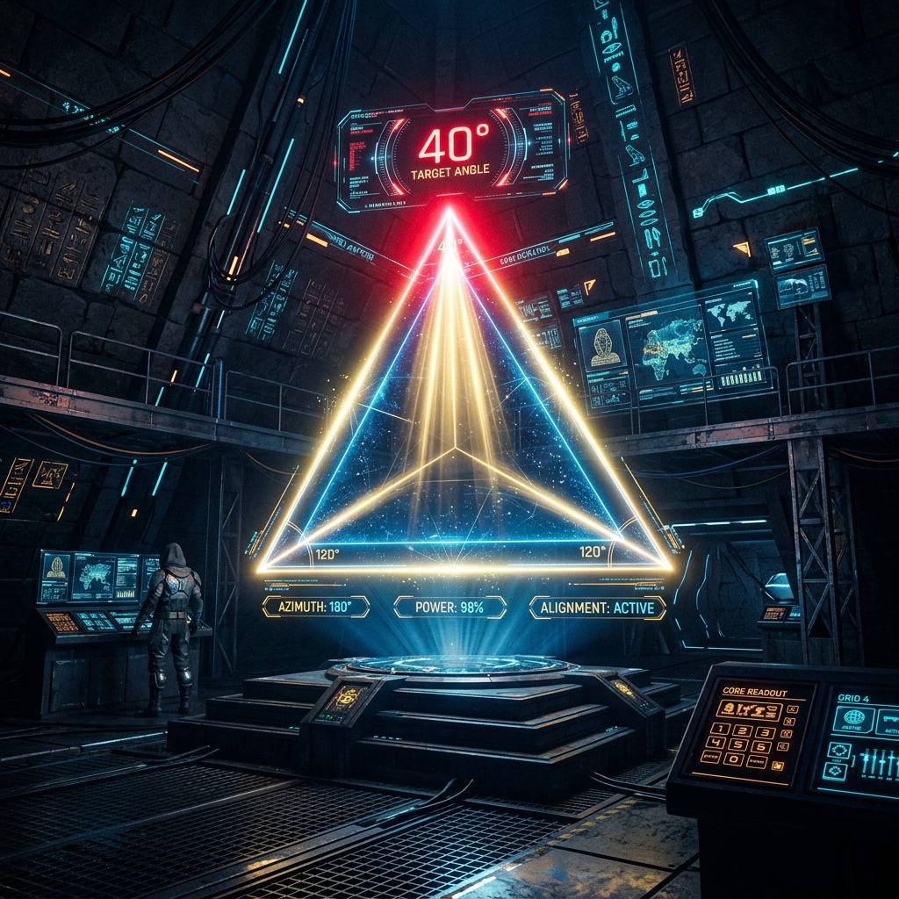
- 질문: <strong>Q3. [밑각의 크기 구하기]</strong> 꼭지각이 40도인 이등변삼각형의 한 밑각의 크기를 구하시오. (숫자만 입력)
- 힌트: 
- 정답 체크: ans === '70' || ans === '70도'
- 선택지: 70, 72, 140, 68
- 플레이스홀더: 숫자만 입력
- 에러 메시지: 틀렸습니다. 삼각형 내각의 합(180도)과 꼭지각의 차를 2로 나누어보세요.
- 지문:
[사원의 약탈자 - 도굴꾼]: "꼭대기 상량 각도를 40도로 좁혀 두었다. 기둥 하단이 찢어지며 천장이 무너지기 전에 이 대칭 경사각을 도출해 보아라!"  <i>벽 틈새로 고대 시간의 모래시계의 모래가 빠르게 쏟아져 내리기 시작합니다.</i>  [신전의 수호 정령 - 임호텝]: "서두르십시오. 꼭지각이 40도일 때, 피라미드 기단 양바닥 경사를 결정할 한 밑각의 각도 수치를 계산하여 모래시계 수조에 입력해 주십시오!"

## Q4
- 제목: 직각 기둥의 대칭 조건
- 이미지: 
- 질문: <strong>Q4. [직각삼각형의 합동 조건]</strong> 직각삼각형의 합동 조건 두 가지를 영어 기호로 쓰시오. (쉼표로 구분하여 예: RHS, RHA)
- 힌트: 
- 정답 체크: ans.includes('RHS') && ans.includes('RHA')
- 선택지: RHS, RHA, SSS, SAS, ASA
- 플레이스홀더: 예: RHS, RHA
- 에러 메시지: 합동 조건 기호가 올바르지 않습니다. (RHS, RHA 확인)
- 지문:
<strong>[제단 감시 방해 탁한 기운 전개]</strong>  [신전의 수호 정령 - 임호텝]: "치직... 제 정렬의 정신력이 교란받고 있습니다! ⚙️ [직각삼각형의 두 합동 조건 판별]  설계도의 좌우 대칭 직각 기둥이 완전히 서로 포개지는 두 가지 기하학적 영어 기호를 쉼표로 구분해 제단 열쇠 홈에 쏘아 주십시오!"

## Q5
- 제목: 예각의 합동 판정
- 이미지: 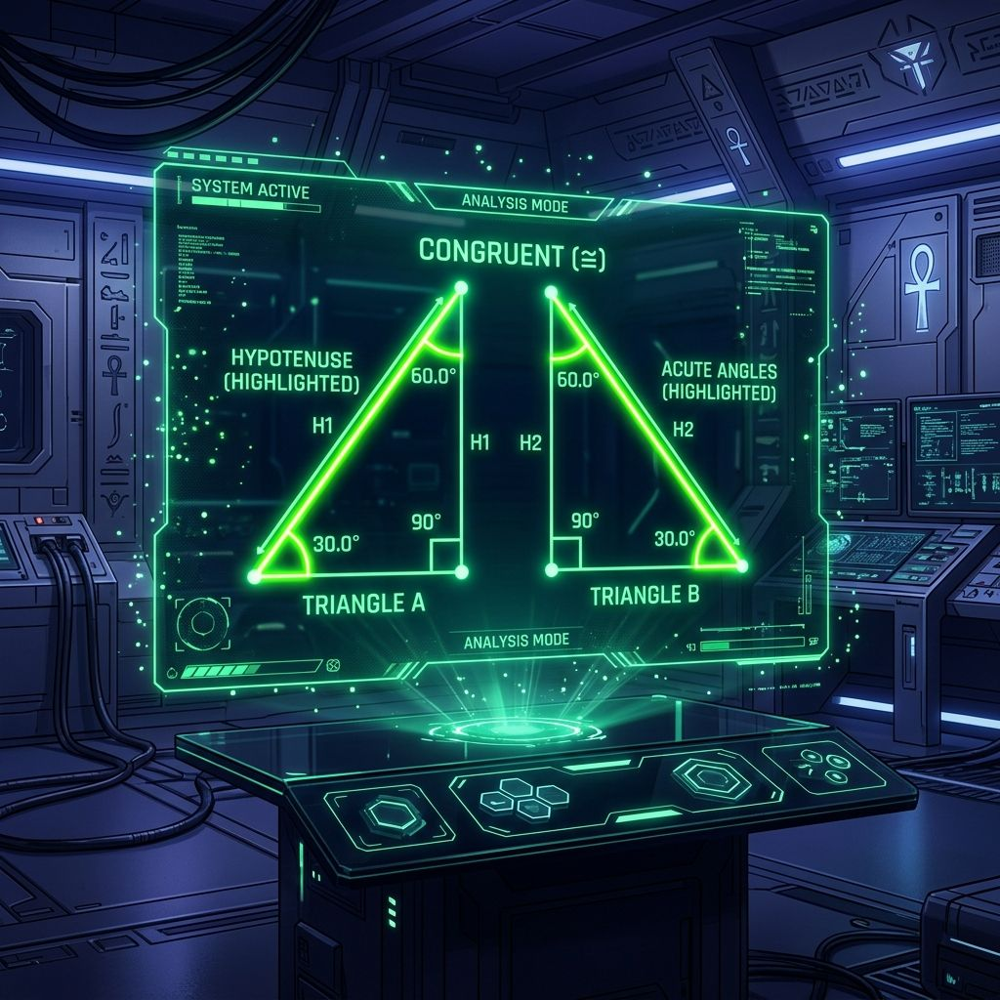
- 질문: <strong>Q5. [RHA 합동의 성질]</strong> 빗변의 길이와 한 예각의 크기가 같은 두 직각삼각형은 서로 합동이다. 이 조건을 무엇이라 하는가?
- 힌트: 
- 정답 체크: ans.includes('RHA')
- 선택지: RHS, RHA, SSS, SAS, ASA
- 플레이스홀더: 알파벳 기호 입력
- 에러 메시지: 틀렸습니다. R...?
- 지문:
<strong>[사원 회랑의 천장 가이드 놋쇠 톱니 연동]</strong>  [신전의 수호 정령 - 임호텝]: "치지직... 천장의 가이드 놋쇠 톱니가 돌아갑니다! 빗변과 하나의 예각이 대칭적으로 포개지는 직각 합동의 공식 명칭을 전송하십시오!"

## Q6
- 제목: 세 꼭짓점의 외접원
- 이미지: 
- 질문: <strong>Q6. [외심의 정의]</strong> 삼각형의 세 꼭짓점을 지나는 원을 외접원이라 하고, 그 중심을 무엇이라 하는가?
- 힌트: 
- 정답 체크: ans === '외심'
- 선택지: 외심, 내심, 무게중심, 수심
- 플레이스홀더: 두 글자 입력
- 에러 메시지: 올바른 명칭이 아닙니다. 바깥쪽 원의 중심입니다.
- 지문:
[사원의 약탈자 - 도굴꾼]: "삼각형 꼭짓점 세 군데를 모두 가두어 감싸 쥐는 고대 구체 마법의 바깥 외접원 중심을 해독할 수 있겠느냐!"  <i>쉬이이익- 벽면의 돌출 장치에서 푸른색 기하학 궤적이 허공에 투사되며 삼각형을 에워싸기 시작합니다.</i>  [신전의 수호 정령 - 임호텝]: "제2구역의 영적 저울입니다. 삼각형의 세 꼭짓점을 감싸 흐르는 외접원의 핵심 중심점 용어(두 글자)를 도출하십시오!"

## Q7
- 제목: 기울어진 기둥의 외심
- 이미지: 
- 질문: <strong>Q7. [둔각삼각형의 외심 위치]</strong> 둔각삼각형의 외심은 삼각형의 ( 내부 / 외부 )에 위치한다.
- 힌트: 
- 정답 체크: ans === '외부'
- 플레이스홀더: 내부 또는 외부 입력
- 에러 메시지: 틀렸습니다. 기하학 모형을 머릿속으로 그려보세요.
- 지문:
[사원의 약탈자 - 도굴꾼]: "90도보다 더 크게 뒤로 누운 사원 둔각 처마 지붕이다. 이 지붕의 외접원 중심점은 사원 뼈대 안쪽과 바깥쪽 중 대체 어느 위험 구역에 맺힐까?"  <i>우지끈- 사원 서까래 대들보 하나가 삐져나오며 기우뚱하게 가라앉습니다.</i>  [신전의 수호 정령 - 임호텝]: "기울어진 둔각삼각형의 외심 균형점 지점(내부 / 외부)을 결정해 구조물이 으스러지는 것을 방지해 주십시오!"

## Q8
- 제목: 직각 지붕의 중심
- 이미지: 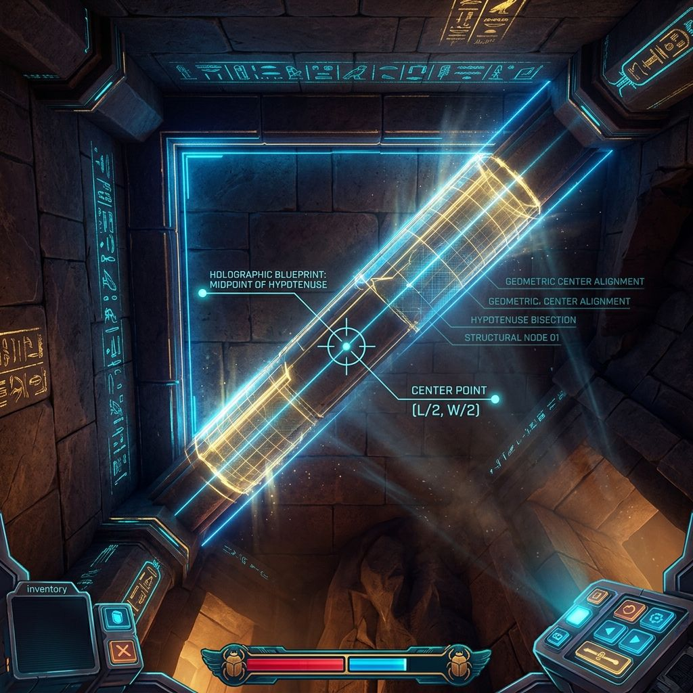
- 질문: <strong>Q8. [직각삼각형의 외심 위치]</strong> 직각삼각형의 외심은 빗변의 ( ? )에 위치한다. (두 글자)
- 힌트: 
- 정답 체크: ans === '중점'
- 플레이스홀더: 두 글자 입력
- 에러 메시지: 틀렸습니다. 빗변을 정확히 반으로 가르는 지점입니다.
- 지문:
[사원의 약탈자 - 도굴꾼]: "완벽한 직각을 이룬 석실 천장이다. 외심의 지점이 빗변의 어느 가장 취약한 부위에 맺히는지 계측해 보아라! 무너지기 직전이다!"  <i>쿠구구구- 석실의 천장 돌판이 미세하게 진동을 타며 내려옵니다.</i>  [신전의 수호 정령 - 임호텝]: "천장 붕괴 저지 수호단 가동! 직각삼각형 구조에서 외심이 놓이는 빗변 위의 고유 균형 지점(두 글자)을 입력하십시오!"

## Q9
- 제목: 세 내각의 분할점
- 이미지: 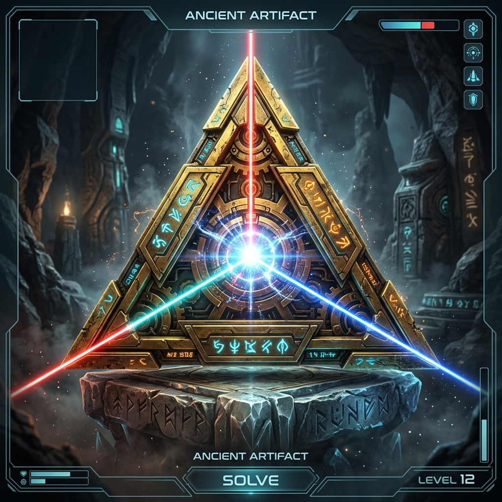
- 질문: <strong>Q9. [내심의 정의]</strong> 삼각형의 세 내각의 이등분선이 만나는 점을 무엇이라 하는가?
- 힌트: 
- 정답 체크: ans === '내심'
- 선택지: 외심, 내심, 무게중심, 수심
- 플레이스홀더: 두 글자 입력
- 에러 메시지: 틀렸습니다. 안쪽 원의 중심입니다.
- 지문:
[사원의 약탈자 - 도굴꾼]: "석실 내부의 세 귀퉁이 각도를 반씩 쪼개 융합한 핵심 핵이다. 이 중심 기하학 원리를 해독할 수 있겠나?"  <i>바닥의 원형 봉인판의 삼각 라인이 맞닿으며 중심부 원 홈으로 노란 빛을 내뿜습니다.</i>  [신전의 수호 정령 - 임호텝]: "석실 봉인을 풀 대칭선 교차 지점입니다. 세 내각의 이등분선이 모이는 삼각형 고유의 중심(내심 / 외심) 명칭을 기입하십시오!"

## Q10
- 제목: 내심의 거리적 특징
- 이미지: 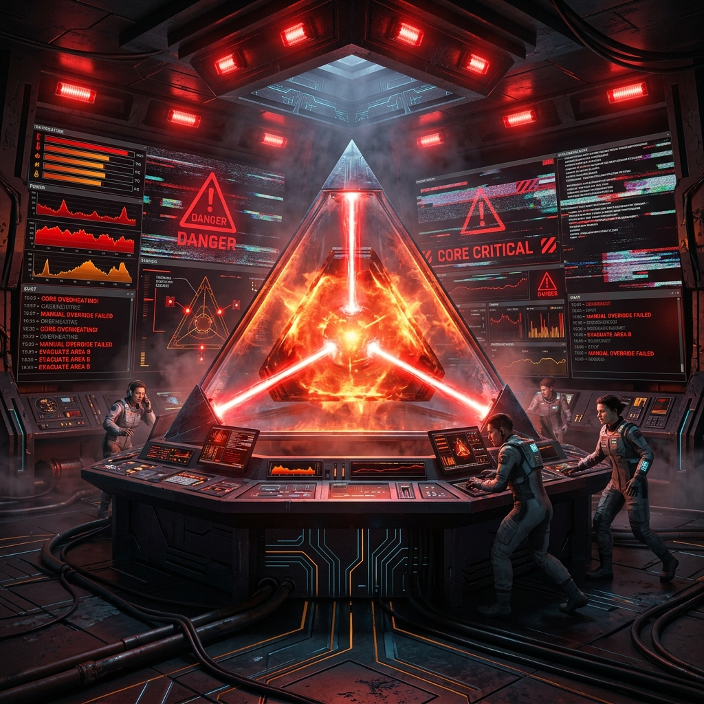
- 질문: <strong>Q10. [내심의 성질]</strong> 삼각형의 내심에서 세 ( ? )에 이르는 거리는 같다. (한 글자)
- 힌트: 
- 정답 체크: ans === '변'
- 플레이스홀더: 한 글자 입력
- 에러 메시지: 틀렸습니다. 기하학 구조를 확인하세요.
- extra_class: glitch-bg
- 지문:
💥 <strong>[비상: 사원의 심장부 마력 폭주 및 사원 붕괴 주술 작동!]</strong> 💥  [사원의 약탈자 - 도굴꾼]: "더는 지체할 수 없다! 설계도고 뭐고 묘실 전체를 폭파해 모조리 매장해 주마! 5분 뒤 모든 봉인의 수호 기단이 일제히 파괴되리라!"  <i>지진처럼 방 안이 격렬하게 흔들리고 천장에서 돌가루가 우수수 떨어집니다. 내심의 기하학적 성질(변 / 꼭짓점)을 규명해 붕괴 장치를 정지시키십시오!</i>  [신전의 수호 정령 - 임호텝]: "마력 에너지 95% 도달! 삼각형의 내심에서 세 '이것'에 이르는 거리가 항상 같다는 기하학적 정리를 한 글자로 대입하여 폭발을 막으십시오!"

## Q11
- 제목: 평행 회랑의 정의
- 이미지: 
- 질문: <strong>Q11. [평행사변형의 정의]</strong> 마주 보는 두 쌍의 대변이 각각 평행한 사각형을 무엇이라 하는가?
- 힌트: 
- 정답 체크: ans === '평행사변형'
- 선택지: 평행사변형, 평행사변형 아님, 알 수 없음, 해 없음
- 플레이스홀더: 다섯 글자 입력
- 에러 메시지: 올바른 명칭이 아닙니다.
- 지문:
[신전의 수호 정령 - 임호텝]: "후... 사원 붕괴 주술 3분 임시 지연 성공! 이제 제3구역 대칭의 사각 회랑 락에 도달했습니다! ⚙️ [평행 사각 봉인]"  <i>마주 보는 두 쌍의 테두리 변이 서로 나란히 평행하게 정렬된 이 사각형의 수학 명칭을 입력해 회랑의 봉인의 철창을 열어 주십시오.</i>

## Q12
- 제목: 대변의 균형
- 이미지: 
- 질문: <strong>Q12. [평행사변형의 성질 1]</strong> 평행사변형에서 마주 보는 대변의 길이는 서로 ( 같다 / 다르다 ).
- 힌트: 
- 정답 체크: ans === '같다'
- 플레이스홀더: 같다 또는 다르다 입력
- 에러 메시지: 틀렸습니다. 두 대변의 길이를 가늠해보세요.
- 지문:
[신전의 수호 정령 - 임호텝]: "좋습니다, 1단계 게이트 해제! 2단계 게이트는 마주 보는 변(대변)의 길이 비례 평형을 체크합니다! ⚙️ [대변의 대칭성]"  <i>격벽 측면의 석재 조율 판독기 홈에 기둥 길이가 일치함을 정의하는 수평 비교 단어(같다 / 다르다)를 입력하십시오.</i>

## Q13
- 제목: 대각의 평형
- 이미지: 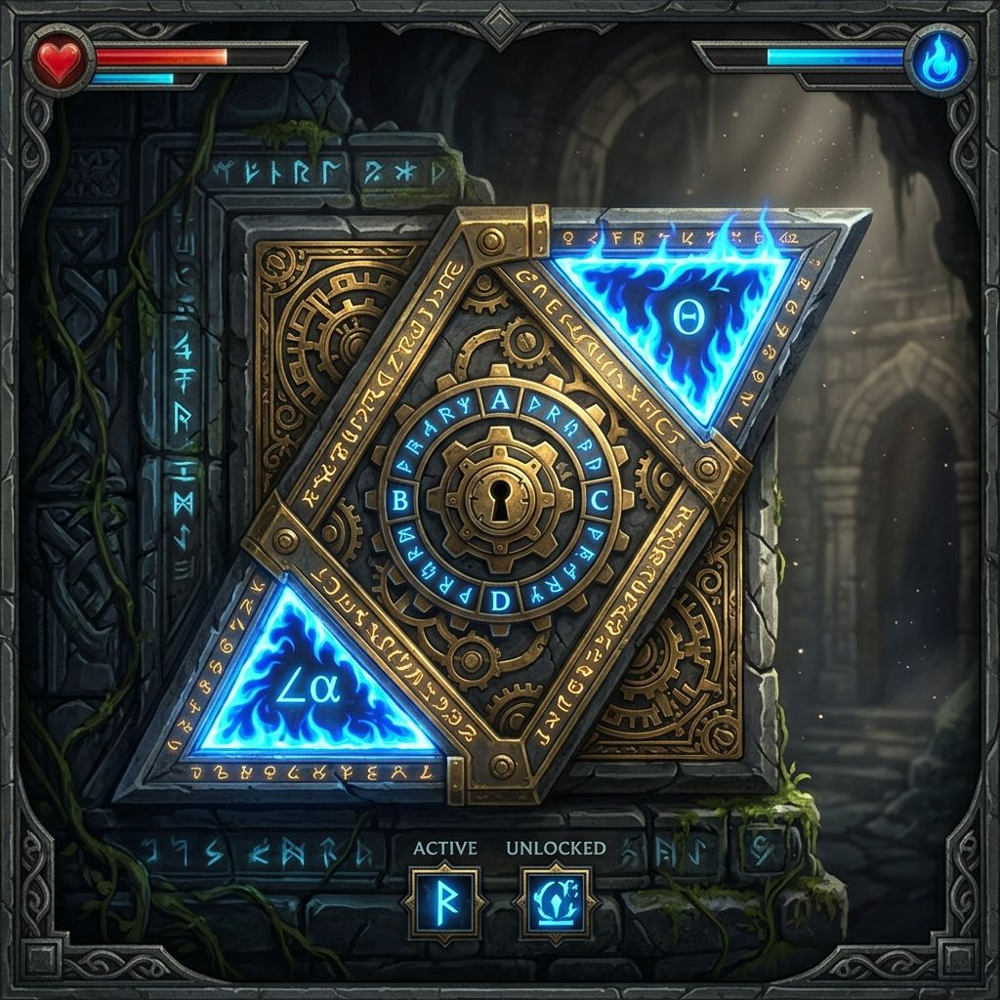
- 질문: <strong>Q13. [평행사변형의 성질 2]</strong> 평행사변형에서 마주 보는 두 대각의 크기는 서로 ( 같다 / 다르다 ).
- 힌트: 
- 정답 체크: ans === '같다'
- 플레이스홀더: 같다 또는 다르다 입력
- 에러 메시지: 틀렸습니다. 대칭되는 두 각의 관계를 상기하세요.
- 지문:
[신전의 수호 정령 - 임호텝]: "중앙 놋쇠 회전 기어 80% 도달! 마주 보는 코너 각도(대각)의 대칭 크기 관계를 선언하여 평형 유지 저울대를 정렬하십시오! ⚙️ [대각의 대칭성]"  <i>기어 조율기 수치 홈이 미세하게 흔들립니다. 대각의 크기가 어떻게 매칭되는지 단답형(같다 / 다르다)으로 답하십시오.</i>

## Q14
- 제목: 대각선의 골조 교차
- 이미지: 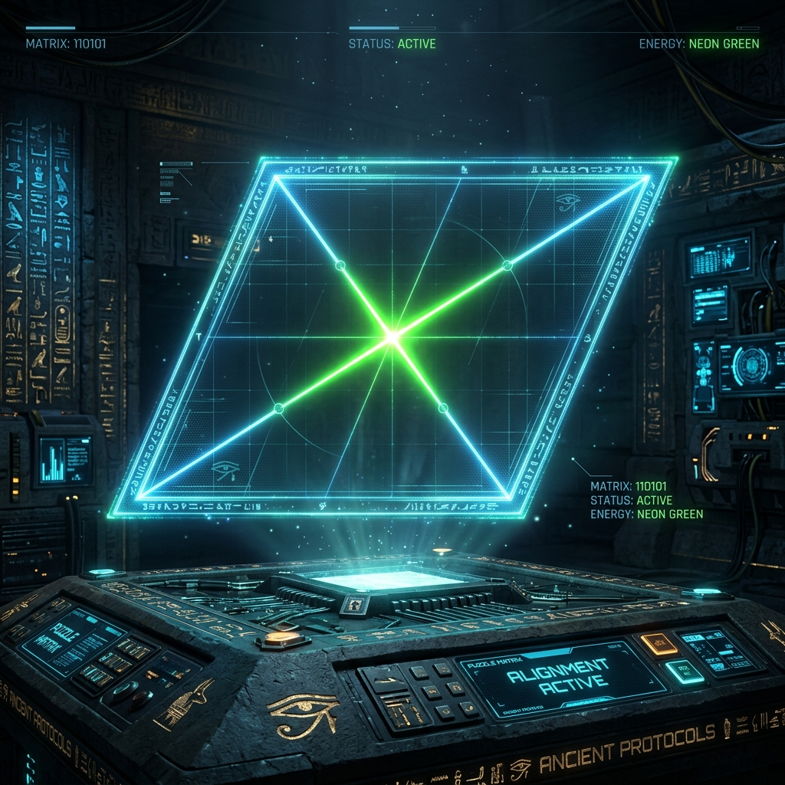
- 질문: <strong>Q15. [평행사변형의 성질 3]</strong> 평행사변형의 두 대각선은 서로 다른 것을 ( ? ) 한다. (네 글자)
- 힌트: 
- 정답 체크: ans.includes('이등분')
- 플레이스홀더: 네 글자 입력
- 에러 메시지: 틀렸습니다. 서로를 똑같이 둘로 나눕니다.
- 지문:
[신전의 수호 정령 - 임호텝]: "회랑의 대칭 기둥 록 마지막 단계입니다! 사각 대각선 지지대들이 교차하여 서로의 길이를 어떻게 나누는지 네 글자의 해독 키를 넣으십시오!"

## Q15
- 제목: 인접한 두 각의 합
- 이미지: 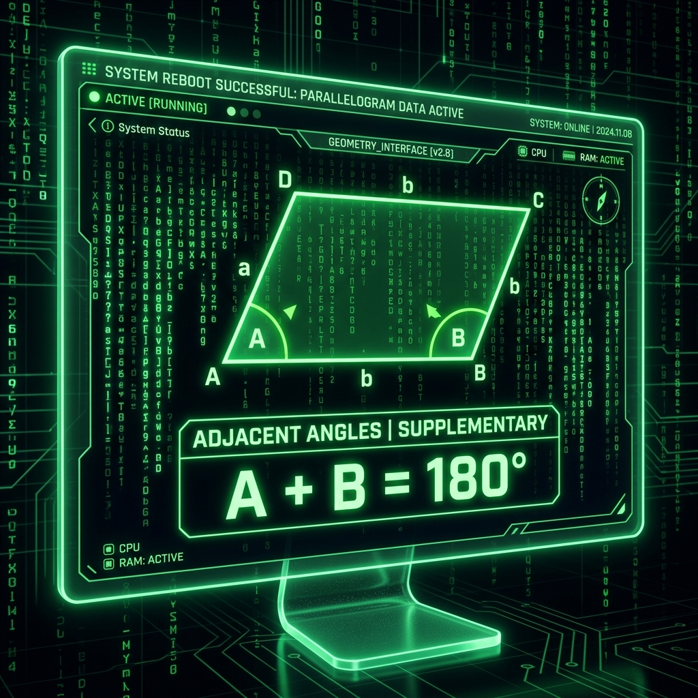
- 질문: <strong>Q15. [이웃한 각의 합]</strong> 이웃하는 두 내각의 크기의 합이 항상 180도인 사각형은 무엇인가? (다섯 글자)
- 힌트: 
- 정답 체크: ans === '평행사변형'
- 선택지: 평행사변형, 평행사변형 아님, 알 수 없음, 해 없음
- 플레이스홀더: 다섯 글자 입력
- 에러 메시지: 틀렸습니다. 대변이 평행한 사각형입니다.
- extra_class: glitch-bg
- 지문:
✨ <strong>[임호텝 고대 제단 수호 권능 100% 복구]</strong> ✨  [신전의 수호 정령 - 임호텝]: "설계 분석 완료! 묘실 내의 모든 봉인 통제권을 완벽하게 장악했습니다! 이제 도굴꾼의 탁한 사기를 정화시킵니다. 이웃한 두 각의 합이 항상 180도로 고정 수렴되는 이 대표적 사각형의 명칭을 기입하십시오!"  <i>제단 틈새로 신선한 솔바람이 불어 들며 자욱했던 연기가 빠르게 소거됩니다.</i>  [사원의 약탈자 - 도굴꾼]: "탁한 사기를 정화하다니...! 내 봉인 해제 빗장은 절대 뚫지 못할 것이다!"

## Q16
- 제목: 직각 보석함의 형태
- 이미지: 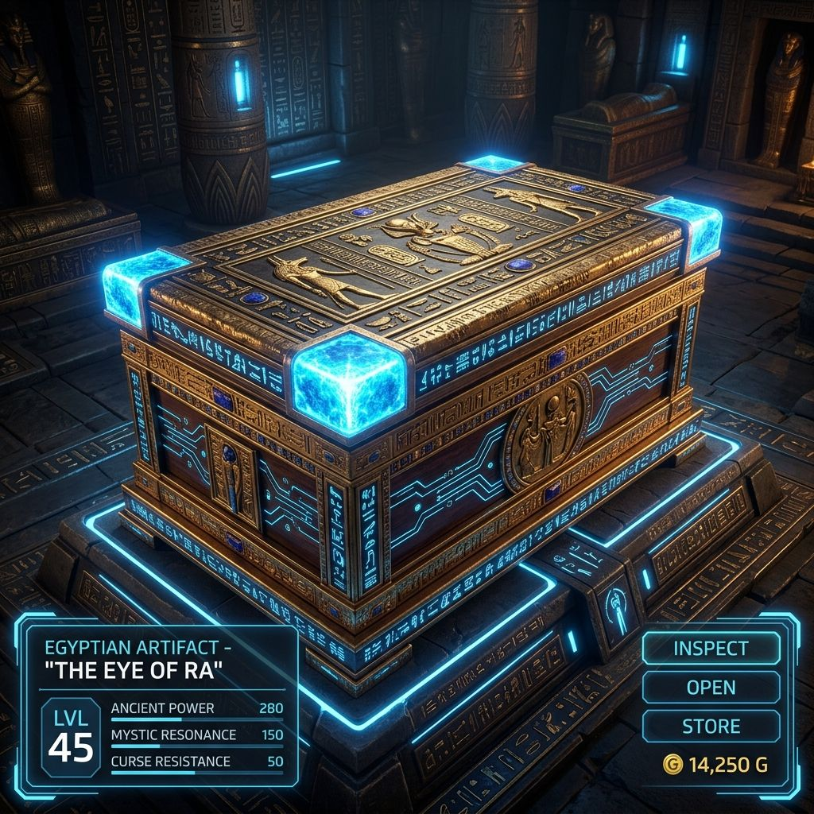
- 질문: <strong>Q16. [직사각형의 정의]</strong> 네 내각의 크기가 모두 90도로 같은 사각형을 무엇이라 하는가?
- 힌트: 
- 정답 체크: ans === '직사각형'
- 플레이스홀더: 세 글자 입력
- 에러 메시지: 틀렸습니다. 직각을 이루는 사각형입니다.
- 지문:
[사원의 약탈자 - 도굴꾼]: "왕의 수호 보석함 봉인이다! 네 모퉁이의 각도가 한 치의 오차도 없이 90도로 정렬된 사각형 상판의 고유 명칭을 입력해 보아라!"  <i>중앙 보석함 청동 두껑 주변에 기하학적인 마력 선들이 직각 대칭 구도로 가동하기 시작합니다.</i>

## Q17
- 제목: 보석함의 대각선 지지대
- 이미지: 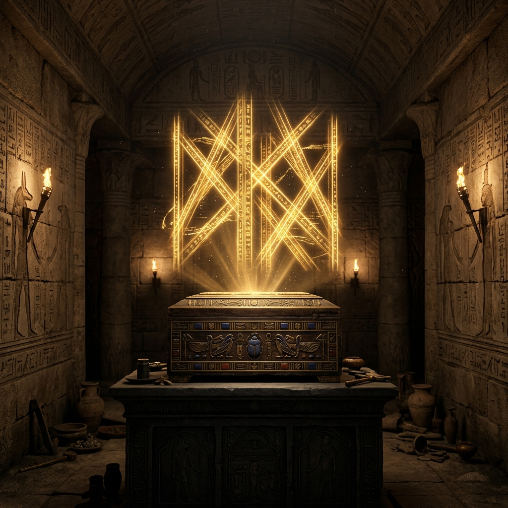
- 질문: <strong>Q17. [직사각형의 대각선 성질]</strong> 직사각형의 두 대각선의 길이는 서로 ( 같다 / 다르다 ).
- 힌트: 
- 정답 체크: ans === '같다'
- 플레이스홀더: 같다 또는 다르다 입력
- 에러 메시지: 틀렸습니다. 직사각형 대각선의 성질을 상기하세요.
- 지문:
[사원의 약탈자 - 도굴꾼]: "상판의 밸런스를 가르는 두 대각선 기둥의 길이 관계를 오차 없이 입력(같다 / 다르다)해야 함이 열릴 것이다!"  <i>보석함 정면 다이얼판이 찰칵 회전하며, 대각선 지지대의 수치 매칭을 요구합니다.</i>

## Q18
- 제목: 대칭 석재의 정렬
- 이미지: 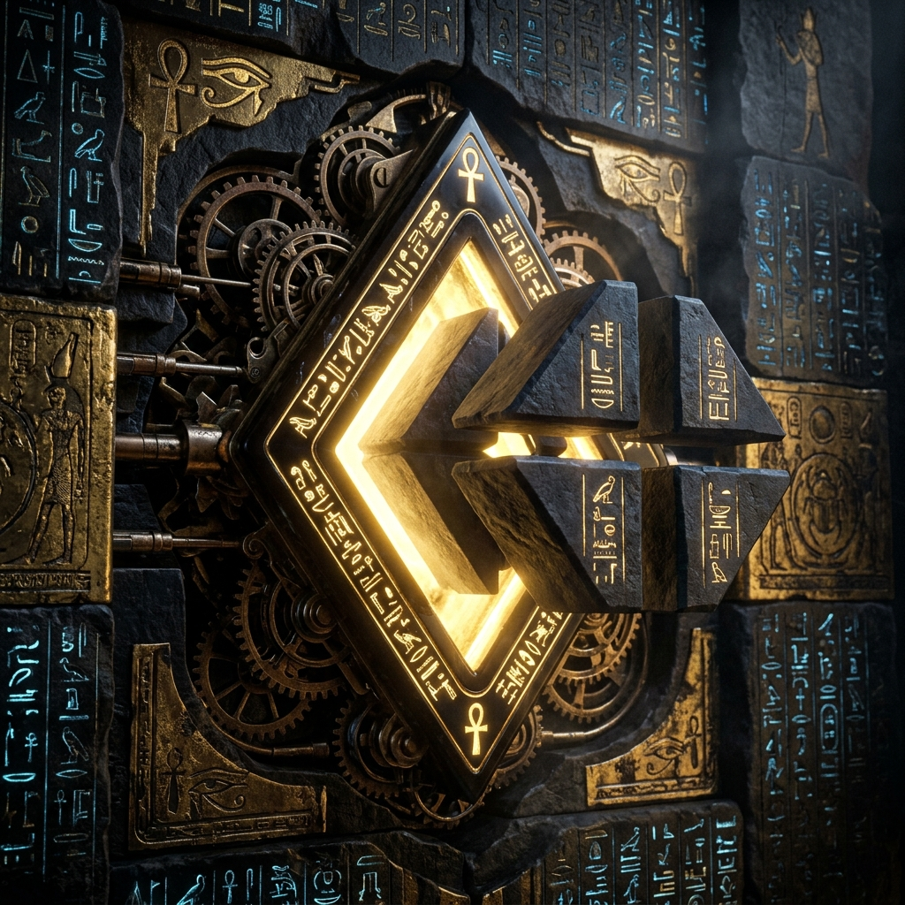
- 질문: <strong>Q18. [마름모의 정의]</strong> 네 변의 길이가 모두 같은 사각형을 무엇이라 하는가?
- 힌트: 
- 정답 체크: ans === '마름모'
- 플레이스홀더: 세 글자 입력
- 에러 메시지: 틀렸습니다. 마름모꼴 모양의 사각형입니다.
- 지문:
[사원의 약탈자 - 도굴꾼]: "이번엔 테두리 네 변의 길이가 전부 정밀하게 통일된 황금 석판 봉인 격자 암호다. 이 사각형의 명칭을 정확히 선언해 봐라!"  <i>봉인 격벽의 한 부분이 안으로 들어가며 황금 석판 삽입구를 노출합니다.</i>

## Q19
- 제목: 수직 교차의 법칙
- 이미지: 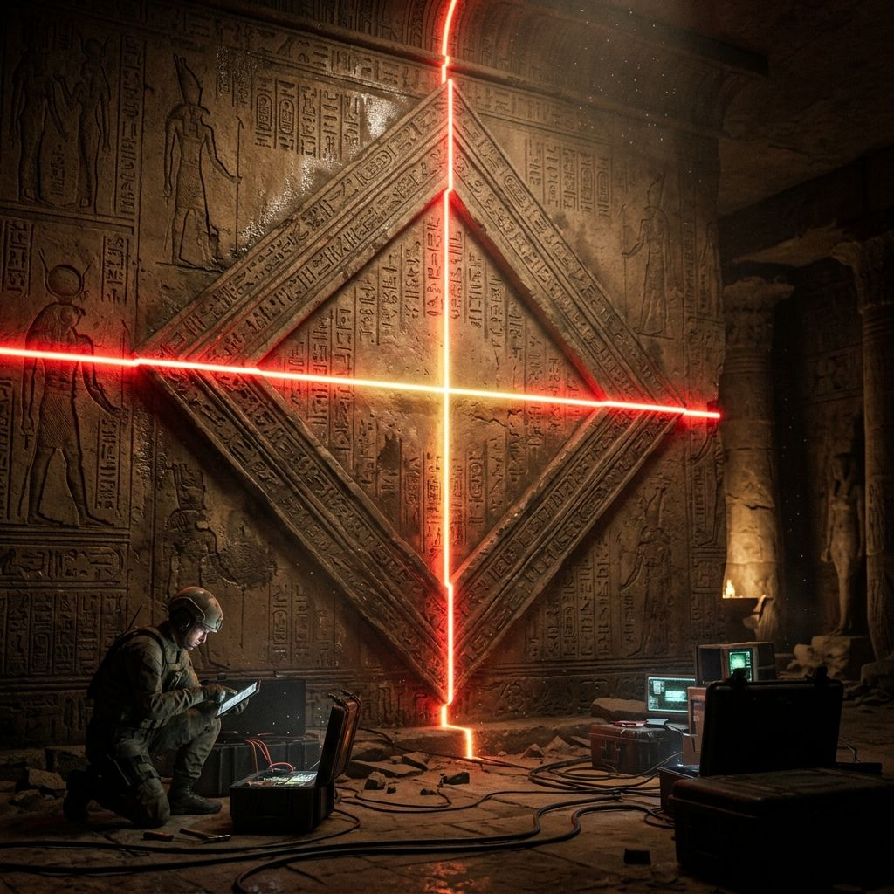
- 질문: <strong>Q19. [마름모의 대각선 성질]</strong> 마름모의 두 대각선은 서로 수직으로 만난다. ( O / X )
- 힌트: 
- 정답 체크: ans === 'O' || ans === '오' || ans === 'TRUE'
- 선택지: O, X
- 플레이스홀더: O 또는 X 입력
- 에러 메시지: 틀렸습니다. 마름모 대각선의 직교 성질을 생각해 보세요.
- 지문:
[사원의 약탈자 - 도굴꾼]: "마름모 석판 대각선 지지대들이 직각(90도)으로 맞교차하는 진위를 판명해라! 어설프게 찍어서 수평이 무너지는 꼴을 감상해주마!"  <i>삐- 삐- 경보 센서가 점멸하며, 수직 교차 법칙 검증용 판독기를 가동합니다.</i>

## Q20
- 제목: 완벽의 정사각형
- 이미지: 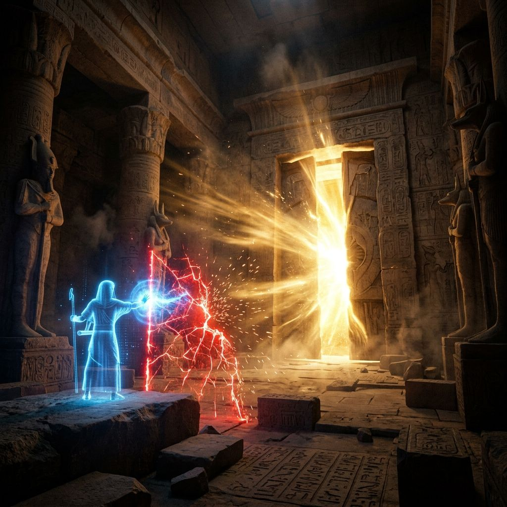
- 질문: <strong>Q20. [정사각형의 정의]</strong> 네 변의 길이가 같고 네 각의 크기가 모두 같은 사각형의 이름은 무엇인가? (세 글자)
- 힌트: 
- 정답 체크: ans === '정사각형'
- 플레이스홀더: 세 글자 입력
- 에러 메시지: 최종 보석의 명칭이 바르지 않습니다.
- extra_class: glitch-bg
- 지문:
🔮 <strong>[최종 파피루스 설계도 봉인 전면 해제]</strong> 🔮  [신전의 수호 정령 - 임호텝]: "조사관님! 이제 임호텝 사원의 출구로 향하는 마지막 최후의 기하학 홈만 남았습니다! 제 마지막 에너지를 석문 게이트에 투입하겠습니다! 네 변의 길이와 네 내각의 각도가 모두 완전 대칭을 이루는 최고의 다각형 명칭을 입력해 황금 게이트를 여십시오! 이제 밖으로 나갈 순간입니다!"  [사원의 약탈자 - 도굴꾼]: "안 돼... 내 봉인 장벽이... 완전히 흔적조차 없이 정화당하다니...!"

---

# [이벤트 정의]

## EVENT1
- 제목: 동력 기어 가동
- 이미지: 
- 버튼 텍스트: 계속 전진하기
- 다음 스테이지: panel_q6
- 달성도: 25
- 지문:
신전의 대리석 기둥 기어 빗장이 어긋나 맞춰 돌며 대리석 회전 통로가 개방되기 시작합니다.

[아틀란]: "좋습니다! 1차 신전 지하 석문이 정렬되었습니다. 어서 다음 원통 격벽으로 진입하십시오!"

## EVENT2
- 제목: 비상 차단 장치 리셋
- 이미지: 
- 버튼 텍스트: 비상 전력 가동
- 다음 스테이지: panel_q11
- 달성도: 50
- 지문:
지하 수압 터빈의 밸브가 복구되며 비상 배수가 리셋 가동됩니다.

[아틀란]: "후우... 신전 수온과 압력이 내려갑니다. 회전체 동축 락이 올바르게 고정되었습니다. 다음 3구역으로 전진하십시오!"

## EVENT3
- 제목: 핵심 복원 제단 활성화
- 이미지: 
- 버튼 텍스트: 제단 활성화
- 다음 스테이지: panel_q16
- 달성도: 75
- 지문:
거대한 조각상 돌벽이 갈라지며 오색으로 회전하며 반짝이는 다면체 보석 결정석 제단이 솟아오릅니다.

[아틀란]: "100% 동기화 성공! 이제 기하학의 모든 신성 기하 공식이 기입됩니다. 빌런인 크라켄의 최종 마스터 락에 도전하십시오!"

## EVENT4
- 제목: 탈출 차원 포탈 개방
- 이미지: 
- 버튼 텍스트: 지상으로 탈출
- 다음 스테이지: outro
- 달성도: 100
- 지문:
최종 석화 결계가 부서지고 그리스 지상으로 연결되는 에메랄드색 오색 차원 링 포탈이 소용돌이칩니다.

[아틀란]: "탈출 게이트가 개방되었습니다! 어서 결정 서판 유산을 챙겨 뛰어듭니다!"

[크라켄]: "입체의 무결성을 인정하노라... 무사 탈출하라."
