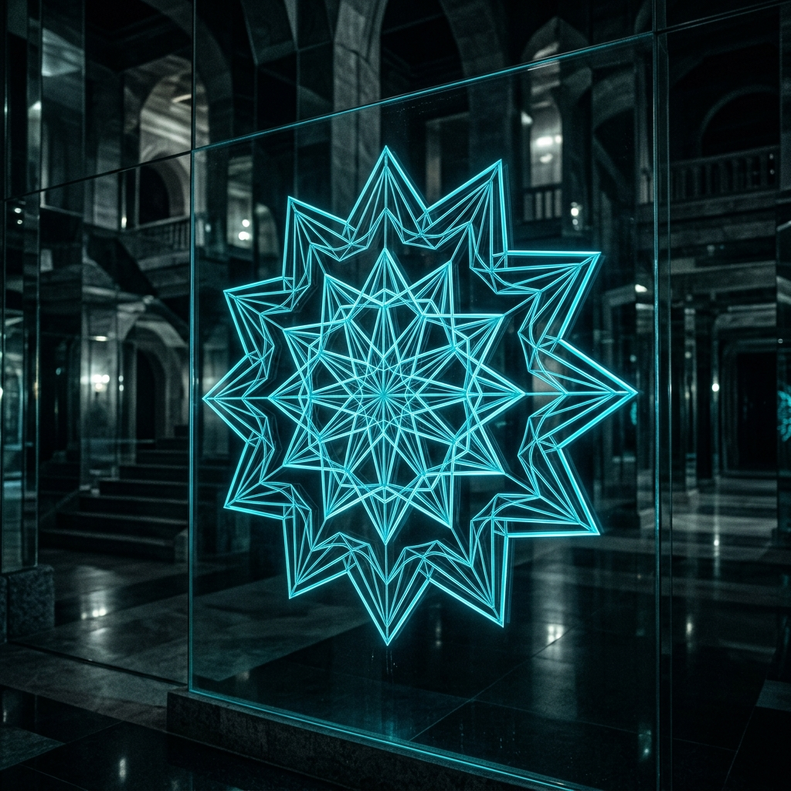
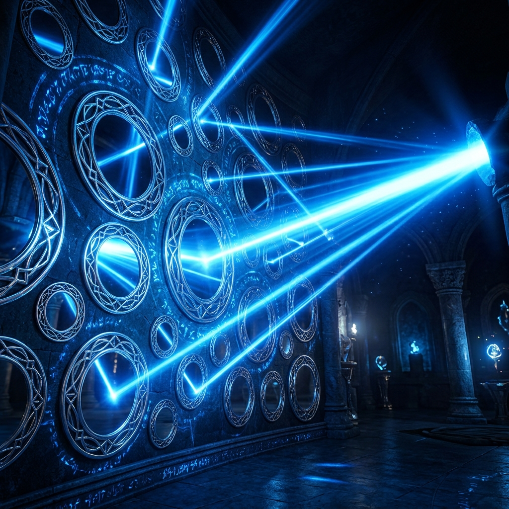
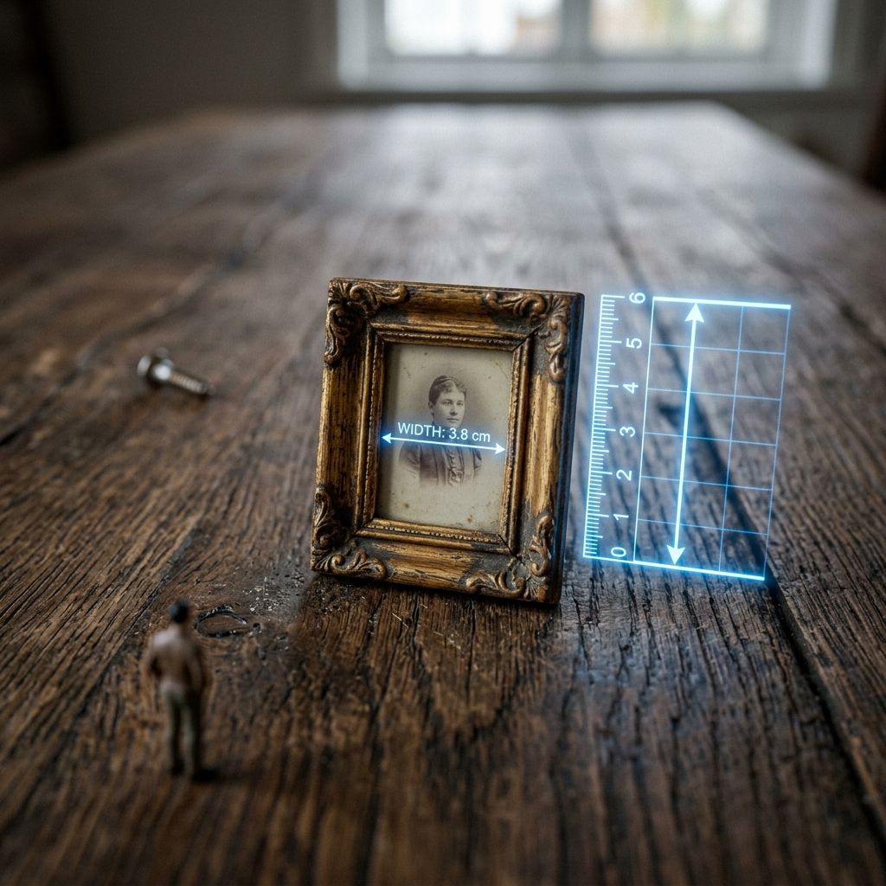
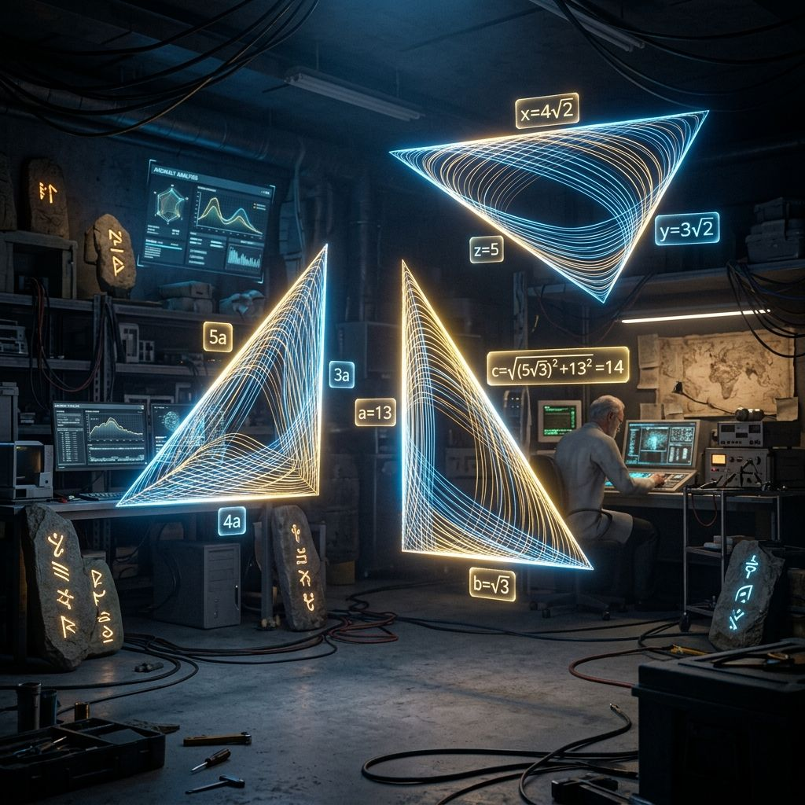
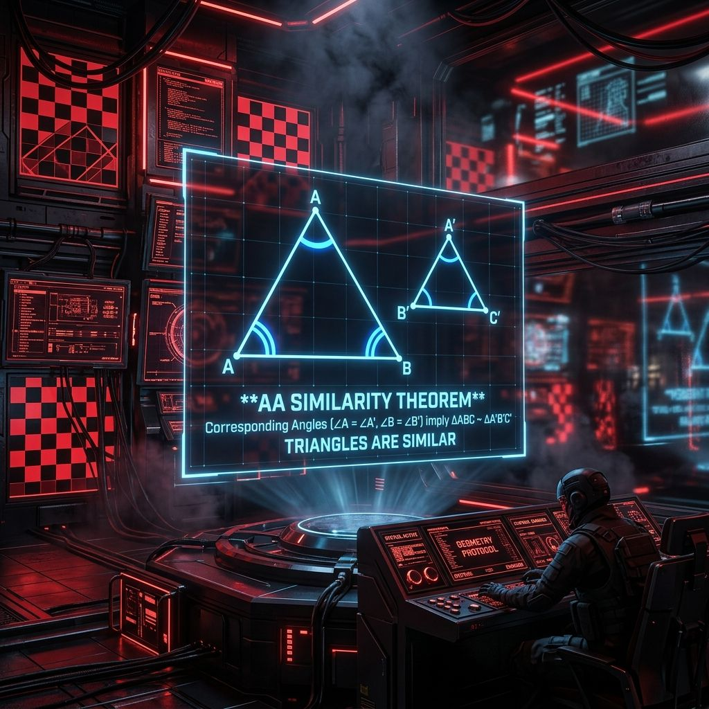
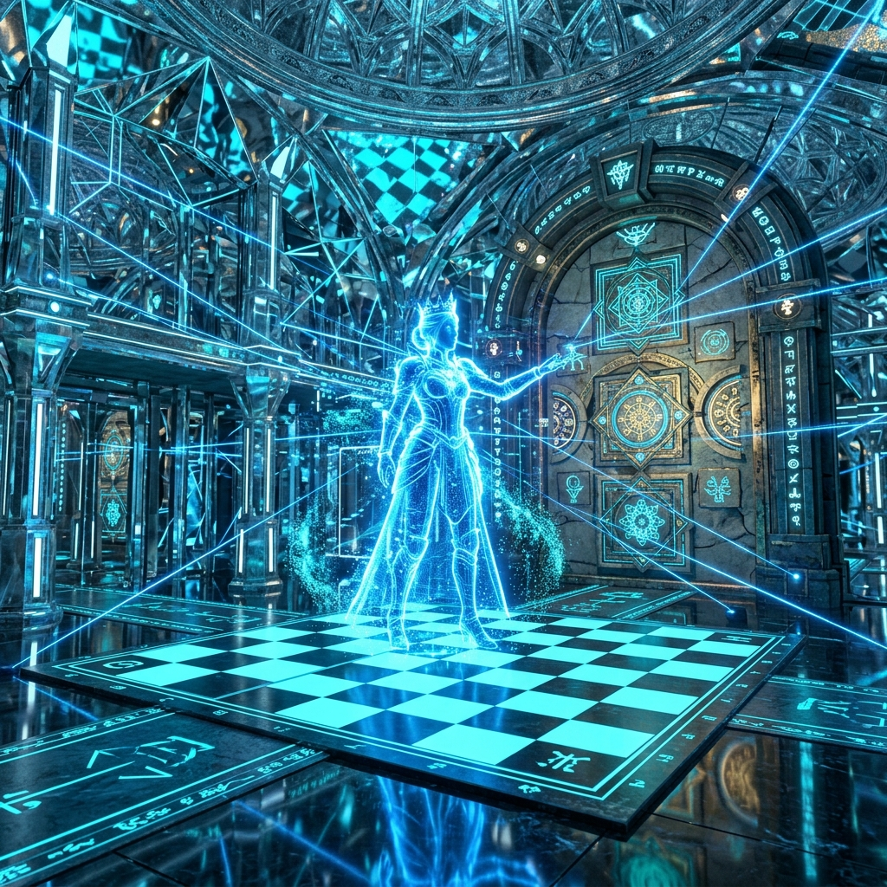

# grade2 7단원 대본집: Geometry2

이 파일은 수학 방탈출 게임의 스토리 대사, 퀴즈 문항, 이벤트 씬 정보를 관리하는 원천 데이터 파일입니다.

---

# [이미지 매핑]
- intro: intro.png
- 1: q1.png
- 2: q2.png
- 3: q3.png
- 4: q4.png
- 5: q5.png
- 6: q6.png
- 7: q7.png
- 8: q8.png
- 9: q9.png
- 10: q10.png
- 11: q11.png
- 12: q12.png
- 13: q13.png
- 14: q14.png
- 15: q15.png
- 16: q16.png
- 17: q17.png
- 18: q18.png
- 19: q19.png
- 20: q20.png
- event1: event1.png
- event2: event2.png
- event3: event3.png
- event4: event4.png
- outro: outro.png

---

# [문항 정의]

## Q1
- 제목: 닮음의 문양 계측
- 이미지: 
- 질문: <strong>Q1. [닮음의 정의]</strong> 한 도형을 일정한 비율로 확대하거나 축소한 도형이 다른 도형과 합동이 될 때, 두 도형은 서로 ( ? )인 관계에 있다고 한다.
- 힌트: 
- 정답 체크: ans === '닮음'
- 선택지: 닮음, 합동, 대칭, 닮음비
- 플레이스홀더: 두 글자 입력
- 에러 메시지: 틀렸습니다. 대칭과 축소의 기본 관계 단어입니다.
- 지문:
[붉은-여왕]: "크하하! 거울 성문 안쪽으로 한 걸음도 들여놓지 못한다! 축소 광선을 맞아 장난감만 해진 몸뚱이로 문고리에 짓눌려 으스러져라!"  <i>지이이잉- 눈앞의 거울 성문 표면에 크기와 비율이 다른 두 개의 마법 기하학 문양이 빛나기 시작합니다. 이 두 도형의 대칭/축소 관계를 나타내는 수학 용어를 주입해야 합니다.</i>  [앨리스-Q]: "조사관님, 몸집이 줄어들어 문고리가 아득히 높습니다! 한 도형을 확대하거나 축소하여 포개질 때 성립하는 이 일치 관계 용어(두 글자)를 전송해 성문을 여십시오!"

## Q2
- 제목: 축소의 배율
- 이미지: 
- 질문: <strong>Q2. [닮음비의 정의]</strong> 서로 닮은 두 평면도형에서 대응하는 선분의 길이의 비를 무엇이라 하는가?
- 힌트: 
- 정답 체크: ans === '닮음비'
- 선택지: 닮음, 합동, 대칭, 닮음비
- 플레이스홀더: 세 글자 입력
- 에러 메시지: 틀렸습니다. 닮음인 두 도형의 선분 길이의 비입니다.
- 지문:
[붉은-여왕]: "너희의 작아진 몸뚱이와 원래의 신체 선분 길이 사이의 축소 척도를 읽어낼 지능이 있느냐? 비율조차 모르는 하찮은 인형들이여!"  <i>벽면의 유리 파이프를 통해 붉은색 축소 용액이 흐르고, 해독 렌즈의 대응 핀이 위아래로 흔들리기 시작합니다.</i>  [앨리스-Q]: "해독 광선 충전을 위해 선분 길이의 비율을 상징하는 단어가 필요합니다! 대응하는 변의 길이비 명칭(세 글자)을 선언하십시오!"

## Q3
- 제목: 원형 거울의 굴절
- 이미지: 
- 질문: <strong>Q3. [원의 닮음]</strong> 두 원은 항상 닮은 도형인가? ( O / X )
- 힌트: 
- 정답 체크: ans === 'O' || ans === '오'
- 선택지: O, X
- 플레이스홀더: O 또는 X 입력
- 에러 메시지: 틀렸습니다. 모든 원은 중심에서 테두리까지 비율이 균일합니다.
- 지문:
[붉은-여왕]: "내 거울 나라에 흩어진 모든 원형 거울들을 모조리 뒤틀어 놓았다. 반사각이 다른 이 원들이 닮음 형태인지 판명할 수 있겠나?"  <i>파지직- 벽면의 크고 작은 비눗방울 모양 원형 거울들이 보랏빛 전류 노이즈를 내며 점멸합니다.</i>  [앨리스-Q]: "원의 닮음 영속성 판정 단계입니다! 모든 원이 항상 대칭적으로 닮은 도형을 유지하는지의 진위(O/X)를 즉시 입력하십시오!"

## Q4
- 제목: 축소된 액자의 가로
- 이미지: 
- 질문: <strong>Q4. [비례식의 연산]</strong> 닮음비가 2:3인 두 직사각형이 있다. 작은 직사각형의 가로가 4cm일 때, 큰 직사각형의 가로는 몇 cm인가? (숫자만 입력)
- 힌트: 
- 정답 체크: ans === '6' || ans === '6CM'
- 플레이스홀더: 단위 없이 숫자만 또는 '6cm' 입력
- 에러 메시지: 틀렸습니다. 비례식 $2:3 = 4:x$를 해결해보세요.
- 지문:
<strong>[거울 파편의 굴절로 인한 통신 왜곡 발생]</strong>  [앨리스-Q]: "치직... 캡틴! 전방의 액자 문틀이 비례식 $2:3 = 4:x$ 배율로 비틀어졌습니다! ⚙️ [액자의 가로축 복원비 계측]  비례식을 만족하는 큰 액자의 가로 길이 값을 도출해 액자 틀을 일치시키십시오!"

## Q5
- 제목: 체스판 타일의 닮음
- 이미지: 
- 질문: <strong>Q5. [정사각형의 닮음]</strong> 모든 정사각형은 항상 서로 닮은 도형인가? ( O / X )
- 힌트: 
- 정답 체크: ans === 'O' || ans === '오'
- 선택지: O, X
- 플레이스홀더: O 또는 X 입력
- 에러 메시지: 틀렸습니다. 정사각형은 네 변의 길이가 같고 네 각이 90도로 고정되어 있습니다.
- 지문:
<strong>[체스판 바닥 타일 함몰 격동]</strong>  [앨리스-Q]: "치지직... 타일 함정이 가동됩니다! 크기가 서로 다른 모든 정사각형 타일들이 항상 기하학적으로 닮아 있는지(O/X)를 판정해 딛고 설 안전 타일을 고르십시오!"

## Q6
- 제목: 세 변의 닮음 조건
- 이미지: 
- 질문: <strong>Q6. [삼각형의 닮음 조건 1]</strong> 삼각형의 세 쌍의 대응하는 변의 길이의 비가 같을 때의 닮음 조건을 쓰시오. (영문 대문자)
- 힌트: 
- 정답 체크: ans === 'SSS'
- 선택지: SSS, SAS, AA, ASA
- 플레이스홀더: 영문 세 글자 입력 (예: SSS)
- 에러 메시지: 기호가 올바르지 않습니다. Side-Side-Side의 약자입니다.
- 지문:
[붉은-여왕]: "도형의 뼈대를 이루는 세 변의 비를 전부 비틀었다. 원래의 안정화 코드로 정렬할 닮음 조건(영문 3글자)을 증명해 봐라!"  <i>드르륵- 벽면에 삼각형 세 쌍의 길이 비율 지시선이 황동색 불빛으로 회전합니다.</i>  [앨리스-Q]: "삼각형의 세 쌍의 변의 비례가 일치할 때 적용되는 닮음 판정 기호(영문 대문자)를 키패드에 기입하십시오!"

## Q7
- 제목: 변과 사잇각의 조건
- 이미지: 
- 질문: <strong>Q7. [삼각형의 닮음 조건 2]</strong> 삼각형의 두 쌍의 대응하는 변의 길이의 비가 같고, 그 끼인각의 크기가 같을 때의 닮음 조건을 쓰시오.
- 힌트: 
- 정답 체크: ans === 'SAS'
- 선택지: SSS, SAS, AA, ASA
- 플레이스홀더: 영문 세 글자 입력 (예: SAS)
- 에러 메시지: 기호가 올바르지 않습니다. Side-Angle-Side의 약자입니다.
- 지문:
[붉은-여왕]: "각도 하나와 주변의 두 변의 비를 뒤엉켜 놨다. 이 비대칭 기하학 락을 풀 닮음 코드(영문 3글자)를 짚어낼 수 있을까?"  <i>보랏빛 레이저 슬롯이 이리저리 교차하며 삼각형의 사잇각 대역을 스캔합니다.</i>  [앨리스-Q]: "두 변의 비가 일정하고 사잇각이 같을 때 성립하는 고유의 닮음 조건을 전송하십시오!"

## Q8
- 제목: 두 각의 닮음 조건
- 이미지: 
- 질문: <strong>Q8. [삼각형의 닮음 조건 3]</strong> 삼각형의 두 쌍의 대응하는 각의 크기가 같을 때의 닮음 조건을 쓰시오.
- 힌트: 
- 정답 체크: ans === 'AA'
- 선택지: SSS, SAS, AA, ASA
- 플레이스홀더: 영문 두 글자 입력 (예: AA)
- 에러 메시지: 기호가 올바르지 않습니다. Angle-Angle의 약자입니다.
- 지문:
[붉은-여왕]: "변의 길이 정보를 모두 지워 버렸다! 각도 두 개만 가지고 이 문을 열어젖힐 닮음 기호(영문 2글자)가 과연 존재할까?"  <i>철컥-! 콘솔의 모든 수치 미터기가 영(0)으로 떨어지고 모퉁이 각 지시기 2개만 점등됩니다.</i>  [앨리스-Q]: "두 개의 내각 크기가 같으면 성립하는 가장 대표적인 삼각형 닮음 약어 기호를 신속히 입력하십시오!"

## Q9
- 제목: 정삼각형의 정합비
- 이미지: 
- 질문: <strong>Q9. [정삼각형의 닮음]</strong> 한 각이 60도인 두 정삼각형은 무조건 어떤 닮음 조건에 의해 닮음인가?
- 힌트: 
- 정답 체크: ans === 'AA' || ans === 'AA닮음'
- 선택지: SSS, SAS, AA, ASA
- 플레이스홀더: 예: AA닮음
- 에러 메시지: 조건이 틀렸습니다. 세 각의 크기가 모두 60도로 동일하게 되는 성질을 생각하세요.
- 지문:
[붉은-여왕]: "60도 내각으로 고정된 정삼각형 방이다. 어떤 닮음 공식 조건에 의해 이 방의 수평이 강제로 맞춰지는지 증명하라!"  <i>지이이잉- 정삼각형 격실 셔터 밸브 단자에 기하학 조건 기호가 요구됩니다.</i>  [앨리스-Q]: "정삼각형의 세 각이 60도로 동일하게 동조되는 성질을 가진 닮음 조건 기호(AA)를 입력하여 게이트를 통과하십시오!"

## Q10
- 제목: 수선 궤적의 쪼개짐
- 이미지: 
- 질문: <strong>Q10. [직각삼각형의 닮음]</strong> 직각삼각형 내부에서 직각인 꼭짓점에서 빗변에 수선을 내렸을 때 만들어지는 두 개의 작은 직각삼각형은 서로 ( ? ) 관계이다.
- 힌트: 
- 정답 체크: ans === '닮음'
- 선택지: 닮음, 합동, 대칭, 닮음비
- 플레이스홀더: 두 글자 입력
- 에러 메시지: 틀렸습니다. 크기는 다르지만 모양이 똑같습니다.
- extra_class: glitch-bg
- 지문:
💥 <strong>[비상 로그: 거울 성 제어 콘솔 마력 오버플로우 및 자폭 작동!]</strong> 💥  [붉은-여왕]: "하찮은 인간들, 축소된 채로 이 차원의 균열과 함께 산산조각이 나거라! 5분 뒤 모든 해독 렌즈 코어가 과열 폭발하리라!"  <i>경보 혼 문자가 공중에 홀로그램으로 붉게 흩날리며 진동합니다. 수선을 내려 쪼개진 두 직각삼각형 간의 핵심 기하학 관계를 선언해 자폭을 긴급 유예하십시오.</i>  [앨리스-Q]: "노심 마력 95% 돌파! 직각삼각형 빗변에 수선을 내렸을 때 분할 생성되는 두 작은 삼각형 간의 기하학적 용어(두 글자)를 긴급 입력하십시오!"

## Q11
- 제목: 평행 관계의 사다리
- 이미지: 
- 질문: <strong>Q11. [중점연결정리와 위치]</strong> 삼각형 ABC에서 변 AB의 중점 M, 변 AC의 중점 N을 이은 선분 MN은 변 BC와 어떤 위치 관계에 있는가? (두 글자)
- 힌트: 
- 정답 체크: ans === '평행'
- 선택지: 평행, 수직, 일치, 꼬인 위치
- 플레이스홀더: 두 글자 입력 (예: 평행)
- 에러 메시지: 틀렸습니다. 두 기둥이 나란히 뻗어 있습니다.
- 지문:
[앨리스-Q]: "휴... 자폭 지연 3분 확보! 하지만 아직 3구역 평행 비례 사다리 록이 가로막고 있습니다! ⚙️ [중점 연결 기하 락]"  <i>사다리의 양옆 중점을 연결한 가로 선분 MN과 맨 밑단 BC 기둥 간의 기하학적 위치 관계 용어(두 글자)를 입력하여 사다리를 내리십시오.</i>

## Q12
- 제목: 중점 연결의 길이 비
- 이미지: 
- 질문: <strong>Q12. [중점연결정리와 길이비]</strong> 삼각형 중점 연결 정리에서 선분 MN의 길이는 선분 BC의 길이의 ( 몇 분의 몇 ) 인가? (예: 1/2)
- 힌트: 
- 정답 체크: ans === '1/2' || ans === '절반' || ans === '0.5'
- 플레이스홀더: 예: 1/2 또는 절반
- 에러 메시지: 틀렸습니다. 중점을 연결했으므로 크기가 절반으로 축소됩니다.
- 지문:
[앨리스-Q]: "1단계 사다리 잠금 오프! 2단계 게이트는 중점 연결 선분의 길이 비례 계수를 판독합니다! ⚙️ [길이비 연산]"  <i>선분 MN의 길이가 밑변 BC의 길이의 몇 분의 몇(분수)에 해당하는지 슬래시(/)를 사용하여 입력하십시오.</i>

## Q13
- 제목: 평행 차단막의 닮음
- 이미지: 
- 질문: <strong>Q13. [평행선과 닮음]</strong> 삼각형의 한 변에 평행한 선분을 그어 다른 두 변과 만나게 하면, 새로 만들어진 작은 삼각형은 원래 삼각형과 ( ? ) 관계이다.
- 힌트: 
- 정답 체크: ans === '닮음'
- 플레이스홀더: 두 글자 입력
- 에러 메시지: 틀렸습니다. 세 각의 크기가 같은 비례형 삼각형입니다.
- 지문:
[앨리스-Q]: "3단계 해치 게이트입니다! 삼각형 변에 나란하게 배치된 가로 레이저 장벽의 궤적 법칙을 판명해야 합니다! ⚙️ [평행선 분할비]"  <i>가로지르는 평행 장벽에 의해 분리된 상단 작은 삼각형이 큰 삼각형과 맺는 관계(두 글자)를 전송해 레이저 출력을 우회시키십시오.</i>

## Q14
- 제목: 평행 빔의 등가 비율
- 이미지: 
- 질문: <strong>Q14. [평행선 사이의 선분비]</strong> 평행한 세 직선이 두 직선과 만날 때, 잘린 대응하는 선분의 길이의 비는 서로 ( 같다 / 다르다 ).
- 힌트: 
- 정답 체크: ans === '같다'
- 플레이스홀더: 같다 또는 다르다 입력
- 에러 메시지: 틀렸습니다. 평행선 사이의 선분 비례 공식을 생각하세요.
- 지문:
[앨리스-Q]: "마지막 사다리 조절 해치 4단계입니다! 평행선 사이를 교차하는 두 사선에 의해 잘린 선분들의 비례 관계를 계측하십시오! ⚙️ [대응 선분 길이비]"  <i>잘려 나간 양 사선의 대응 선분비가 서로 어떠한지 단답(같다 / 다르다)으로 콘솔에 기록하십시오.</i>

## Q15
- 제목: 질량 중심의 분할비
- 이미지: 
- 질문: <strong>Q15. [무게중심의 성질]</strong> 삼각형의 무게중심은 세 중선의 길이를 꼭짓점으로부터 각각 몇 대 몇의 비율로 나누는가? (예: 2:1)
- 힌트: 
- 정답 체크: ans.replace(/\s+/g, '') === '2:1' || ans.replace(/\s+/g, '') === '2대1'
- 플레이스홀더: 예: 2:1 또는 2대1
- 에러 메시지: 비율이 올바르지 않습니다. 위쪽이 아래쪽보다 두 배 더 깁니다.
- extra_class: glitch-bg
- 지문:
✨ <strong>[앨리스-Q 거울 방 제어 시스템 권한 100% 완전 환수]</strong> ✨  [앨리스-Q]: "해독 대조 성공! 거울 방의 모든 해독 프리즘과 리플렉터 배율을 완벽히 흡수했습니다! 이제 붉은 여왕의 차원 붕괴 주파수를 차단합니다. 무게중심이 중선을 분할하는 황금비 수치(예: 2:1)를 입력하십시오!"  <i>전방 렌즈 빔 제어 창이 화사한 노란색 격자망으로 재정렬되며 축소 전류가 진정됩니다.</i>  [붉은-여왕]: "내 핵심 렌즈 통제망이 전멸당하다니...! 최종 입체 차원비로 발사 각도를 가두어 주마!"

## Q16
- 제목: 넓이의 차원비
- 이미지: 
- 질문: <strong>Q16. [닮음비와 넓이비]</strong> 두 평면도형의 닮음비가 $m:n$ 일 때, 넓이의 비는 얼마인가? (거듭제곱 기호 ^ 사용)
- 힌트: 
- 정답 체크: ans.replace(/\s+/g, '') === 'M^2:N^2' || ans.replace(/\s+/g, '') === 'M2:N2' || ans.replace(/\s+/g, '') === 'M^2대N^2'
- 플레이스홀더: 예: m^2:n^2
- 에러 메시지: 비율 식이 잘못되었습니다. 넓이의 비는 닮음비의 제곱의 비입니다.
- 지문:
[붉은-여왕]: "닮음비 m:n의 거울 표면적(넓이) 비율 공식이다! 제곱식 차원 계수를 맞춰 렌즈 표면을 터뜨려 봐라!"  <i>해독 렌즈 표면 코팅막이 과열 팽창으로 쩍쩍 금이 가려 합니다. 거듭제곱 기호(^)를 사용해 기하학 넓이비 공식을 기입하십시오.</i>

## Q17
- 제목: 정육면체 거울 상자의 표면적
- 이미지: 
- 질문: <strong>Q17. [입체도형의 겉넓이비]</strong> 두 정육면체의 닮음비가 1:2 일 때, 넓이(겉넓이)의 비는 얼마인가? (예: 1:4)
- 힌트: 
- 정답 체크: ans.replace(/\s+/g, '') === '1:4' || ans.replace(/\s+/g, '') === '1대4'
- 플레이스홀더: 예: 1:4 또는 1대4
- 에러 메시지: 틀렸습니다. 닮음비가 1:2이면 넓이의 비는 제곱의 비입니다.
- 지문:
[붉은-여왕]: "닮음비 1:2의 두 정육면체 에너지 팩이다! 이 상자들의 겉넓이 비율을 맞추지 못하면 전압이 역류하여 합선되리라!"  <i>변전 스위치 격자판이 황색 스파크를 튀기며 작동 지연음을 냅니다.</i>

## Q18
- 제목: 부피의 차원비
- 이미지: 
- 질문: <strong>Q18. [닮음비와 부피비]</strong> 두 입체도형의 닮음비가 $m:n$ 일 때, 부피의 비는 얼마인가? (세제곱 기호 ^ 사용)
- 힌트: 
- 정답 체크: ans.replace(/\s+/g, '') === 'M^3:N^3' || ans.replace(/\s+/g, '') === 'M3:N3' || ans.replace(/\s+/g, '') === 'M^3대N^3'
- 플레이스홀더: 예: m^3:n^3
- 에러 메시지: 부피의 비는 닮음비의 세제곱에 비례합니다.
- 지문:
[붉은-여왕]: "이번엔 공간 체적(부피)의 차원비다. 닮음비 m:n 일 때의 입체 공간 비례를 세제곱 기호(^)를 사용해 맞추어라!"  <i>메인 빔 렌즈 경통이 팽창음과 함께 뜨겁게 달아오릅니다.</i>

## Q19
- 제목: 거울 구슬의 체적비
- 이미지: 
- 질문: <strong>Q19. [구슬의 부피비]</strong> 닮음비가 1:3 인 두 구슬의 부피의 비는 얼마인가? (예: 1:27)
- 힌트: 
- 정답 체크: ans.replace(/\s+/g, '') === '1:27' || ans.replace(/\s+/g, '') === '1대27'
- 플레이스홀더: 예: 1:27
- 에러 메시지: 틀렸습니다. 1과 3을 각각 세제곱하여 비율을 구하세요.
- 지문:
[붉은-여왕]: "1:3 닮음비를 지닌 거울 구슬 제어 장치의 체적 부피 비율 상수를 연산판에 도출해 봐라!"  <i>구슬 모양 축소 필터 유도관의 지시창이 깜빡이며, 두 구슬 파츠의 최종 부피 비례를 요구합니다.</i>

## Q20
- 제목: 광선 증폭의 최종 비례식
- 이미지: 
- 질문: <strong>Q20. [부피 활용 비례식]</strong> 작은 컵의 부피가 10mL이다. 닮음비가 2:3인 큰 컵이 있다면, 큰 컵의 부피(x)를 구하기 위한 비례식을 세워보시오. (공백 없이 입력)
- 힌트: 
- 정답 체크: ans.replace(/\s+/g, '') === '8:27=10:X' || ans.replace(/\s+/g, '') === '10:X=8:27'
- 플레이스홀더: 예: 8:27=10:x
- 에러 메시지: 비례식 세팅 실패! 부피비는 닮음비의 세제곱인 8:27임을 이용해 10:x와 연계해 세우세요.
- extra_class: glitch-bg
- 지문:
🔮 <strong>[최종 거울 게이트 닮음 비례식 해제]</strong> 🔮  [앨리스-Q]: "조사관님! 이제 원래의 거대한 몸집으로 돌아가는 최후의 광선 발사대 렌즈만 남았습니다! 제 모든 마나 증폭 에너지를 발사 패널에 연동하겠습니다! 컵의 닮음비 2:3을 활용한 최종 부피 비례식을 입력해 격벽 해독 게이트를 여십시오! 탈출 시간입니다!"  [붉은-여왕]: "안 돼... 내 거울 속 축소 매트릭스가... 완전히 해제 정지되어 파쇄되다니...!"

---

# [이벤트 정의]

## EVENT1
- 제목: 동력 기어 가동
- 이미지: 
- 버튼 텍스트: 계속 전진하기
- 다음 스테이지: panel_q6
- 달성도: 25
- 지문:
신전의 대리석 기둥 기어 빗장이 어긋나 맞춰 돌며 대리석 회전 통로가 개방되기 시작합니다.

[헤라클레스]: "좋습니다! 1차 신전 지하 석문이 정렬되었습니다. 어서 다음 원통 격벽으로 진입하십시오!"

## EVENT2
- 제목: 비상 차단 장치 리셋
- 이미지: 
- 버튼 텍스트: 비상 전력 가동
- 다음 스테이지: panel_q11
- 달성도: 50
- 지문:
지하 수압 터빈의 밸브가 복구되며 비상 배수가 리셋 가동됩니다.

[헤라클레스]: "후우... 신전 수온과 압력이 내려갑니다. 회전체 동축 락이 올바르게 고정되었습니다. 다음 3구역으로 전진하십시오!"

## EVENT3
- 제목: 핵심 복원 제단 활성화
- 이미지: 
- 버튼 텍스트: 제단 활성화
- 다음 스테이지: panel_q16
- 달성도: 75
- 지문:
거대한 조각상 돌벽이 갈라지며 오색으로 회전하며 반짝이는 다면체 보석 결정석 제단이 솟아오릅니다.

[헤라클레스]: "100% 동기화 성공! 이제 기하학의 모든 신성 기하 공식이 기입됩니다. 빌런인 하이드라의 최종 마스터 락에 도전하십시오!"

## EVENT4
- 제목: 탈출 차원 포탈 개방
- 이미지: 
- 버튼 텍스트: 지상으로 탈출
- 다음 스테이지: outro
- 달성도: 100
- 지문:
최종 석화 결계가 부서지고 그리스 지상으로 연결되는 에메랄드색 오색 차원 링 포탈이 소용돌이칩니다.

[헤라클레스]: "탈출 게이트가 개방되었습니다! 어서 결정 서판 유산을 챙겨 뛰어듭니다!"

[하이드라]: "입체의 무결성을 인정하노라... 무사 탈출하라."
